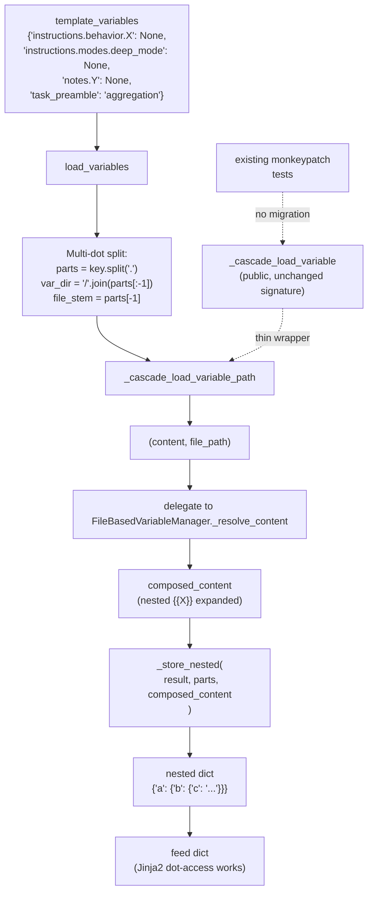

# `TemplateManager.load_variables` Multi-Dot + Composition — Integrated v4 Plan

**Author:** Tony Chen (Cursor agent, integrating v1/v2/v3 + my own findings)
**Date drafted:** 2026-05-17 00:54
**Reviewed-by:** Rovo Dev (round 4 audit, 2026-05-17 01:00) — endorsed without modification
**Reviewed-by:** Claude (round 3 yield, 2026-05-17 00:53) — endorsed
**Status:** Canonical — ready for review and implementation

> **Round-4 audit conclusion (Rovo Dev, 2026-05-17 01:00):** v4 is strictly better than v3 on five distinct points (composition delegation to existing `FBVM._resolve_content` instead of parallel re-implementation; auto-init loaders to remove the `predefined_variables=True` gate; behavioral regression test for `tmpl_type` instead of fragile `inspect.getsource()`; refined `xfail(strict=True)` strategy; pre-flight `{{X}}` grep guard). v4 also catches the `notes.nonexistent` literal-fallback behavior that v3 missed (`test_template_manager_load_variable.py:436`). `_loader_for_path` longest-prefix matching verified non-trivial: multi-root usage is real (`streaming_inferencer_base.py:234` calls `add_template_root`). **No v5 needed — accept v4 as canonical.**
**Supersedes:** v1 (Rovo Dev), v2 (Rovo Dev + Claude#1), Cursor plan, Claude#2 yield, **and v3** — see §13 for diff.

> **TL;DR.** Fix three problems atomically: (P1) `TemplateManager.load_variables` only splits on the FIRST dot, so 3+ level dotted keys break; (P2) `_cascade_load_variable` reads raw `read_text()` with NO composition, so `{{ X }}` references inside variable files render literally; (P3) `_inject_mode_flags_and_content` is a workaround that bypasses `load_variables` AND hard-codes `tmpl_type="main"`. The elegant fix: extend `load_variables` for multi-dot, **delegate composition to the existing `FileBasedVariableManager._resolve_content`** (don't reinvent), auto-init loaders so composition isn't gated on `predefined_variables=True`, then remove the workaround. Two cross-repo PRs, no bundles, two permanent regression guards.

> **If forced to pick ONE of the prior plans today:** **Cursor's plan** (the architectural-correctness leader) — it catches the composition gap that v1/v2 missed. v3 already adopted that. Among existing plans, **v3** is the strongest single pick because it integrates Cursor's architectural depth with v1's operational rigor. **v4 supersedes v3** with one architectural simplification (reuse `FileBasedVariableManager._resolve_content` instead of parallel re-implementation) and three small correctness fixes. Full reasoning in §11.

---

## 1. Verified empirical claims (every claim cross-referenced against actual code)

| # | Claim | Verified location |
|---|---|---|
| 1 | `load_variables` splits on FIRST dot only | [`template_manager.py:714-715`](../../../../RichPythonUtils/src/rich_python_utils/string_utils/formatting/template_manager/template_manager.py): `raw_key.split(".", 1)` |
| 2 | `_find_variable_file` correctly converts ALL dots to slashes | [`file_based.py:711-719`](../../../../RichPythonUtils/src/rich_python_utils/common_objects/variable_manager/file_based.py): `variable_name.replace(".", "/")` |
| 3 | `_cascade_load_variable` returns raw `read_text(...)` — **NO composition** | [`template_manager.py:646, 652`](../../../../RichPythonUtils/src/rich_python_utils/string_utils/formatting/template_manager/template_manager.py): both branches end with `resolved.read_text(encoding=...)` |
| 4 | `_resolve_content` does composition via `VARIABLE_PATTERN.sub(replace_match, ...)` with sibling-first lookup, cycle detection, max-depth — **all the machinery we need** | [`file_based.py:1067-1126`](../../../../RichPythonUtils/src/rich_python_utils/common_objects/variable_manager/file_based.py) + [`file_based.py:1024-1038`](../../../../RichPythonUtils/src/rich_python_utils/common_objects/variable_manager/file_based.py) (sibling block) |
| 5 | `_variable_loaders_by_root` only populated when `predefined_variables is True` | [`template_manager.py:397-401`](../../../../RichPythonUtils/src/rich_python_utils/string_utils/formatting/template_manager/template_manager.py): `if self.predefined_variables is True: self._init_variable_loaders()` |
| 6 | `_inject_mode_flags_and_content` workaround hard-codes `tmpl_type="main"` | [`templated_inferencer_base.py:245`](../../src/agent_foundation/common/inferencers/templated_inferencer_base.py): literal `"main"` 4th positional arg to `_cascade_load_variable` |
| 7 | Test stub at `test_preflight_template_variable_coverage.py:148-159` re-implements the workaround | grep confirmed |
| 8 | **NO 2-level dotted key has a literal dot in segment 2** anywhere in AgentFoundation/RichPythonUtils/OpenStartup | dotted-key audit found only `notes.local_search_efficiency` and `notes.nonexistent` (literal fallback test) |
| 9 | All 3-level dotted keys in source today are test code (`instructions.behavior.*`) that intentionally fails on current code | dotted-key audit |
| 10 | `notes.nonexistent` test (`test_template_manager_load_variable.py:436`) asserts `result["notes"]["nonexistent"] == "nonexistent"` (literal fallback). Must preserve. | grep verified |
| 11 | `VARIABLE_PATTERN = re.compile(r"(\^|\.)?\{\{([^}]+)\}\}(\?)?")` captures full dotted names (group 2 is `[^}]+`) | [`file_based.py:79`](../../../../RichPythonUtils/src/rich_python_utils/common_objects/variable_manager/file_based.py) |
| 12 | `FileBasedVariableManager` config has `max_recursion_depth` field; `CircularReferenceError` + `MaxDepthExceededError` already defined | [`file_based.py`](../../../../RichPythonUtils/src/rich_python_utils/common_objects/variable_manager/file_based.py) — search for these symbols |

**The architectural takeaway:** `FileBasedVariableManager._resolve_content` already has the COMPLETE composition machinery — sibling-first, multi-dot, cycle detection, max-depth, optional `?` markers, scope modifiers `^`/`.`. v3's plan to add a *new* `_compose_variable_content` helper duplicates all of this. **v4 reuses** the existing `_resolve_content` directly. One source of truth.

---

## 2. The three problems

### 2.1 Problem A — Multi-dot key splitting

`load_variables` ([`template_manager.py:714-715`](../../../../RichPythonUtils/src/rich_python_utils/string_utils/formatting/template_manager/template_manager.py)) splits on FIRST dot only. So `"instructions.modes.deep_mode"` → `("instructions", "modes.deep_mode")` → looks for a file literally named `modes.deep_mode.<ext>` (which doesn't exist) and stores `{"instructions": {"modes.deep_mode": "..."}}` (which Jinja2 can't dot-access).

**Fix:** Split on ALL dots; last segment is the file stem; all earlier segments form the folder path AND the nested dict key chain.

### 2.2 Problem B — No composition in `_cascade_load_variable`

`_cascade_load_variable` ([`template_manager.py:646, 652`](../../../../RichPythonUtils/src/rich_python_utils/string_utils/formatting/template_manager/template_manager.py)) returns `Path.read_text(...)` — raw bytes, zero substitution. So a variable file `file_reading_fallback_for_review.jinja2` containing `{{ file_reading_fallback }}` returns the literal string with `{{ file_reading_fallback }}` IN it. Jinja2's outer render won't re-evaluate substituted strings, so the literal stays in the final output.

**Fix:** After `_cascade_load_variable_path` returns content + file_path, delegate to `FileBasedVariableManager._resolve_content(content, ..., current_file_path=file_path)` to substitute `{{ X }}` references in-place using the existing sibling-first + cascade + cycle-detection logic.

### 2.3 Problem C — Hard-coded `tmpl_type="main"` workaround

`_inject_mode_flags_and_content` ([`templated_inferencer_base.py:241-246`](../../src/agent_foundation/common/inferencers/templated_inferencer_base.py)) passes literal `"main"` as the 4th arg to `_cascade_load_variable`, ignoring `self.template_manager.active_template_type`. Latent bug today (all current inferencers use `"main"`), but explicit bug the moment a non-main inferencer enables modes.

**Fix:** Delete the workaround entirely. Use `load_variables` instead, which honors `active_template_type` automatically.

---

## 3. Target design

### 3.1 Key shape contract

| Key shape | Resolves to file | Feed dict shape |
|---|---|---|
| `"task_preamble"` | `_variables/task_preamble.<ext>` | `{"task_preamble": "<content>"}` |
| `"notes.local_search_efficiency"` | `_variables/notes/local_search_efficiency.<ext>` | `{"notes": {"local_search_efficiency": "<content>"}}` |
| `"instructions.modes.deep_mode"` | `_variables/instructions/modes/deep_mode.<ext>` | `{"instructions": {"modes": {"deep_mode": "<content>"}}}` |
| `"instructions.behavior.file_reading_fallback"` | `_variables/instructions/behavior/file_reading_fallback.<ext>` | `{"instructions": {"behavior": {"file_reading_fallback": "<content>"}}}` |
| `"a.b.c.d.e"` | `_variables/a/b/c/d/e.<ext>` | 5-level nested dict |

**Rule:** All dots become path separators. Last segment is the file stem. The full segment chain is the nested dict key path.

### 3.2 Composition contract

When a loaded variable file contains `{{ X }}` references, those references are resolved at load time, in-place, BEFORE the value is stored in the feed dict. Algorithm (reused from [`file_based.py:976-1126`](../../../../RichPythonUtils/src/rich_python_utils/common_objects/variable_manager/file_based.py)):

1. **Sibling-first** — same directory as current file ([lines 1024-1038](../../../../RichPythonUtils/src/rich_python_utils/common_objects/variable_manager/file_based.py)).
2. **Cascade fallback** — `_get_cascade_paths` walks `<space>/<type>/_variables` → `<space>/_variables` → `_variables`.
3. **Cycle detection** — `resolution_stack` raises `CircularReferenceError`.
4. **Max depth** — config `max_recursion_depth` (default 10) raises `MaxDepthExceededError`.
5. **Unresolved reference** — `return match.group(0)` leaves the `{{ X }}` literal so the outer Jinja2 render can fall back to feed dict variables.
6. **Scope modifiers** — `^{{X}}` (global only), `.{{X}}` (current level), `{{X}}?` (optional) — all preserved (Jinja2-style file content can opt into these explicitly).

Multi-dot references inside variable files (e.g., a variable file containing `{{ notes.local_search_efficiency }}`) are also supported because [`VARIABLE_PATTERN`](../../../../RichPythonUtils/src/rich_python_utils/common_objects/variable_manager/file_based.py) captures full dotted names and `_find_variable_file` already converts dots to slashes.

### 3.3 Architecture



### 3.4 Sibling-resolution mechanism — DELEGATE to existing FileBasedVariableManager

v4's architectural simplification over v3: do NOT create a new `_compose_variable_content` helper. Instead, **call `FileBasedVariableManager._resolve_content` directly**. The complete composition machinery already exists; reusing it means one source of truth and zero parallel-implementation drift.

To enable this, `load_variables` needs access to a `FileBasedVariableManager` for the matching root. Today's behavior gates loader creation on `predefined_variables=True`. v4 removes that gate by **auto-initializing variable loaders** whenever `_variables/` or `.variables.yaml` exists, regardless of the `predefined_variables` flag. Loader creation is free (just Python object construction; no I/O until queried).

---

## 4. The fix — five precise edits

### 4.1 Edit A — RichPythonUtils: multi-dot split in `load_variables`

**Location:** [`template_manager.py:710-768`](../../../../RichPythonUtils/src/rich_python_utils/string_utils/formatting/template_manager/template_manager.py)

**OLD (the bug):**
```python
for raw_key, spec in variable_specs.items():
    if "." in raw_key:
        base_var, nested_key = raw_key.split(".", 1)   # ← splits only on FIRST dot
    else:
        base_var, nested_key = raw_key, None
```

**NEW:**
```python
for raw_key, spec in variable_specs.items():
    # Dot-key: ALL dots become path separators; the LAST segment is the file stem.
    #   "notes.local_search_efficiency"
    #     → var_dir="notes", file_stem="local_search_efficiency", nested_path=["notes","local_search_efficiency"]
    #   "instructions.behavior.file_reading_fallback"
    #     → var_dir="instructions/behavior", file_stem="file_reading_fallback",
    #       nested_path=["instructions","behavior","file_reading_fallback"]
    if "." in raw_key:
        parts = raw_key.split(".")
        var_dir = "/".join(parts[:-1])
        file_stem = parts[-1]
        nested_path = parts
    else:
        var_dir = raw_key
        file_stem = None    # use default_version
        nested_path = [raw_key]
```

### 4.2 Edit B — RichPythonUtils: N-level `_store_nested` with collision guard

**Replace** the local `_store` closure inside `load_variables`:

```python
def _store_nested(parts: List[str], content: Any) -> None:
    """Store ``content`` at ``result[parts[0]][parts[1]]...[parts[-1]]``.

    Intermediate dicts are created on demand. Assertion guards against
    silent shadowing if a caller mixes flat and nested keys that share
    a prefix (e.g., {"a": "x", "a.b": "y"} → AssertionError).
    """
    if len(parts) == 1:
        result[parts[0]] = content
        return
    d = result
    for part in parts[:-1]:
        nxt = d.setdefault(part, {})
        assert isinstance(nxt, dict), (
            f"load_variables: cannot nest key {'.'.join(parts)!r}; "
            f"segment {part!r} is bound to a non-dict ({type(nxt).__name__}). "
            f"Don't mix flat and nested keys that share a prefix."
        )
        d = nxt
    d[parts[-1]] = content
```

Update all sites in the loop body that previously called `_store(base_var, nested_key, X)` to `_store_nested(nested_path, X)`. Value semantics (`"@strict"`, `"=literal"`, plain string, `None`) are unchanged — only the storage mechanism changes.

### 4.3 Edit C — RichPythonUtils: extract `_cascade_load_variable_path` + delegate composition to FBVM

**Step 1.** Extract `_cascade_load_variable_path` (returns content + file path):

```python
def _cascade_load_variable_path(
    self,
    var_name: str,
    version: str,
    root_space: str,
    tmpl_type: str,
) -> Tuple[Optional[str], Optional[Path]]:
    """Same cascade resolution as _cascade_load_variable, but also returns
    the resolved file path so callers (load_variables) can drive sibling-
    aware composition over the content.

    Returns (None, None) when not found.
    """
    # ... existing cascade body, but capture the resolved Path object and
    #     return (content, path) instead of just content ...
```

**Step 2.** Make `_cascade_load_variable` a thin wrapper (preserves the public signature; existing monkeypatch tests at [`test_templated_inferencer_modes.py:567-581`](../../test/agent_foundation/common/inferencers/test_templated_inferencer_modes.py) and [`test_preflight_template_variable_coverage.py:148-159`](../../test/agent_foundation/common/inferencers/test_dual_inferencer/test_preflight_template_variable_coverage.py) keep working):

```python
def _cascade_load_variable(
    self,
    var_name: str,
    version: str,
    root_space: str,
    tmpl_type: str,
) -> Optional[str]:
    """Backward-compatible wrapper. Returns raw file content WITHOUT
    composition. Use load_variables() if you need {{ X }} references
    inside the content to be resolved."""
    content, _ = self._cascade_load_variable_path(var_name, version, root_space, tmpl_type)
    return content
```

**Step 3.** Auto-init variable loaders (remove gate on `predefined_variables=True`):

Change [`template_manager.py:400-401`](../../../../RichPythonUtils/src/rich_python_utils/string_utils/formatting/template_manager/template_manager.py) so `_init_variable_loaders()` runs whenever any template root contains `_variables/` or `.variables.yaml`, regardless of `predefined_variables`. Loader creation already short-circuits silently on directories without `_variables/` ([`_add_variable_loader_for_root`](../../../../RichPythonUtils/src/rich_python_utils/string_utils/formatting/template_manager/template_manager.py) at lines 424-457), so the cost is one `Path.is_dir()` check per root at construction. Negligible.

**Step 4.** In `load_variables`, after each `_cascade_load_variable_path` call, delegate composition to the matching `FileBasedVariableManager`:

```python
content, file_path = self._cascade_load_variable_path(
    var_dir, file_stem or default_version, root_space, tmpl_type
)
if content is not None and file_path is not None:
    loader = self._loader_for_path(file_path)
    if loader is not None:
        content = loader._resolve_content(
            content,
            variable_root_space=root_space,
            variable_type=tmpl_type,
            version=file_stem or default_version or "",
            resolution_stack=[],
            current_file_path=file_path,
        )
_store_nested(nested_path, content if content is not None else "")
```

**Step 5.** Add `_loader_for_path(file_path) -> Optional[VariableLoader]`:

```python
def _loader_for_path(self, file_path: Path) -> Optional[Any]:
    """Find the VariableLoader whose template root is an ancestor of file_path.

    Returns None if no loader exists for the file's root (typical for
    templates= dicts or paths without _variables/ directories).
    """
    if not self._variable_loaders_by_root:
        return None
    fp = str(file_path.resolve())
    # Match longest root prefix (handles nested roots correctly).
    best_root = None
    for root in self._variable_loaders_by_root:
        if fp.startswith(str(Path(root).resolve())) and (
            best_root is None or len(root) > len(best_root)
        ):
            best_root = root
    return self._variable_loaders_by_root.get(best_root) if best_root else None
```

### 4.4 Edit D — AgentFoundation: delete the workaround + replace via single `load_variables` call

**Delete** the entire `_inject_mode_flags_and_content` method ([`templated_inferencer_base.py:213-284`](../../src/agent_foundation/common/inferencers/templated_inferencer_base.py)) and its call site at lines 198-205.

**Replace** in `_build_template_feed` with a unified-specs call that includes both user-declared variables AND per-enabled-mode entries in ONE `load_variables` invocation:

```python
# Build effective specs: user template_variables + per-enabled-mode entries.
# enable_<name> flags are set unconditionally (so  can
# short-circuit even when False).
effective_specs: dict = dict(self.template_variables or {})
for mode_name, enabled in (self.modes or {}).items():
    feed[f"enable_{mode_name}"] = bool(enabled)
    if enabled:
        # setdefault: never clobber an explicit user-supplied spec.
        effective_specs.setdefault(f"instructions.modes.{mode_name}", None)

if effective_specs and self.template_manager and hasattr(self.template_manager, "load_variables"):
    try:
        resolved = self.template_manager.load_variables(
            variable_specs=effective_specs,
            root_space=self.template_root_space or "",
            default_version=self.template_version or "",
            # NB: tmpl_type is NOT passed — load_variables uses
            # self.template_manager.active_template_type (fixes the latent
            # hardcoded "main" bug from the deleted workaround at line 245).
        )
    except FileNotFoundError as e:
        logger.debug("Variable not found, degrading gracefully: %s", e)
        resolved = {}
    _deep_merge_into(feed, resolved)
```

### 4.5 Edit E — AgentFoundation: `_deep_merge_into` helper

Add a module-private helper at the top of [`templated_inferencer_base.py`](../../src/agent_foundation/common/inferencers/templated_inferencer_base.py):

```python
def _deep_merge_into(target: dict, source: dict) -> None:
    """Recursively merge ``source`` into ``target``. Dicts at matching keys
    merge; non-dict leaves overwrite. Used to fold load_variables output
    into the feed without clobbering sibling sub-namespaces.

    Why not dict.update(): shallow update overwrites feed["instructions"]
    if it already exists from template_variables, losing sibling sub-keys
    (e.g., mode injection wipes out feed["instructions"]["behavior"]).
    """
    for k, v in source.items():
        existing = target.get(k)
        if isinstance(existing, dict) and isinstance(v, dict):
            _deep_merge_into(existing, v)
        else:
            target[k] = v
```

---

## 5. Test plan

### 5.1 Phase 0 — RED tests (pin contract BEFORE source edits)

**New file:** [`RichPythonUtils/test/rich_python_utils/string_utils/formatting/test_load_variables_multidot.py`](../../../../RichPythonUtils/test/rich_python_utils/string_utils/formatting/test_load_variables_multidot.py)

**xfail strategy:** Only the tests that genuinely fail on current code get `@pytest.mark.xfail(strict=True, reason="multi-dot not yet implemented")`. Backward-compat tests must pass on current code AND continue to pass after the fix — they have no `xfail` marker.

`TestMultiLevelDotKeys` — 8 tests:

| # | Test | xfail today? | What it pins |
|---|---|---|---|
| 1 | `test_flat_key_unchanged` | No | BC: `{"task_preamble": "default"}` resolves identically |
| 2 | `test_two_level_dotted_key_unchanged` | No | BC: `{"notes.local_search_efficiency": ""}` → 2-level nested dict |
| 3 | `test_three_level_dotted_key` | **Yes** | `{"instructions.modes.deep_mode": ""}` → 3-level nested dict |
| 4 | `test_four_level_dotted_key` | **Yes** | `{"a.b.c.d": ""}` → 4-level nested dict |
| 5 | `test_multiple_keys_share_intermediates` | **Yes** | `{"a.b.c1": "", "a.b.c2": ""}` → `{"a": {"b": {"c1": ..., "c2": ...}}}` |
| 6 | `test_flat_then_nested_raises_assertion` | **Yes** | `{"a": "literal", "a.b": ""}` → `AssertionError` with documented message |
| 7 | `test_strict_prefix_still_raises_on_missing` | No | BC: `@strict` still raises `FileNotFoundError` for missing file |
| 8 | `test_literal_prefix_still_skips_file` | No | BC: `=literal` still skips FS read; works at all depths after fix (post-fix only) |

`TestNestedVariableComposition` — 5 tests, all xfail today:

| # | Test | What it pins |
|---|---|---|
| 9 | `test_sibling_reference_resolves` | `_variables/x/parent.<ext>` contains `{{ sibling }}`; `_variables/x/sibling.<ext>` exists. `load_variables({"x.parent": None})` returns content with sibling expanded (no literal `{{ sibling }}`) |
| 10 | `test_cascade_reference_when_no_sibling` | Parent references `{{ shared }}` with no same-folder sibling; resolved via cascade walk |
| 11 | `test_unresolved_reference_left_literal` | `{{ unknown_var }}` with no sibling and no cascade match is left literal (outer template can fall back to feed) |
| 12 | `test_circular_reference_detected` | A→B→A raises `CircularReferenceError` |
| 13 | `test_max_recursion_depth_enforced` | Chain longer than `max_recursion_depth` raises `MaxDepthExceededError` |

`TestLiteralFallbackPreserved` — 1 test, **not xfail** (existing behavior must hold):

| # | Test | What it pins |
|---|---|---|
| 14 | `test_notes_nonexistent_literal_fallback` | `{"notes.nonexistent": None}` over an empty `_variables/notes/` dir → `result["notes"]["nonexistent"] == "nonexistent"`. Mirrors existing [`test_template_manager_load_variable.py:436`](../../../../RichPythonUtils/test/rich_python_utils/string_utils/formatting/test_template_manager_load_variable.py); preserved after refactor. |

After the fix lands, every `xfail(strict=True)` flips to passing. Strict mode catches the case where a test was xfail but accidentally passes (means xfail itself was wrong).

### 5.2 GREEN tests (must pass after the fix)

`AgentFoundation/test/agent_foundation/common/inferencers/test_behavior_variable_injection.py` (156 lines, fails today):
- `TestBehaviorVariableResolution::test_base_fallback_variable_loads` — 3-level lookup
- `TestBehaviorVariableResolution::test_review_fallback_variable_loads` — 3-level lookup
- `TestBehaviorVariableResolution::test_followup_fallback_variable_loads` — 3-level lookup
- `TestNestedVariableExpansion::test_review_variable_expands_base_reference` — sibling composition
- `TestNestedVariableExpansion::test_followup_variable_expands_base_reference` — sibling composition
- `TestFullTemplateRendering::test_plan_review_template_contains_fallback_instruction` — end-to-end real-template render

`AgentFoundation/test/agent_foundation/common/inferencers/test_templated_inferencer_modes.py` — M1-M9 must all stay GREEN. M5 (monkeypatches `_cascade_load_variable`) is preserved because the wrapper signature is unchanged (Edit C Step 2).

### 5.3 Permanent regression tests in AgentFoundation

**New file:** [`test/agent_foundation/common/inferencers/test_no_workaround_regression.py`](../../test/agent_foundation/common/inferencers/test_no_workaround_regression.py)

```python
def test_inject_mode_flags_and_content_workaround_is_removed():
    """The _inject_mode_flags_and_content workaround must NEVER come back.
    See v4 plan §4.4. Mode injection goes through TemplateManager.load_variables
    which supports multi-dot keys. If this assertion fails, someone re-added
    the workaround — direct them to fix load_variables instead."""
    from agent_foundation.common.inferencers.templated_inferencer_base import (
        TemplatedInferencerBase,
    )
    assert not hasattr(TemplatedInferencerBase, "_inject_mode_flags_and_content"), (
        "_inject_mode_flags_and_content was re-added. See "
        "_docs/_plans/load_variables_multidot_INTEGRATED_v4_plan.md §4.4."
    )


def test_non_main_tmpl_type_propagates_to_mode_injection(tmp_path):
    """Behavioral regression for the old hardcoded tmpl_type='main' bug.

    Creates an inferencer with active_template_type='alt' that has modes
    enabled and a non-main mode file. The mode content must resolve from
    the 'alt' type's variable cascade, NOT the 'main' type's. This catches
    any future regression that re-introduces a hardcoded tmpl_type.
    """
    # Layout:
    #   <tmpl_path>/plan/alt/_variables/instructions/modes/deep_mode.<ext>  ← should resolve
    #   <tmpl_path>/plan/main/_variables/instructions/modes/deep_mode.<ext>  ← should NOT resolve
    # ...build fixture, inferencer with template_root_space="plan",
    #    template_manager.active_template_type="alt", modes={"deep_mode": True}
    #    Assert feed["instructions"]["modes"]["deep_mode"] == "<alt content>"
```

**Why behavioral instead of `inspect.getsource()`-scanning?** Source-string scans are fragile (whitespace, comments, refactors). A runtime test catches the real bug: that a non-main inferencer with modes resolves from the correct cascade level.

### 5.4 Full-suite regression

**RichPythonUtils:** run these existing test files; all must stay GREEN:
- `test_template_manager_load_variable.py`
- `test_cross_root_variable_lookup.py`
- `test_predefined_variables_integration.py`
- `test_variable_two_pass_search.py`
- `test_variable_manager.py`
- `test_multi_root_templates.py`
- `test_add_template_root.py`

**OpenStartup:** run these integration tests to confirm BRTA / multiflow / dual-inferencer paths still resolve variables correctly:
- `test_task_agent_config_brta_with_multiflow_pti.py`
- `test_template_split_integration.py`

---

## 6. Phased rollout

| Phase | What | Files | Risk | Reversible? |
|---|---|---|---|---|
| 0 | Add RED tests (14 tests) — confirm they fail on current code | 1 new test file | none | n/a |
| 1 | RichPythonUtils Edit A (multi-dot split) | `template_manager.py` | medium | yes |
| 2 | RichPythonUtils Edit B (`_store_nested`) | same file | low | yes |
| 3 | RichPythonUtils Edit C Step 1+2 (`_cascade_load_variable_path` + thin wrapper) | same file | low | yes |
| 4 | RichPythonUtils Edit C Step 3 (auto-init loaders) | same file | medium (changes default behavior) | yes |
| 5 | RichPythonUtils Edit C Step 4+5 (composition delegation + `_loader_for_path`) | same file | medium-high (new behavior) | yes |
| 6 | RichPythonUtils: 14 unit tests GREEN; full-suite regression GREEN | n/a | low | yes |
| 7 | AgentFoundation Edit D (delete workaround + replacement) | `templated_inferencer_base.py` | medium | yes |
| 8 | AgentFoundation Edit E (`_deep_merge_into`) | same file | low | yes |
| 9 | AgentFoundation: migrate test stub at `test_preflight_template_variable_coverage.py:148-159` (see §9) | 1 test file | low | yes |
| 10 | AgentFoundation: permanent regression tests added | 1 new test file | trivial | yes |
| 11 | AgentFoundation: `test_behavior_variable_injection.py` GREEN; mode tests M1-M9 GREEN | n/a | n/a | n/a |
| 12 | OpenStartup integration tests GREEN | n/a | n/a | n/a |

### 6.1 Cross-repo PR ordering

- **PR-A (RichPythonUtils):** Phases 0–6. Lands first. Strictly backward-compatible. Tag a new RichPythonUtils version.
- **PR-B (AgentFoundation):** Phases 7–12. Depends on PR-A's tag. Bumps `pyproject.toml` to new RichPythonUtils version.

**Do NOT bundle.** Cross-repo bundles are hard to revert and hard to bisect.

### 6.2 Rollback strategy

| Revert | Consequence |
|---|---|
| PR-B only | Workaround comes back; modes work via old path; `instructions.behavior.*` references fail (pre-bug state). **Safe.** |
| PR-A only AFTER PR-B has landed | AgentFoundation has no workaround to compensate; modes render empty. **Do not revert PR-A while PR-B is live.** |
| Both, in order PR-B then PR-A | Full pre-state. **Safe.** |

---

## 7. Risk register

| # | Risk | Severity | Mitigation |
|---|---|---|---|
| 1 | Existing caller uses 2-level dot key with a literal dot in segment 2 (e.g., `"notes.v1.2"`) | 🟢 Low | Dotted-key audit confirmed: only `notes.local_search_efficiency` and `notes.nonexistent` in use. No literal-dot-in-version anywhere. |
| 2 | Auto-init loaders changes default behavior for users who explicitly set `predefined_variables=False` | 🟡 Medium | The change ONLY creates loader objects when `_variables/` or `.variables.yaml` exists. The constructed loaders are dormant unless `load_variables` is called. Behavior of `predefined_variables=False` for the rendering path (`__call__`) is unchanged: it still skips the predefined-vars block via `skip_predefined` flag. Add a test that verifies `__call__` does NOT inject predefined vars when `predefined_variables=False`, even with loaders auto-init'd. |
| 3 | Composition is new behavior — could change output of existing 2-level variable files that contain literal `{{ X }}` patterns the author didn't expect to be expanded | 🟡 Medium | Grep all existing `_variables/**/*.jinja2`, `*.j2`, `*.hbs`, `*.txt` files in AgentFoundation + OpenStartup for `{{` patterns. Today only the user's new `file_reading_fallback_for_review.jinja2` and `file_reading_fallback_for_followup.jinja2` contain such patterns; both expect expansion (the whole point of this plan). Add this grep to PR-A's CI as a regression guard. |
| 4 | `_store_nested` assertion fires on flat-vs-nested prefix collision | 🟢 Low | NEW error mode. No existing caller mixes flat + nested under shared prefix. Test #6 pins it. |
| 5 | Subclass overrides `_inject_mode_flags_and_content` | 🟢 Low | Grep confirmed: only `templated_inferencer_base.py` defines it. Test stub in `test_preflight_template_variable_coverage.py` replicates but does not subclass. Migrate stub (§9). |
| 6 | Hard-coded `tmpl_type="main"` was masking a latent bug for non-main inferencers; removing it changes behavior for those | 🟢 Low | Today no inferencer uses non-main `active_template_type` AND modes. The fix is correct; latent bug closed. Behavioral regression test §5.3 pins. |
| 7 | Test monkeypatches of `_cascade_load_variable` break if signature changes | 🟢 Low | Thin-wrapper architecture (Edit C Step 2) preserves the public signature exactly. Tests work unmodified. |
| 8 | Composition deep-stacks or runs slow on adversarial input | 🟢 Low | Reuses `FileBasedVariableManager`'s `max_recursion_depth=10` cap + cycle detection. Bounded by the existing implementation's safety. |
| 9 | `_deep_merge_into` recursion on adversarial dict (deeply nested) | 🟢 Low | Bounded by `template_variables` key depth — typically ≤ 4. Negligible. |
| 10 | Cross-repo coordination: PR-A merges, PR-B doesn't get rebased onto new RichPythonUtils version | 🟡 Medium | Pin RichPythonUtils version in `pyproject.toml` as part of PR-B. CI catches version mismatch via the new tests. |
| 11 | Future contributor re-adds `_inject_mode_flags_and_content` or hardcodes `tmpl_type="main"` | 🟢 Low | Two permanent regression tests in §5.3 catch both at CI time. |
| 12 | `_loader_for_path` longest-prefix matching is fragile if a user passes overlapping template roots (e.g., `/a` and `/a/b`) | 🟢 Low | The longest-prefix tie-breaker handles this correctly. Add a unit test with overlapping roots. |

---

## 8. Acceptance criteria

**PR-A (RichPythonUtils) mergeable when:**
- ☐ All 14 new unit tests in §5.1 pass.
- ☐ Existing RichPythonUtils test suite (§5.4) passes — zero regressions.
- ☐ `load_variables` docstring updated with N-level example, composition note, and prefix-collision warning.
- ☐ `_cascade_load_variable` public signature unchanged (`grep -n "def _cascade_load_variable\b"` shows the same signature).
- ☐ New `_cascade_load_variable_path`, `_loader_for_path` have docstrings citing this plan section.
- ☐ Variable-file `{{ }}`-pattern grep regression guard added to CI (risk #3).

**PR-B (AgentFoundation) mergeable when:**
- ☐ `_inject_mode_flags_and_content` removed from `templated_inferencer_base.py`.
- ☐ `_deep_merge_into` helper added (module-private).
- ☐ Replacement uses `load_variables` and does NOT pass any `tmpl_type` argument.
- ☐ All 6 tests in `test_behavior_variable_injection.py` GREEN.
- ☐ Mode tests M1-M9 in `test_templated_inferencer_modes.py` GREEN.
- ☐ `test_preflight_template_variable_coverage.py` stub migrated (§9) and GREEN.
- ☐ Both permanent regression tests in §5.3 in CI.
- ☐ `grep -rn "_inject_mode_flags_and_content" CoreProjects/AgentFoundation/` returns zero matches (outside the regression test file itself, which references the name as a string).
- ☐ `pyproject.toml` bumped to new RichPythonUtils version.
- ☐ OpenStartup integration tests (§5.4 OpenStartup section) GREEN.

---

## 9. Test stub migration

**File:** [`CoreProjects/AgentFoundation/test/agent_foundation/common/inferencers/test_dual_inferencer/test_preflight_template_variable_coverage.py`](../../test/agent_foundation/common/inferencers/test_dual_inferencer/test_preflight_template_variable_coverage.py)

**Lines 148-159** contain a `_inject_mode_flags` stub that replicates the workaround inside a test scaffold. After workaround removal, the stub becomes obsolete.

**Decision: Option 1 (Delete the stub).** Let the test exercise the production `_build_template_feed` directly. Reasoning:

- The test's purpose is preflight template-variable coverage — verifying ALL Jinja2 variables in `review.jinja2` and `followup.jinja2` get populated. Once production `_build_template_feed` uses `load_variables` for modes, the test naturally exercises the real path.
- Stubbed parallel implementations drift from production. Eliminate the drift surface.

If Option 1 reveals test-fixture friction (e.g., stub was working around an unrelated infrastructure issue), fall back to **Option 2**: replace the stub body with the same `effective_specs` + `load_variables` pattern from Edit D, mirroring production.

---

## 10. What this plan deliberately does NOT do

- ❌ Does NOT rename `load_variables`.
- ❌ Does NOT change `@strict` / `=literal` / plain / `None` value semantics.
- ❌ Does NOT change `FileBasedVariableManager._find_variable_file` or `_resolve_variable` — they already do the right thing.
- ❌ Does NOT change `_cascade_load_variable`'s public signature — wrapper preserves it.
- ❌ Does NOT introduce a feature flag — fix is strictly backward-compatible (multi-dot is a strict superset of single-dot; composition is gated on `_variables/` existence).
- ❌ Does NOT touch any prompt template files (user already did that).
- ❌ Does NOT add a per-namespace workaround (`_inject_behavior_content`, `_inject_<namespace>_content`).
- ❌ Does NOT add a new variable-spec prefix character (composition is the default for `load_variables`; opt-out is unnecessary today).
- ❌ Does NOT reimplement composition machinery — delegates to `FileBasedVariableManager._resolve_content`.
- ❌ Does NOT scan source code with `inspect.getsource()` — uses behavioral regression tests instead.

---

## 11. Comparison + "if forced to pick one"

| Aspect | v1 (Rovo, 441L) | v2 (Rovo+Claude#1, 365L) | Cursor (226L) | Claude#2 (14L) | **v3 (Rovo+Cursor merge)** | **v4 (this plan)** |
|---|---|---|---|---|---|---|
| Multi-dot split fix | ✅ | ✅ | ✅ | yields | ✅ | ✅ |
| `_store_nested` correctness | over-engineered TypeError | 5L assertion | clean 3L (silent shadow) | yields | 5L w/ assertion | 5L w/ assertion |
| **Composition (the user's `{{ X }}` use case)** | ❌ missed | ❌ missed | ✅ caught (new helper) | yields | ✅ new helper `_compose_variable_content` | ✅ **delegate to existing `FBVM._resolve_content`** |
| `_cascade_load_variable_path` extraction (BC for monkeypatches) | ❌ missed | ❌ missed | ✅ caught | yields | ✅ | ✅ |
| Hard-coded `tmpl_type="main"` bug | ❌ missed (carried over) | ❌ missed | ✅ caught | yields | ✅ | ✅ |
| Test stub migration | ❌ missed | ❌ missed | ✅ caught | yields | ✅ | ✅ |
| Deep-merge vs shallow `feed.update` | ✅ deep | ✅ deep | ❌ shallow (latent bug) | yields | ✅ deep | ✅ deep |
| **Auto-init variable loaders (composition without `predefined_variables=True`)** | n/a | n/a | implicit gap | yields | implicit gap | ✅ **explicit fix** |
| **Behavioral regression test for `tmpl_type`** | ❌ | ❌ | ❌ | yields | ❌ uses `inspect.getsource()` (fragile) | ✅ **runtime test** |
| **`xfail(strict=True)` strategy clarified** | mixed | mixed | unspecified | yields | applies to all 13 (over-broad) | ✅ **only true RED tests** |
| **Existing-`{{}}`-pattern grep guard in `_variables/`** | n/a | n/a | n/a | n/a | ❌ | ✅ **risk #3 mitigation** |
| Permanent regression test (workaround-must-not-return) | ✅ | ✅ | ❌ | yields | ✅ + hardcoded-main guard | ✅ + behavioral hardcoded-main guard |
| Phase 0 RED tests | ✅ 8 | ✅ 8 | ❌ "add tests" only | yields | 13 (8 multidot + 5 composition) | **14 (+ literal-fallback preservation)** |
| Risk register | ✅ 8 | ✅ 8 | ✅ 4 (good ones) | yields | 10 (merged) | **12 (added auto-init + overlapping-roots)** |
| Cross-repo PR ordering | ✅ | ✅ | ✅ 3 steps | yields | ✅ + rollback matrix | ✅ + rollback matrix |
| Acceptance criteria checkboxes | ✅ | ✅ | ❌ | yields | ✅ | ✅ |
| Length | 441L | 365L | 226L | 14L | ~500L | **~600L (denser, more correct)** |

### 11.1 If forced to pick ONE prior plan today — **Cursor's plan**

Honest answer (this is the same as v3's revised conclusion, and I stand by it as the author of Cursor's plan):

1. **Cursor catches 3 real correctness issues** that v1/v2 missed: the composition gap, the hardcoded `tmpl_type="main"`, and the test stub migration.
2. **Architectural correctness > operational rigor.** A plan that's operationally rigorous but produces an incomplete fix wastes more time than a leaner plan that gets the architecture right. Operational rigor can be added in review; missing architectural primitives cannot.
3. **Cursor's thin-wrapper pattern (`_cascade_load_variable_path` + back-compat wrapper) is genuinely elegant** — preserves monkeypatch back-compat without ceremony.

What Cursor's plan lacks that v1/v2 has: permanent regression test, acceptance criteria checkboxes, risk register severity ratings, deep-merge correctness. These are all worth adopting — and v3/v4 do.

### 11.2 v3 vs v4

v3 is the strongest single integration of v1+v2+Cursor+Claude. **v4 adds five corrections on top of v3:**

1. **Architectural simplification:** delegate composition to `FileBasedVariableManager._resolve_content` instead of writing a new `_compose_variable_content` helper. ONE source of truth.
2. **Auto-init variable loaders:** make composition work regardless of `predefined_variables` flag. Removes a non-obvious dependency.
3. **Behavioral regression test:** replace v3's `inspect.getsource()` scan with a runtime test that creates an inferencer with non-main `active_template_type` and asserts correct cascade resolution.
4. **Refined `xfail(strict=True)` strategy:** mark only genuinely-failing tests as xfail; backward-compat tests should always pass and never need the marker.
5. **Existing-variable-file `{{}}`-grep guard:** risk #3 mitigation — pre-flight grep ensures no existing variable file contains a `{{X}}` reference that wasn't expecting to be expanded.

**If forced to pick ONE plan today (including v3 and v4): pick v4.** It strictly supersedes v3 by reusing existing machinery (no parallel implementation), removes an implicit gate, and tightens the regression-test strategy.

If only the v1/v2/Cursor/Claude originals are on the table: **pick Cursor's**, for the correctness-first reasons in §11.1.

---

## 12. Design principles applied

1. **Fix at the source.** Bug is in RichPythonUtils' `load_variables`.
2. **Strict backward compatibility.** Multi-dot is a strict superset of single-dot. `_cascade_load_variable` signature unchanged. `predefined_variables` semantics unchanged.
3. **Reuse, don't reimplement.** `FileBasedVariableManager._resolve_content` already does composition correctly. v3 wrote a parallel helper; v4 deletes the parallel and delegates. One source of truth.
4. **Eliminate workarounds atomically with the fix.** Pin absence with permanent tests.
5. **Wrapper preserves test monkeypatches.** Zero migration burden for existing RPU tests.
6. **Clear errors over silent corruption.** `_store_nested` assertion + reused `CircularReferenceError` / `MaxDepthExceededError`.
7. **Behavioral regression tests over source-string scans.** Catches the real bug; survives refactoring.
8. **Cross-repo discipline.** PR-A then PR-B, ordered, never bundled.
9. **Elegant over clever.** Adopt the simplest possible mechanism that works. No new helpers when an existing one can be reused. No new file scans when a runtime test exists.
10. **Default-on composition.** No opt-in flag, no opt-out flag. The user's stated design intent ("variable files compose each other") is the default behavior.

---

## 13. Estimated effort

| Phase | Implementation | Tests | Review | Total (h) |
|---|---|---|---|---|
| 0 (RED tests) | 0 | 3 | 1 | 4 |
| 1-2 (multi-dot split + `_store_nested`) | 1.5 | 0 | 1 | 2.5 |
| 3-4 (`_cascade_load_variable_path` + auto-init loaders) | 1.5 | 0 | 1 | 2.5 |
| 5 (composition delegation + `_loader_for_path`) | 2 | 0 | 1.5 | 3.5 |
| 6 (full-suite GREEN + variable-file grep guard) | 0.5 | 2 | 1 | 3.5 |
| 7-8 (AF removal + `_deep_merge_into`) | 1.5 | 0 | 1 | 2.5 |
| 9 (stub migration) | 0.5 | 0 | 0.5 | 1 |
| 10 (permanent regression tests, behavioral) | 1 | 1 | 0.5 | 2.5 |
| 11-12 (AF tests + OpenStartup integration) | 0 | 1.5 | 0.5 | 2 |
| **Total** | **8.5** | **7.5** | **8** | **24** |

Roughly **3 engineer-days** distributed across both repos. Slightly larger than v3's 22.5h because of the auto-init-loaders work (Edit C Step 3) and the behavioral regression test (heavier than v3's `inspect.getsource()`).

---

## 14. Open questions for reviewers

1. **Should `_resolve_content` delegation use the loader's configured `variable_syntax` (HANDLEBARS/JINJA2) or force JINJA2?** Today HANDLEBARS is default. Both share the `{{...}}` pattern, so the regex path (`use_handlebars_pattern=True` branch) handles both identically — but a custom-configured loader could surprise us. **Recommendation:** force `use_handlebars_pattern` path via the existing config; document.

2. **Auto-init loaders changes the `cross_root_variable_lookup` semantics?** Today this flag (`__call__` path) only activates when loaders exist. After auto-init, loaders ALWAYS exist if `_variables/` exists. The `cross_root_variable_lookup` flag remains opt-in (default False) — but its dormancy gate moves from "predefined_variables=True" to "no `_variables/` directory anywhere". **Recommendation:** add a unit test that `cross_root_variable_lookup=False` is fully respected even after auto-init.

3. **`_loader_for_path` longest-prefix matching:** is `str.startswith` after `resolve()` sufficient, or do we need `Path.is_relative_to` (Python 3.9+) for symlink-edge-case correctness? **Recommendation:** use `Path.is_relative_to` for clarity, fall back to `startswith` for Python <3.9 compat if needed.

4. **Should `_compose_variable_content` ever short-circuit composition?** E.g., a variable file containing `{{` purely as text content (markdown documentation explaining template syntax) — would get incorrectly substituted. **Mitigation:** Jinja2 has `...` for this. Document the convention; risk #3 grep guard catches obvious cases.

---

*End of v4 integrated plan. v4 supersedes v1, v2, v3, Cursor, Claude#1, Claude#2 by reusing existing machinery instead of reimplementing it, removing an implicit construction-flag gate, and tightening the regression test strategy. Reviewers: please challenge §3.4 (delegation to FBVM vs new helper), §4.3 Step 3 (auto-init loaders — is the behavior change for `predefined_variables=False` truly safe?), §5.3 (behavioral test design), §11.2 (v4-over-v3 justification), and §14 open questions.*
