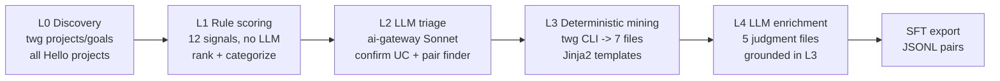

# Data Builder + Corpus Expansion Pipeline (v2.0)

## Context: what already exists, and the one correction that matters

A v1.0 plan (`atlassian-agi/data/src/_docs/_plan/00_PLAN_data_builder.md`) and a package skeleton (`atlassian_agi_data_builder/` with `cli.py` + `core/entity.py`) were authored today. The architecture is sound (5-layer funnel, pairwise failure/success framing, staged corpus sizing). I am keeping that architecture.

The **one foundational correction**: v1.0 assumes `mcp__atlassian_project__search_projects`-style MCP tools as the data path. Those are conversational, not batch-scriptable. The actually-working, JSON-emitting, scriptable path — which I verified live — is the **`twg` CLI** at `/Users/tchen7/.agents/skills/twg/scripts/twg`. Proof: `twg projects --scope all --status all --updated-since 2026-01-01 -o json` returned real Hello projects (`ATLAS-126838 Gdrive Personal Drive Group Blocklist` → `on_track`, `ATLAS-126828` → `paused`, etc.) with health labels. The data-builder's data spine must be this CLI, wrapped in a thin Python client.

### Honest capability boundary (verified)
- Runnable today via `twg` CLI: org-wide project + goal enumeration with health/status/dates; `jira` workitem/sprint/board; `confluence search`/pages (CQL + version history); `bitbucket` PRs; `work` activity projection.
- Gated / NOT runnable today: event-level mining (direct Cypher + Socrates/Databricks need `twg-graph-explorer-readonly` SSAM + Hello Databricks access — see `_shared/TWG_RECONSTRUCTION_FRAMEWORK.md` §C.2/D.1); Loom enumeration (`rovo_search` returns unknown entity); HOT incidents live on `ops.internal.atlassian.net`, a separate tenant (resolve via Confluence PIR pages + `#hot-*` channels).
- Consequence: the **honest v0 corpus granularity is inventory/governance level** — which is exactly what the 23 hand-authored cases actually are (β-tier). The "~67K–177K events" figure in the framework doc is SSAM-blocked aspiration. v0 is an **SFT** corpus; event-level RL traces are a v1 unlock contingent on SSAM.

## Two decisions I made (questions were skipped)
- Output destination: a new `atlassian-agi/data/opportunity-studies/auto/` folder mirroring the exact 12-file canonical shape — keeps the 23 hand-authored `tony/` cases pristine and provenance clean, while staying promotion-compatible.
- Data baseline: `twg` CLI only (inventory granularity). Databricks/Socrates event-level is an explicitly-optional, SSAM-gated enrichment module that no-ops gracefully when access is absent.

## Corpus size — my committed answer
**v0 = 200 dossiers: ~100 failure/at-risk + ~100 structurally-matched successes (100 pairs).** Reasoning, honestly bounded:
- 150 is the floor where domain-SFT signal beats prompt-engineering (LIMA / Tulu-style narrow-domain evidence). Below that is wasted effort.
- The organizing unit is the **pair**, not the example — 100 pairs gives pairwise contrast across all 5 frontier UCs (~20 pairs each), which is the minimum for "what distinguishes the good trajectory from the bad" rather than binary classification.
- 300 is the stretch if success-case substrate proves rich enough.
- v1 (RL-ready) = 1,000–3,000, but that is gated on SSAM event-level access; do not promise it under current access.

## The canonical 12-file dossier shape (target output, per project)
Mirrors `tony/20_patroni_pod_label_retry_gap/`: `01_project_arc.md`, `02_team_and_people_inventory.md`, `03_timeline_and_trace.md`, `04_trace_schema.yaml`, `05_frontier_lab_counterfactual.md`, `06_honest_caveats.md`, `07_substrate_artifact_index.md`, `08_jira_inventory.md`, `09_confluence_inventory.md`, `10_slack_inventory.md`, `11_bitbucket_inventory.md`, `12_loom_video_inventory.md`, plus `scripts/twg/` (rerunnable queries + methodology) and optional `hots/hot_*/`.
- ~7 of 12 files are **deterministically derivable** (02, 03, 04, 07, 08, 09, 11) from twg CLI output → built by L3, no LLM.
- ~5 files need **judgment** (01, 05, 06, README, and the hypothesis/UC-mapping prose) → filled by L4 LLM agents.
- 10 (slack) + 12 (loom) are honest-gap stubs today.

## Pipeline (each layer = a CLI subcommand + a module dir)

### L0 Discovery (`l0_discovery/`, runnable now)
- Primary: sweep `twg projects --scope all --status all --updated-since <window> -n 200 -o json` across monthly windows (status `all` requires a since-date) to enumerate all non-archived projects; also `--status completed`/`paused`/`cancelled` for terminal outcomes.
- Strategic layer: `twg goals --scope all --status all --include-contributing-projects --include-parent-goal -o json` for goal→project linkage and dependency fan.
- Write `data/l0_candidates.parquet` keyed by project key; idempotent via per-window checkpoints.

### L1 Rule-based health scoring (`l1_health/`, no LLM)
Signals computable from L0 JSON + cheap per-project `twg projects get <key>` follow-ups: health label (`off_track`/`at_risk` direct), phase-transition stall (`in_progress`→`paused`/`pending`), staleness vs cadence, goal-linkage/dependency fan, outcome-label present (`completed`/`cancelled`), cross-team owner spread. Status-oscillation and scope-churn are partial (need update history; fetch where cheap, flag honestly otherwise). Composite score + multi-label category assignment to the 5 frontier UCs + innovation health categories already enumerated in `core/entity.py`'s `FrontierCategory`. Output `data/l1_shortlist.parquet`. **Validation gate: the 23 hand-authored cases must rank in the top tier (recall test).**

### L2 LLM triage + pair finder (`l2_triage/`, ai-gateway)
- LLM path = `atlassian_packages/ai-gateway` Claude Sonnet 4.5 via SLAUTH (`quickstart_for_local_environment_claude.py` is the working reference; needs `atlas slauth server --port 5000` + SDK install).
- Classify shortlist (name + description + recent updates) → confirmed UC + confidence.
- Pair finder: for each confirmed failure, nearest `completed`+`on_track`-terminus success within same size/domain/era. Output `data/l2_winners.parquet` (~100 failures + ~100 matched successes).

### L3 Deterministic dossier mining (`l3_substrate/`, twg CLI, no LLM)
One module per derivable file, each emitting a payload rendered by Jinja2 templates into the canonical shape:
- `02` team/people ← project owner/contributors + `twg work`.
- `03` timeline ← project updates + Jira changelog + Confluence page-version history.
- `08` jira ← `twg jira` workitem/sprint/board for the project.
- `09` confluence ← `twg confluence search --cql` (space/ancestor/contributor).
- `11` bitbucket ← `twg bitbucket` PRs by linked issue.
- `04`/`07` ← templated schema + cross-source rollup.
- `10`/`12` ← honest-gap stubs with promotion notes.
Writes to `opportunity-studies/auto/<NN>_<slug>/`. Optional Databricks event-level enricher is a separate module that no-ops without SSAM.

### L4 LLM enrichment (`l4_enrichment/`, ai-gateway)
Per-project agent fills `01`, `05`, `06`, `README` strictly grounded in the L3 files (no new facts; cite file/line). Honest cost cap.

### Export (`evaluation/` + `export/`)
Corpus-quality checks (all 12 files present, anchors filled, pairs structurally similar), then JSONL SFT pairs.

## Execution approach after approval
1. Supersede `00_PLAN_data_builder.md` → v2.0 (twg-CLI spine; auto/ destination; honest capability boundary; 200-dossier target).
2. Build `core/twg_client.py` (thin wrapper over `scripts/twg`, JSON parsing, ret/caching) + `core/cache.py` + `core/checkpoint.py`.
3. Implement L0 → validate candidate count is plausible; implement L1 → run the 23-case recall gate.
4. Implement L2 (wire ai-gateway) → L3 (templates validated against case 20 by character-overlap) → L4.
5. Run end-to-end for a 5-project pilot (mix of failure + success), human-review the dossiers, iterate templates/prompts.
6. Scale: launch parallel subagents (one per project batch) to drive L3+L4 across the ~200 winners into `opportunity-studies/auto/`, then export SFT JSONL.

## Honest risks
- twg CLI rate limits / per-window pagination quirks on `--status all`; mitigate with caching + backoff.
- Success-case substrate is thinner than failure-case substrate (failures have PIRs/HOTs; successes execute silently) — score success "evidence richness" and only admit pairs above a density floor.
- L1 oscillation/scope-churn signals are partial without update-history; be explicit, don't fabricate.
- ai-gateway is staging + SLAUTH-gated; confirm access before L2/L4.
- Everything stays inside `atlassian-agi/data/`; PII/RAI scrub before any SFT use (reuse the existing `rai_scrub()` patterns).