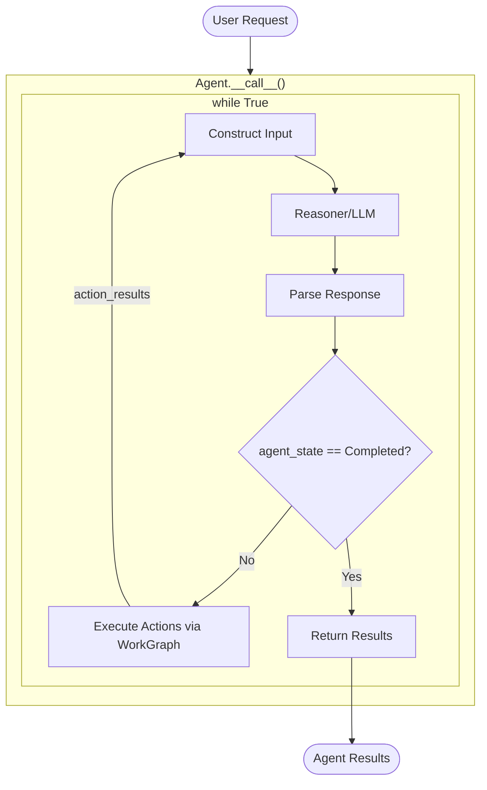
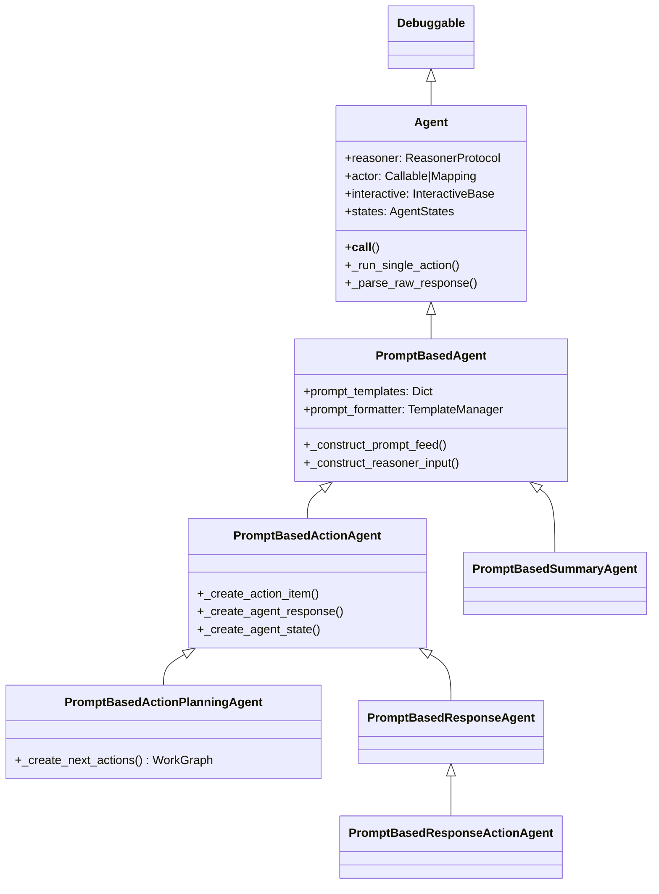

# Architecture Overview

This document covers the high-level architecture, class hierarchy, and core data structures of the Agent framework.

**Related documents:** [Execution Flow](02_execution_flow.md) | [WorkGraph](03_workgraph.md) | [State & Memory](05_state_and_memory.md)

---

## Architecture Overview

The Agent framework implements an **agentic loop pattern** where:

1. A **Reasoner** (typically an LLM) analyzes user input and decides what actions to take
2. An **Actor** executes those actions in the real world
3. The results feed back to the Reasoner for the next decision
4. This continues until the task is complete



---

## Class Hierarchy



### Class Responsibilities

| Class | Responsibility |
|-------|----------------|
| `Agent` | Core execution loop, actor management, workflow control |
| `PromptBasedAgent` | Prompt template construction, response parsing |
| `PromptBasedActionAgent` | Action parsing from structured responses (XML/JSON) |
| `PromptBasedActionPlanningAgent` | Task decomposition into sub-problems with dependency graphs |
| `PromptBasedResponseAgent` | Response-focused agents with action capabilities |
| `PromptBasedSummaryAgent` | Summarization of agent results |

---

## Core Components

### 1. Agent (`agent.py`)

The base `Agent` class is the heart of the framework. Key attributes:

```python
@attrs
class Agent(Debuggable):
    # Core processing components
    _reasoner: ReasonerProtocol      # LLM or decision-making system
    actor: Union[Callable, Mapping]   # Action executor(s)
    interactive: InteractiveBase      # User I/O interface

    # Context providers
    user_profile: Any                 # User context/preferences
    context: Any                      # Additional context

    # State management
    states: AgentStates               # History of agent states
    actor_state: Any                  # Current actor state

    # Execution control
    max_num_loops: int                # Max iterations (-1 = infinite)
    _control: AgentControls           # Stop/Pause/Continue signals
    _status: CommonWorkflowStatus     # Running/Paused/Stopped
```

### 2. AgentResponse (`agent_response.py`)

Represents what the reasoner returns:

```python
@attrs
class AgentResponse:
    raw_response: Any                 # Original LLM response
    instant_response: str             # Immediate text response to user
    instant_learnings: Mapping        # Knowledge extracted during execution
    next_actions: Iterable[Iterable[AgentAction]]  # Actions to execute
```

**Important**: `next_actions` is a nested structure:
- Outer list: Sequential action groups
- Inner list: Parallel actions within a group

```python
# Example: [[A], [B, C, D], [E]]
# Execution: A → (B, C, D in parallel) → E
```

### 3. AgentAction (`agent_response.py`)

Represents a single action:

```python
@attrs
class AgentAction:
    reasoning: str      # Why this action was chosen
    type: str           # Action category (e.g., "Navigation.VisitURL")
    target: str         # What to act on (e.g., URL)
    args: Dict          # Additional parameters
    is_follow_up: bool  # Is this a continuation?
    result: Any         # Populated after execution
    source: Any         # Source context (e.g., current URL)
```

### 4. AgentStateItem (`agent_state.py`)

Captures state at each reasoning step:

```python
@attrs
class AgentStateItem:
    new_task: bool                    # Is this a new task?
    task_status: AgentTaskStatusFlags # Completed/Ongoing/Pending
    task_status_description: str      # Human-readable status

    # Execution context
    user_input: Any
    reasoner_input: str
    raw_response: Any
    response: AgentResponse
    action_results: Any
```

---

**Next:** [Execution Flow](02_execution_flow.md)
