# Execution Flow

This document covers the complete execution flow of an agent request and the reasoner-action feedback loop.

**Related documents:** [Architecture](01_architecture.md) | [WorkGraph](03_workgraph.md) | [State & Memory](05_state_and_memory.md)

---

## Complete Flow Diagram

```mermaid
flowchart TB
    subgraph Step1["STEP 1: Resolve Input"]
        A1[_resolve_task_input_from_call_args]
        A2[_extract_user_input_and_metadata]
        A3["Extract: user_input, metadata, attachments"]
        A1 --> A2 --> A3
    end

    subgraph Step2["STEP 2: Resolve Agent Args"]
        B1["_resolve_task_input_field() for:"]
        B2["trigger_action, user_profile, context, action_results"]
        B3["Initialize states and actor_state"]
        B1 --> B2 --> B3
    end

    subgraph Step3["STEP 3: Main Loop (while True)"]
        C1["3A: _check_workflow_control()"]
        C2["3B: _construct_reasoner_input()"]
        C3["3C: Call Reasoner (LLM)"]
        C4["3D: _parse_raw_response()"]
        C5{"3E: Completed?"}
        C6["3F: Execute Actions via WorkGraph"]

        C1 --> C2 --> C3 --> C4 --> C5
        C5 -->|No| C6
        C6 -->|action_results| C1
    end

    subgraph Step4["STEP 4: Finalization"]
        D1["_get_agent_results()"]
        D2["_finalize_and_send_agent_results()"]
        D3["Return agent_results"]
        D1 --> D2 --> D3
    end

    UserRequest([User Request]) --> Step1
    Step1 --> Step2
    Step2 --> Step3
    C5 -->|Yes| Step4
    Step4 --> Output([Agent Results])
```



---

## The Reasoner-Action Loop

### Feedback Loop Mechanics

The agent implements a **closed-loop control system**:


### Key Insight: action_results vs agent_results

| Attribute | Purpose | When Updated | Format |
|-----------|---------|--------------|--------|
| `action_results` | Machine feedback for next reasoning step | After each action | Raw operational data (HTML, flags, etc.) |
| `agent_results` | Human-readable final output | Only at completion | Structured summaries (AgentActionResult) |

**Example transformation:**

```python
# action_results (raw, machine-oriented):
{
    'body_html_before': '<div class="old">...</div>',
    'body_html_after': '<div class="new">...</div>',
    'is_follow_up': False,
    'source': 'https://example.com/page'
}

# agent_results (structured, human-oriented):
AgentActionResult(
    summary='## Page Analysis\nFound 5 key items...',
    details='<structured content>',
    source='https://example.com/page',
    action='Navigation.VisitURL'
)
```

---

**Previous:** [Architecture](01_architecture.md) | **Next:** [WorkGraph](03_workgraph.md)
