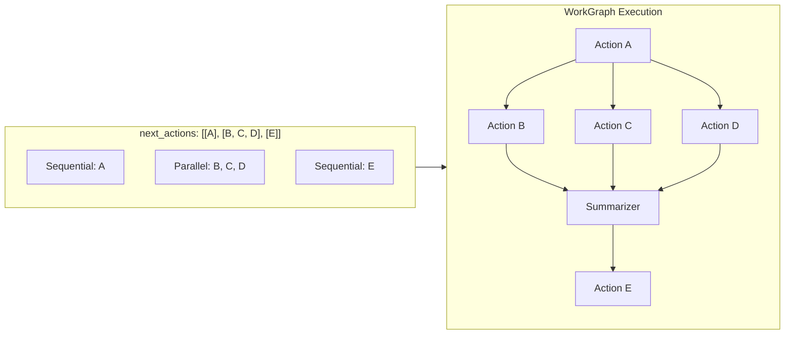
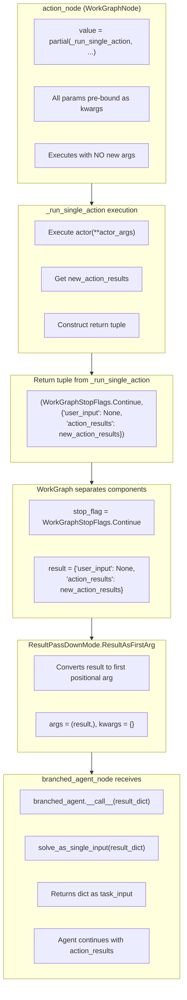
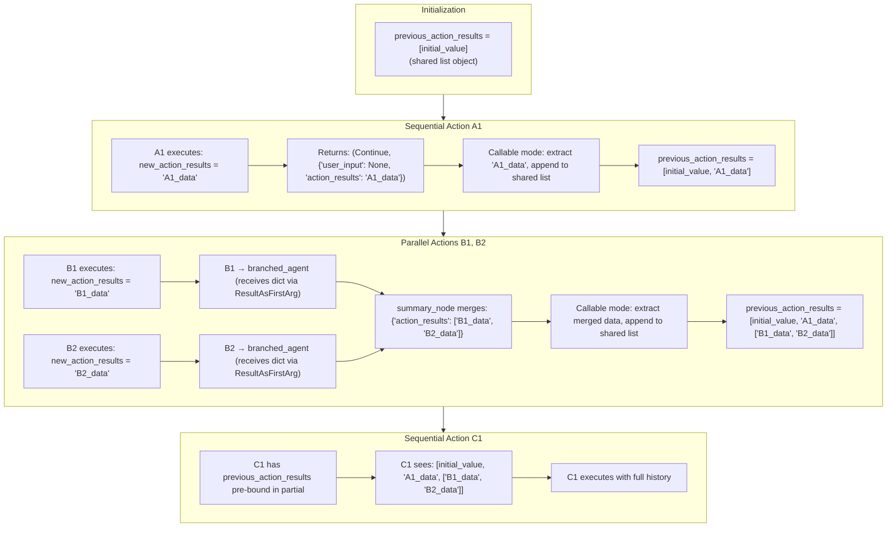
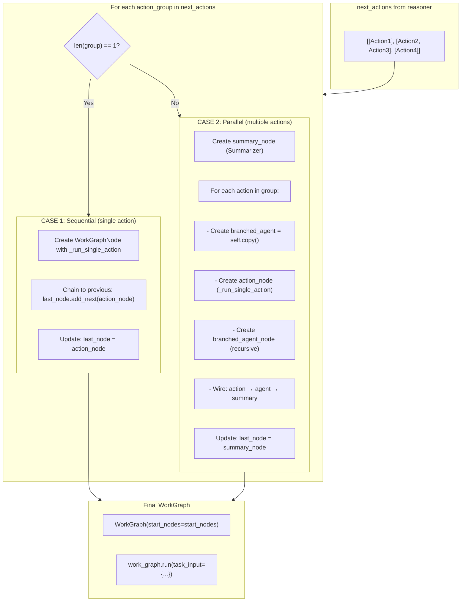
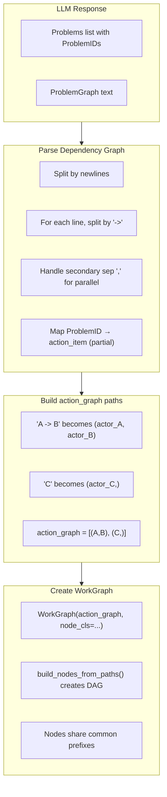
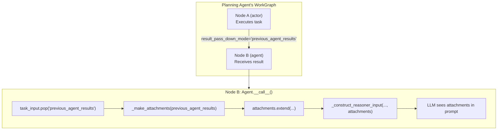
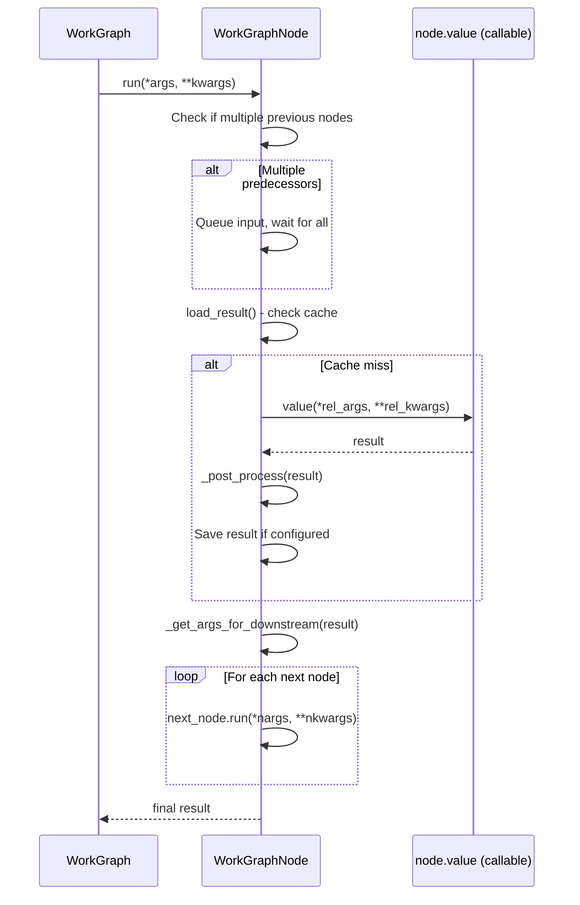
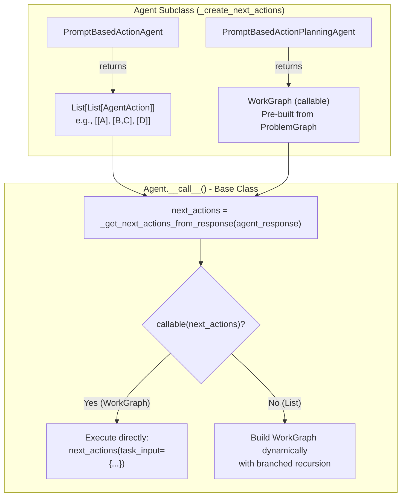

# WorkGraph Integration

This document provides a deep dive into how the Agent framework uses WorkGraph for action execution, including argument passing, graph construction methods, and the polymorphic dispatch pattern.

**Related documents:** [Execution Flow](02_execution_flow.md) | [Branching](04_branching.md) | [State & Memory](05_state_and_memory.md)

---

## What is WorkGraph?

`WorkGraph` (from `science_python_utils`) is a **Directed Acyclic Graph (DAG)** execution engine that:

1. Manages sequential and parallel execution of nodes
2. Passes results between nodes based on `result_pass_down_mode`
3. Supports saving/resuming execution state
4. Handles stop flags for early termination

## How Agent Uses WorkGraph

When the reasoner returns `next_actions`, the agent builds a WorkGraph:



## WorkGraphNode Structure

Each action becomes a `WorkGraphNode`:

```python
action_node = WorkGraphNode(
    value=partial(
        self._run_single_action,
        action=next_action,
        task_input=task_input,
        agent_state=agent_state,
        agent_response=agent_response,
        previous_action_results=action_results,
        task_input_metadata=task_input_metadata,
        attachments=attachments
    ),
    result_pass_down_mode=ResultPassDownMode.ResultAsFirstArg,
    copy_debuggable_config_from=self
)
```

## ResultPassDownMode

Controls how results flow between nodes:

| Mode | Behavior |
|------|----------|
| `NoPassDown` | Don't pass result to downstream |
| `ResultAsFirstArg` | Replace first positional arg with result |
| `ResultAsLeadingArgs` | Prepend result(s) to positional args |
| `"key_name"` (string) | Inject result into kwargs with given key |
| `Callable` | Custom function `(result, *args, **kwargs) -> Optional[(args, kwargs)]` for complex merging |

---

## Argument Passing Through WorkGraph

Understanding how results flow between WorkGraph nodes is critical to understanding the Agent's execution model. This section traces the complete argument passing flow.

### Flow Overview



### Step-by-Step Breakdown

#### Step 1: _run_single_action Returns Result Dict

[agent.py:838-844](../../../agent.py#L838-L844)

```python
def _run_single_action(self, action, task_input, agent_state,
                       agent_response, previous_action_results, ...):
    # ... execute actor ...
    new_action_results = actor(**actor_args)

    # Construct return tuple: (stop_flag, result_dict)
    return (
        WorkGraphStopFlags.Continue,
        {
            self.task_input_field_user_input: None,
            self.task_input_field_action_results: new_action_results  # Raw operational data
        }
    )
```

**Why a dict?**
- `user_input: None` signals no new user input (continuation of same task)
- `action_results` contains raw operational data for next reasoning iteration
- This structure matches what `Agent.__call__()` expects as `task_input`

#### Step 2: WorkGraph Separates Stop Flag from Result

```python
# Inside WorkGraphNode._run()
result = self.value(*rel_args, **rel_kwargs)  # Returns tuple from _run_single_action
stop_flag, result = WorkGraphStopFlags.separate_stop_flag_from_result(result)

# Now:
# stop_flag = WorkGraphStopFlags.Continue
# result = {'user_input': None, 'action_results': new_action_results}
```

#### Step 3: ResultPassDownMode Converts Dict to Positional Arg

For parallel execution, action_nodes use `result_pass_down_mode=ResultPassDownMode.ResultAsFirstArg`:

```python
def get_args_for_downstream(result, mode, args, kwargs):
    # ...
    elif mode == ResultPassDownMode.ResultAsFirstArg:
        return (result, *args[1:]), kwargs
```

**Result:**
- `args = ({'user_input': None, 'action_results': new_action_results},)`
- `kwargs = {}`

#### Step 4: branched_agent_node Receives Dict as First Arg

[agent.py:1622-1628](../../../agent.py#L1622-L1628)

```python
branched_agent_node = WorkGraphNode(
    branched_agent,  # Callable via __call__
    result_pass_down_mode=ResultPassDownMode.ResultAsFirstArg,
    id='$class-Agent'
)
```

When this node executes, it calls:

```python
branched_agent.__call__({'user_input': None, 'action_results': new_action_results})
```

#### Step 5: Agent.__call__ Processes Dict via solve_as_single_input

[agent.py:1052](../../../agent.py#L1052)

```python
def __call__(self, *args, **kwargs):
    # Called with: args = ({'user_input': None, 'action_results': ...},)

    task_input = solve_as_single_input(*args, **kwargs)
    # With single positional dict arg: returns it as-is
    # task_input = {'user_input': None, 'action_results': new_action_results}
```

**solve_as_single_input behavior** (from SciencePythonUtils):
- **Single positional arg with no kwargs**: Returns the arg as-is
- This means the dict passes through unchanged
- Later extracted: `user_input = task_input['user_input']`, `action_results = task_input['action_results']`

### Why This Design Works

This multi-step transformation achieves:

1. **Type Safety**: `_run_single_action` returns structured data (dict), not arbitrary objects
2. **Stop Flag Separation**: WorkGraph can control execution flow via stop flags
3. **Uniform Interface**: All WorkGraphNodes receive results the same way
4. **Agent Compatibility**: The dict structure matches `Agent.__call__`'s expected input format

### Sequential vs Parallel Argument Passing

The Agent uses **different result passing strategies** for sequential vs parallel execution:

#### Sequential Nodes

[agent.py:1559-1562](../../../agent.py#L1559-L1562)

```python
action_node = WorkGraphNode(
    value=partial(self._run_single_action, ...),
    result_pass_down_mode=partial(
        self._merge_action_results_to_list,
        shared_list=previous_action_results
    )
)
```

**Strategy**: Callable mode with custom merge function
- Extracts `result['action_results']` (not entire dict)
- Appends to shared `previous_action_results` list
- Returns `None` to keep original args/kwargs
- Enables accumulation across sequential actions

#### Parallel Nodes (action_node → branched_agent_node)

[agent.py:1616](../../../agent.py#L1616)

```python
action_node = WorkGraphNode(
    value=partial(branched_agent._run_single_action, ...),
    result_pass_down_mode=ResultPassDownMode.ResultAsFirstArg
)
```

**Strategy**: ResultAsFirstArg (pass entire dict)
- Branched agent needs full context (`user_input`, `action_results`)
- Dict becomes first positional arg
- `solve_as_single_input` recognizes it as task_input

#### Summary Nodes (after parallel branches)

[agent.py:1590-1593](../../../agent.py#L1590-L1593)

```python
summary_node = WorkGraphNode(
    value=self.summarizer or self._default_summarizer,
    result_pass_down_mode=partial(
        self._merge_action_results_to_list,
        shared_list=previous_action_results
    )
)
```

**Strategy**: Callable mode (same as sequential)
- Merges parallel branch results
- Appends merged results to shared list
- Makes results available to downstream sequential actions

### Complete Example: [[A1], [B1, B2], [C1]]



### Key Insights

1. **Dict Construction Point**: The result dict is constructed at the **end of `_run_single_action`** (lines 838-844)

2. **Dual Role of ResultAsFirstArg**:
   - For parallel branches: Passes full context to independent agents
   - Not used for sequential: Would cause conflicts with pre-bound kwargs

3. **Callable Mode Advantages**:
   - Extracts only needed data (`action_results` field)
   - Supports shared mutable state (list accumulation)
   - Returns `None` to preserve original args/kwargs
   - Enables result aggregation across sequential and parallel nodes

4. **shared_list Closure Pattern**:
   - All nodes share reference to same list object
   - In-place mutations visible to all downstream nodes
   - Pre-bound in partial, propagates through entire workflow

---

## WorkGraph Creation Deep Dive

The agent framework creates WorkGraphs in **two distinct ways**, depending on the agent type and use case.

### Method 1: Action-Based WorkGraph (Agent Base Class)

In `Agent.__call__()` (lines 1494-1645), a WorkGraph is built dynamically from `next_actions` returned by the reasoner.

#### When It's Used
- When `next_actions` is a **list of action groups** (not callable)
- Each action group is `List[AgentAction]`
- Structure: `[[A], [B, C, D], [E]]` where inner lists represent parallel actions

#### Construction Algorithm



#### Code Walkthrough

```python
# In Agent.__call__(), lines 1494-1609

start_nodes = last_node = None

for next_action_group in next_actions:
    if len(next_action_group) == 1:
        # SEQUENTIAL: Single action in group
        next_action = next_action_group[0]

        action_node = WorkGraphNode(
            value=partial(
                self._run_single_action,
                action=next_action,
                task_input=task_input,
                agent_state=agent_state,
                agent_response=agent_response,
                previous_action_results=action_results,
                task_input_metadata=task_input_metadata,
                attachments=attachments
            ),
            result_pass_down_mode=ResultPassDownMode.ResultAsFirstArg,
            id='$class-Actioner'
        )

        if start_nodes is None:
            start_nodes = [action_node]
        else:
            last_node.add_next(action_node)

        last_node = action_node

    else:
        # PARALLEL: Multiple actions in group
        summary_node = WorkGraphNode(
            value=self.summarizer or self._default_summarizer,
            id='$class-Summarizer'
        )

        action_nodes = []
        for next_action in next_action_group:
            # Create independent agent copy for recursion
            branched_agent = self.copy(clear_states=self.branching_agent_start_as_new)

            # Action node executes immediate action
            action_node = WorkGraphNode(
                value=partial(branched_agent._run_single_action, action=next_action, ...),
                result_pass_down_mode=ResultPassDownMode.ResultAsFirstArg,
                id='$class-Actioner'
            )

            # Agent node enables recursive agent execution
            branched_agent_node = WorkGraphNode(
                branched_agent,  # Callable via __call__
                result_pass_down_mode=ResultPassDownMode.ResultAsFirstArg,
                id='$class-Agent'
            )

            # Wire the branch
            action_node.add_next(branched_agent_node)
            branched_agent_node.add_next(summary_node)
            action_nodes.append(action_node)

        if start_nodes is None:
            start_nodes = action_nodes
        else:
            for action_node in action_nodes:
                last_node.add_next(action_node)

        last_node = summary_node

# Create and execute the WorkGraph
work_graph = WorkGraph(start_nodes=start_nodes)
work_graph_results = work_graph.run(task_input={...})
```

#### Node Types in Action-Based WorkGraph

| Node Type | ID Pattern | Value | Purpose |
|-----------|------------|-------|---------|
| **Actioner** | `$class-Actioner` | `partial(_run_single_action, ...)` | Execute a single action via actor |
| **Agent** | `$class-Agent` | `branched_agent` (callable) | Recursive agent execution for parallel branches |
| **Summarizer** | `$class-Summarizer` | `self.summarizer` or `_default_summarizer` | Merge results from parallel branches |

---

### Method 2: Path-Based WorkGraph (PromptBasedActionPlanningAgent)

In `PromptBasedActionPlanningAgent._create_next_actions()`, a WorkGraph is built from a **dependency graph** parsed from the LLM response.

#### When It's Used
- When a **planning agent** decomposes a task into sub-problems
- The LLM returns a `ProblemGraph` specifying dependencies
- Structure: Text-based graph like `"A -> B -> C\nD"` (A leads to B leads to C, D is independent)

#### LLM Response Format

```xml
<StructuredResponse>
  <Problems>
    <Problem>
      <Request>Search for Starbucks recipe</Request>
      <ProblemID>SUGGEST_RECIPE_STARBUCKS</ProblemID>
    </Problem>
    <Problem>
      <Request>Order from Starbucks</Request>
      <ProblemID>ORDER_STARBUCKS</ProblemID>
    </Problem>
    <Problem>
      <Request>Order from McDonald's</Request>
      <ProblemID>ORDER_MCDONALDS</ProblemID>
    </Problem>
  </Problems>
  <ProblemGraph>
    SUGGEST_RECIPE_STARBUCKS -> ORDER_STARBUCKS
    ORDER_MCDONALDS
  </ProblemGraph>
</StructuredResponse>
```

#### Construction Algorithm



#### Code Walkthrough

```python
# In PromptBasedActionPlanningAgent._create_next_actions()

def _create_next_actions(self, action_items: List, raw_response_parse: Mapping):
    if self.response_field_action_graph in raw_response_parse:
        raw_graph_text = strip_(raw_response_parse[self.response_field_action_graph])

        # Build mapping: ProblemID → actor (partial function)
        action_id_to_action_items_map = {
            action_item.name: action_item
            for action_item in action_items
        }

        # Parse graph text into paths
        # "A -> B -> C\nD" → [["A", "B", "C"], ["D"]]
        raw_action_dependency_texts = split_(raw_graph_text, sep='\n')

        action_graph = []
        for raw_action_dependency_text in raw_action_dependency_texts:
            if not raw_action_dependency_text:
                continue

            # Split by "->" to get sequential dependencies
            action_item_names = split_(raw_action_dependency_text, sep=self.action_sep)

            # Handle "," for parallel alternatives (Cartesian product)
            for action_path in product(*map(
                lambda x: split_(x, sep=self.secondary_action_sep),
                action_item_names
            )):
                action_graph.append(tuple(
                    action_id_to_action_items_map[action_item_name]
                    for action_item_name in action_path
                ))
    else:
        # No graph specified - linear dependency
        action_graph = (action_items,)

    # Create WorkGraph from paths
    return WorkGraph(
        action_graph,
        node_cls=partial(
            WorkGraphNode,
            result_pass_down_mode=self.task_input_field_previous_agent_results
        )
    )
```

#### How `build_nodes_from_paths` Works

The `WorkGraph` constructor (via `DirectedAcyclicGraph`) uses `build_nodes_from_paths()` to convert path sequences into a DAG:

```python
# From rich_python_utils/algorithms/graph/dag.py

def build_nodes_from_paths(paths, node_cls=Node):
    """
    Converts paths like:
      [["A", "B", "C"], ["A", "B", "D"], ["X", "Y"]]

    Into a DAG:
          A ──► B ──► C
               │
               └──► D
          X ──► Y

    Key features:
    - Merges common prefixes (A→B is shared)
    - Returns only start nodes (A, X)
    - Nodes store callable values
    """
    all_nodes = {}

    for path in paths:
        prev_node = None
        for value in path:
            current_node = all_nodes.get(value)
            if current_node is None:
                current_node = node_cls(value=value)
                all_nodes[value] = current_node

            if prev_node is not None:
                prev_node.add_next(current_node)

            prev_node = current_node

    # Return nodes with no predecessors
    return [n for n in all_nodes.values() if not n.previous]
```

#### Example: Graph Text to WorkGraph

```
Input ProblemGraph:
  "SUGGEST_RECIPE -> ORDER_STARBUCKS
   ORDER_MCDONALDS"

Parsed paths:
  [
    (actor_SUGGEST_RECIPE, actor_ORDER_STARBUCKS),
    (actor_ORDER_MCDONALDS,)
  ]

Resulting DAG:
  SUGGEST_RECIPE ──► ORDER_STARBUCKS
  ORDER_MCDONALDS

Start nodes: [SUGGEST_RECIPE, ORDER_MCDONALDS]
```

---

### Comparison: Two WorkGraph Creation Methods

| Aspect | Method 1 (Agent Base) | Method 2 (Planning Agent) |
|--------|----------------------|---------------------------|
| **Trigger** | `next_actions` is list of action groups | `next_actions` is callable (WorkGraph) |
| **Input Format** | `[[A], [B,C], [D]]` nested lists | Text graph `"A -> B\nC"` |
| **Node Values** | `partial(_run_single_action, ...)` | `partial(self.actor, **args)` |
| **Branching** | Creates `branched_agent` copies | Uses `build_nodes_from_paths` |
| **Recursion** | Agent nodes enable recursive calls | Nodes are simple actors |
| **Parallel Handling** | Multiple actions in inner list | Comma-separated in graph text |
| **Result Passing** | `ResultPassDownMode.ResultAsFirstArg` | String key (`previous_agent_results`) |

---

### Result Passing: previous_agent_results → Attachments

When using `PromptBasedActionPlanningAgent`, results from predecessor nodes are passed to successor nodes via the `previous_agent_results` named argument. The receiving agent then converts these results into **attachments** for its reasoner.



#### Code Flow (Agent.__call__ lines 1214-1229)

```python
# In Agent.__call__():

# 1. Extract previous_agent_results from task_input (passed as named kwarg)
previous_agent_results = task_input.pop(self.task_input_field_previous_agent_results, None)

# 2. Convert to attachments if present
if previous_agent_results is not None:
    attachments.extend(self._make_attachments(previous_agent_results))

# 3. Later, attachments are passed to the reasoner
reasoner_input = self._construct_reasoner_input(
    task_input=task_input_metadata,
    user_input=user_input,
    user_profile=user_profile,
    context=context,
    action_results=action_results,
    attachments=attachments  # Includes previous agent's results
)
```

#### Why This Design?

This pattern enables **context propagation** through the dependency graph:

1. **Task A** completes and produces a result (e.g., search results)
2. **Task B** depends on Task A → receives Task A's result as `previous_agent_results`
3. Task B's agent converts this to attachments → LLM can see and use the information
4. Task B can make informed decisions based on Task A's output

This is how `PromptBasedActionPlanningAgent` achieves **information flow** between decomposed sub-tasks without requiring the LLM to re-execute previous steps.

---

### WorkGraph Node Lifecycle



---

### Key Insight: Callable vs List next_actions

The critical branching point in `Agent.__call__()` is:

```python
next_actions = self._get_next_actions_from_response(agent_response)

if callable(next_actions):
    # Planning agent already built a WorkGraph
    # Just execute it directly
    action_results = next_actions(task_input={...})
else:
    # Action agent returned list of action groups
    # Build WorkGraph dynamically with branched recursion
    start_nodes = last_node = None
    for next_action_group in next_actions:
        # ... build nodes ...
    work_graph = WorkGraph(start_nodes=start_nodes)
    work_graph_results = work_graph.run(task_input={...})
```

This design allows:
- **PromptBasedActionPlanningAgent**: Return a pre-built WorkGraph for task decomposition
- **PromptBasedActionAgent**: Return action groups for dynamic graph construction with recursion

---

### Polymorphic WorkGraph Dispatch Pattern

The agent framework uses a **polymorphic dispatch pattern** where different agent subclasses can override `_create_next_actions()` to return different types, and the base `Agent.__call__()` handles both cases:



#### How It Works

1. **PromptBasedActionAgent** (and subclasses like `PromptBasedResponseActionAgent`):
   - `_create_next_actions()` returns a **list of action groups**: `[[A], [B, C], [D]]`
   - The base `Agent.__call__()` detects this is NOT callable
   - Agent builds its own WorkGraph with **branched recursion** (creating agent copies for parallel execution)

2. **PromptBasedActionPlanningAgent**:
   - `_create_next_actions()` **overrides** the parent method
   - Parses `ProblemGraph` text from LLM response
   - Returns a **pre-built WorkGraph object** (which is callable via `__call__` → `run()`)
   - The base `Agent.__call__()` detects this IS callable
   - Agent **executes it directly** without building its own WorkGraph

#### Why This Design?

| Agent Type | Control Over Graph Structure | Recursion Support |
|------------|------------------------------|-------------------|
| **Planning Agent** | Full control - defines exact dependency graph from LLM | No (simple actors) |
| **Action Agent** | Delegates to base class | Yes (branched agents) |

This polymorphic pattern allows:
- **Planning agents** to decompose complex tasks with explicit dependency graphs
- **Action agents** to leverage the base class's sophisticated branching/recursion mechanism
- **Future agent types** to define their own WorkGraph creation strategies

---

**Previous:** [Execution Flow](02_execution_flow.md) | **Next:** [Branching](04_branching.md)
