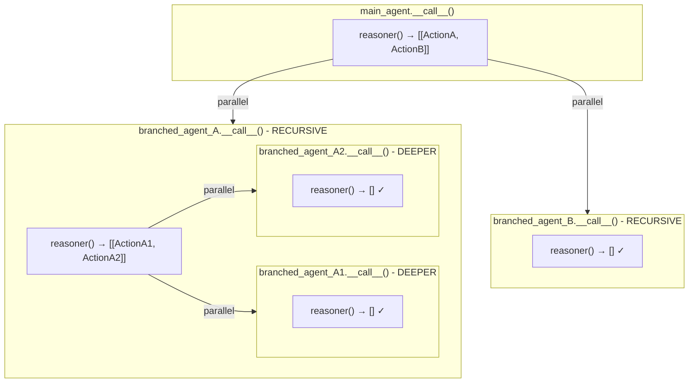

# Branched Recursion

This document explains how the agent handles parallel actions through branched recursion — creating independent copies of itself that can further branch.

**Related documents:** [WorkGraph](03_workgraph.md) | [State & Memory](05_state_and_memory.md)

---

## The Key Insight

When the agent encounters **parallel actions**, it creates **copies of itself** (branched agents) that can independently:

- Make their own decisions
- Execute their own actions
- Create MORE branches (unbounded recursion depth)

## Recursion Mechanics

```python
# In Agent.__call__(), when handling parallel actions:

for next_action in next_action_group:  # Multiple actions = parallel
    # 1. Create independent agent copy
    branched_agent = self.copy(clear_states=self.branching_agent_start_as_new)

    # 2. Create action node for immediate action
    action_node = WorkGraphNode(
        value=partial(branched_agent._run_single_action, action=next_action, ...)
    )

    # 3. Create recursive agent node (THIS IS THE KEY!)
    branched_agent_node = WorkGraphNode(
        branched_agent,  # Agent is callable via __call__
        ...
    )

    # 4. Wire: action → recursive_agent → summary
    action_node.add_next(branched_agent_node)
    branched_agent_node.add_next(summary_node)
```

## Visual Recursion Tree



## Termination

Each recursive `__call__` terminates when its reasoner returns no `next_actions`, setting `agent_state == Completed`.

---

**Previous:** [WorkGraph](03_workgraph.md) | **Next:** [State & Memory](05_state_and_memory.md)
