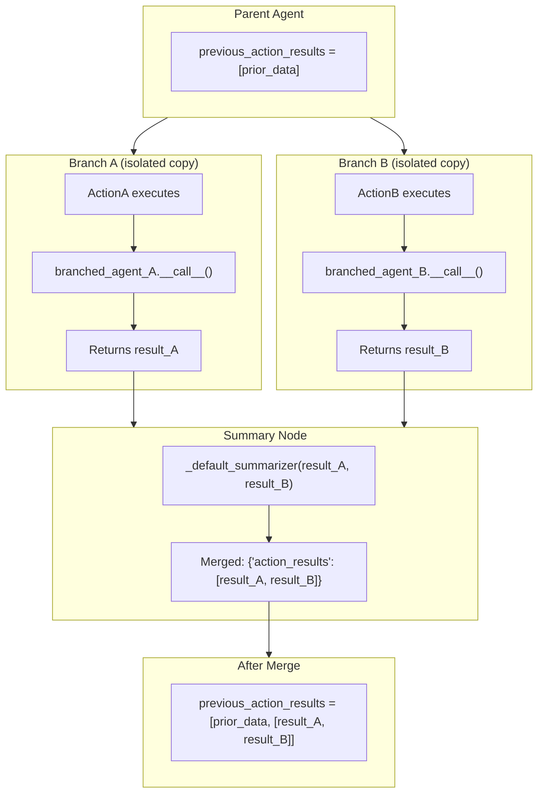
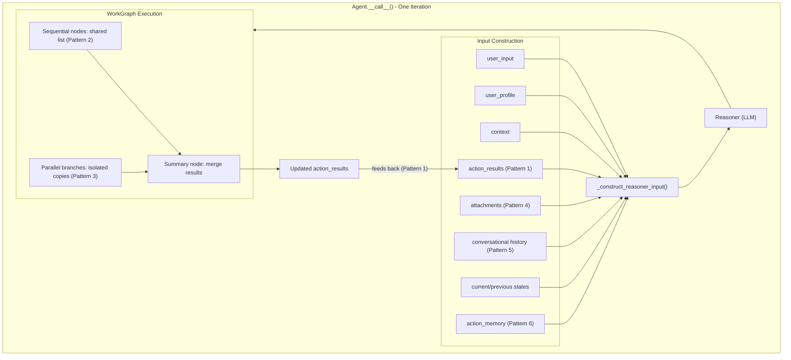

# State and Memory Propagation

This document provides a comprehensive explanation of how memory and state flow between nodes during agent execution. It covers the six distinct memory propagation patterns, data structure lifecycles, and the mechanisms that enable ancestor nodes to provide context to descendant nodes.

**Related documents:** [Execution Flow](02_execution_flow.md) | [WorkGraph](03_workgraph.md) | [Branching](04_branching.md)

---

## Overview: Six Memory Flow Patterns

The agent framework has six distinct patterns for propagating memory and state:

```mermaid
flowchart TB
    subgraph P1["Pattern 1: Feedback Loop"]
        A1["action_results from iteration N"] --> B1["reasoner input for iteration N+1"]
    end

    subgraph P2["Pattern 2: Sequential Accumulation"]
        A2["shared mutable list"] --> B2["_merge_action_results_to_list()"]
    end

    subgraph P3["Pattern 3: Parallel Branch Isolation"]
        A3["self.copy()"] --> B3["independent agent per branch"]
    end

    subgraph P4["Pattern 4: Cross-Agent DAG"]
        A4["previous_agent_results"] --> B4["→ attachments → prompt"]
    end

    subgraph P5["Pattern 5: Conversational History"]
        A5["self.states accumulation"] --> B5["full conversation in prompt"]
    end

    subgraph P6["Pattern 6: Action Memory"]
        A6["action_memory.memory field"] --> B6["dedicated prompt placeholder"]
    end
```



| Pattern | Scope | Mechanism | Data Structure |
|---------|-------|-----------|----------------|
| Feedback Loop | Within agent iterations | `action_results` passed to reasoner | Dict |
| Sequential Accumulation | Within one WorkGraph | `_merge_action_results_to_list()` | Shared mutable list |
| Parallel Branch Isolation | Across parallel branches | `self.copy()` creates independent agents | Agent copy |
| Cross-Agent DAG | Between planning DAG nodes | `previous_agent_results` → `AgentAttachment` | Attachments |
| Conversational History | Across all iterations | `self.states` walked chronologically | `AgentStates` list |
| Action Memory | Per action result | `action_memory.memory` extraction | String |

---

## Pattern 1: Feedback Loop Within Agent Iterations

This is the primary memory mechanism. After each WorkGraph execution, `action_results` is extracted and fed back to the next reasoner call.

### Flow

```
Iteration 1: reasoner(user_input) → action → action_results_1
Iteration 2: reasoner(action_results=action_results_1) → action → action_results_2
Iteration 3: reasoner(action_results=action_results_2) → ...
```

### How action_results Feeds Back

At the end of each WorkGraph execution, the agent extracts `action_results` from the final WorkGraph result:

```python
# agent.py:1620-1628
work_graph_final_result = (
    work_graph_results[-1]
    if isinstance(work_graph_results, Sequence)
    else work_graph_results
)

# UPDATE action_results for next iteration
user_input = work_graph_final_result[self.task_input_field_user_input]
agent_state.action_results = action_results = (
    work_graph_final_result[self.task_input_field_action_results]
)
# Loop continues: the agent will call the reasoner again with updated action_results
```

### How the Reasoner Receives action_results

In `PromptBasedAgent._construct_prompt_feed()`, `action_results` is formatted as XML and injected into the prompt template:

```python
# prompt_based_agent.py:322-329
if action_results:
    feed[self.prompt_placeholder_action_result] = self._get_action_result_string(action_results)
```

The formatting converts action_results to XML:

```python
# prompt_based_agent.py:206-218
def _get_action_result_string(self, action_results):
    _action_results = []
    for _action_result in iter_(action_results):
        if isinstance(_action_result, AgentAction):
            _action_results.append({
                'ActionType': _action_result.type,
                'ActionResult': str(_action_result.result)
            })
        else:
            _action_results.append({'ActionResult': str(_action_result)})
    return mapping_to_xml(_action_results, root_tag='ActionResults', include_root=True)
```

The LLM sees the previous action's results in a format like:

```xml
<ActionResults>
  <Action>
    <ActionType>Navigation.VisitURL</ActionType>
    <ActionResult>{'body_html_after': '<div>...', 'source': 'https://...'}</ActionResult>
  </Action>
</ActionResults>
```

### action_results Lifecycle Example

```
ITERATION 1 (first call, no prior results):
  action_results = None
  → Reasoner receives prompt WITHOUT {action_result} placeholder filled
  → Action executes: actor returns {'body_html': '...', 'source': 'https://...'}
  → action_results = {'body_html': '...', 'source': 'https://...'}

ITERATION 2:
  action_results = {'body_html': '...', 'source': 'https://...'}
  → Reasoner receives prompt WITH {action_result} = "<ActionResults>...</ActionResults>"
  → Action executes: actor returns {'search_results': [...], 'query': '...'}
  → action_results = {'search_results': [...], 'query': '...'}
  (NOTE: action_results is REPLACED, not accumulated — only the latest action's result)

ITERATION 3:
  action_results = {'search_results': [...], 'query': '...'}
  → Reasoner sees only the LATEST action's results
  → If completed, loop exits
```

**Key insight**: Within the main agent loop, `action_results` is **replaced** each iteration — it holds only the most recent action's result. Accumulation across sequential actions within a single iteration happens via Pattern 2.

---

## Pattern 2: Sequential Node Accumulation

When multiple sequential actions execute within a single WorkGraph (i.e., `next_actions = [[A], [B], [C]]`), results accumulate via a **shared mutable list** using a closure pattern.

### The Mechanism: `_merge_action_results_to_list()`

```python
# agent.py:845-869
def _merge_action_results_to_list(self, result, shared_list, *_args, **_kwargs):
    """
    Extract action_results from result dict and append to shared list.
    Used as result_pass_down_mode callable for sequential WorkGraph nodes.
    """
    if isinstance(result, dict) and self.task_input_field_action_results in result:
        action_results_data = result[self.task_input_field_action_results]
        append_(action_results_data, arr=shared_list)
    return None  # Keeps original args/kwargs, shared_list mutated in-place
```

### How It Works

```python
# In Agent.__call__(), when building sequential action nodes:
# agent.py:1497-1508

previous_action_results = [action_results]  # Shared mutable list

action_node = WorkGraphNode(
    value=partial(self._run_single_action, ...),
    result_pass_down_mode=partial(
        self._merge_action_results_to_list,
        shared_list=previous_action_results  # Closure over shared list
    )
)
```

### Step-by-Step Example

```
SETUP:
  next_actions = [[ActionA], [ActionB], [ActionC]]
  previous_action_results = [initial_value]  (shared list, created once)

ActionA EXECUTES:
  _run_single_action returns: {'user_input': None, 'action_results': 'A_data'}
  _merge_action_results_to_list extracts 'A_data', appends to shared_list
  previous_action_results = [initial_value, 'A_data']

ActionB EXECUTES:
  (previous_action_results already pre-bound in partial, sees accumulated list)
  _run_single_action returns: {'user_input': None, 'action_results': 'B_data'}
  _merge_action_results_to_list extracts 'B_data', appends to shared_list
  previous_action_results = [initial_value, 'A_data', 'B_data']

ActionC EXECUTES:
  previous_action_results = [initial_value, 'A_data', 'B_data']
  → ActionC's actor can see ALL prior results via its previous_action_results parameter
  _run_single_action returns: {'user_input': None, 'action_results': 'C_data'}
  previous_action_results = [initial_value, 'A_data', 'B_data', 'C_data']
```

### Key Design Detail

The `partial()` closure captures a **reference** to the same list object. All sequential nodes see the same list. When any node appends to it, all downstream nodes see the update because:
- `previous_action_results` is a Python list (mutable)
- `partial(self._run_single_action, ..., previous_action_results=previous_action_results)` captures the list reference
- In-place `append_()` mutates the shared object

---

## Pattern 3: Parallel Branch State Isolation

When the agent encounters parallel actions (e.g., `next_actions = [[A, B, C]]`), it creates **independent copies** of itself for each branch.

### The Copying Mechanism

```python
# agent.py:1537-1538
branched_agent = self.copy(clear_states=self.branching_agent_start_as_new)
```

### What `branching_agent_start_as_new` Controls

| Value | Behavior | Use Case |
|-------|----------|----------|
| `True` | Branch starts with **empty** `states` | Branch doesn't need parent's history |
| `False` | Branch **inherits** parent's `states` | Branch needs conversational context |

### Branch Isolation

Each branch gets:
- Its own agent copy with independent `states`
- Its own `_run_single_action` → `branched_agent_node` chain
- Its own reasoner calls and action execution loop

Branches **cannot** communicate with each other during execution. They are fully isolated.

### How Parallel Results Merge

All parallel branches converge at a shared `summary_node`:

```python
# agent.py:833-843
def _default_summarizer(self, *args, **kwargs):
    """Default summarizer that merges results from parallel branches."""
    return {
        self.task_input_field_user_input: None,
        self.task_input_field_action_results: args[0] if args else None
    }
```

The summarizer receives all branch results as positional args and produces a single merged result dict. This merged result then:
1. Gets appended to the shared `previous_action_results` list (via `_merge_action_results_to_list` on the summary node)
2. Becomes available to any subsequent sequential action nodes

### Visual: Parallel Isolation and Merge



---

## Pattern 4: Cross-Agent Result Passing (Planning DAG)

In `PromptBasedActionPlanningAgent`, the LLM decomposes tasks into sub-problems with dependencies. Results from predecessor nodes must be visible to successor nodes.

### The Mechanism: previous_agent_results → Attachments

```mermaid
flowchart LR
    NodeA["Node A completes<br/>Returns result"] -->|"result_pass_down_mode=<br/>'previous_agent_results'"| NodeB
    NodeB["Node B receives<br/>kwargs['previous_agent_results']"]
    NodeB --> Extract["task_input.pop('previous_agent_results')"]
    Extract --> Convert["_make_attachments(result)"]
    Convert --> Attach["AgentAttachment(id, description, content)"]
    Attach --> Prompt["Included in _construct_reasoner_input()"]
    Prompt --> LLM["LLM sees ancestor's result"]
```



### Code Flow

```python
# agent.py:1180-1188 (inside Agent.__call__())
#
# When a node in the Planning Agent's WorkGraph completes:
#   1. WorkGraph passes result to next node as kwargs['previous_agent_results']
#   2. Node B (this agent) extracts it here from task_input
#   3. _make_attachments() converts the result into AgentAttachment objects
#   4. Attachments are included in _construct_reasoner_input() for the LLM to see
#
previous_agent_results = task_input.pop(self.task_input_field_previous_agent_results, None)
if previous_agent_results is not None:
    attachments.extend(self._make_attachments(previous_agent_results))
```

### How Attachments Appear in the Prompt

The `_construct_prompt_feed()` method converts attachments to strings and injects them into the prompt template:

```python
# prompt_based_agent.py:337-338
if attachments:
    feed[self.prompt_placeholder_attachments] = '\n'.join(
        str(attachment) for attachment in attachments
    )
```

Each `AgentAttachment` has:
- `id`: The task label (e.g., "FETCH_URLS")
- `description`: "The result of the 'FETCH_URLS' agent"
- `content`: The full result object

### Difference from Pattern 1

| Aspect | Pattern 1 (Feedback Loop) | Pattern 4 (Cross-Agent) |
|--------|--------------------------|------------------------|
| **Scope** | Within single agent's iterations | Between different agents in a DAG |
| **Data Format** | XML via `{action_result}` placeholder | Attachments via `{attachments}` placeholder |
| **Mechanism** | Direct `action_results` variable | `task_input.pop()` → `_make_attachments()` |
| **Who Sets It** | `_run_single_action` return value | WorkGraph's `result_pass_down_mode` string key |

---

## Pattern 5: Conversational History

When `use_conversational_user_input=True`, the agent builds a full conversation history from its `states` list.

### How It Works

```python
# prompt_based_agent.py:178-190
def _get_user_input_string(self, user_input, conversational):
    if conversational:
        conversation = []
        for agent_state in self.states:
            if isinstance(agent_state, AgentStateItem):
                # Add prior USER inputs
                for _user_input in iter_(agent_state.user_input):
                    conversation.append(self._format_input_string(_user_input))
                # Add prior AGENT responses
                agent_response = agent_state.response.instant_response
                if agent_response:
                    conversation.append(self._format_response_string(agent_response))
        # Add current user input
        if user_input:
            conversation.append(self._format_input_string(user_input))
        return join_(conversation, sep='\n')
```

### Result

The `{conversation}` (or `{user_input}`) placeholder in the prompt template gets filled with:

```
User: Tell me about quantum computing
Agent: Quantum computing is a type of computation...
User: What are qubits?
Agent: Qubits are the fundamental units...
User: How do they differ from classical bits?
```

### State Accumulation

Each iteration appends a new `AgentStateItem` to `self.states`:

```python
# Each AgentStateItem contains:
AgentStateItem(
    new_task=False,
    task_status=AgentTaskStatusFlags.Ongoing,
    task_status_description="Researching quantum computing",
    user_input="Tell me about quantum computing",
    reasoner_input="<full prompt>",
    raw_response="<LLM output>",
    response=AgentResponse(instant_response="Quantum computing is..."),
    action_results={'search_results': [...]}
)
```

The `self.states` list grows monotonically — no pruning occurs.

---

## Pattern 6: Action Memory (Specialized)

Actions can surface specific "memories" beyond raw results. If `action_results` contains a nested `action_memory.memory` field, it is extracted and placed in a dedicated prompt placeholder.

### Extraction Logic

```python
# prompt_based_agent.py:220-229
def _get_action_memory_string(self, action_results):
    if isinstance(action_results, AgentAction):
        action_results = action_results.result

    action_memory = get_(get_(action_results, 'action_memory'), 'memory')

    if action_memory:
        return action_memory
    return None
```

### How It Appears in the Prompt

```python
# prompt_based_agent.py:327-329
action_memory = self._get_action_memory_string(action_results)
if action_memory:
    feed[self.prompt_placeholder_action_memory] = action_memory
```

This means the prompt template can have BOTH:
- `{action_result}` — Full XML-formatted action results
- `{action_memory}` — Just the extracted memory string

This allows actors to provide a concise summary or key findings separately from their full raw output.

---

## State Data Structures

### AgentStates

A container that holds the ordered list of all `AgentStateItem` objects, one per agent iteration:

```python
# Conceptually:
self.states = [
    AgentStateItem(...)  # Iteration 1
    AgentStateItem(...)  # Iteration 2
    AgentStateItem(...)  # Iteration 3
    ...
]
```

### AgentStateItem Fields

| Field | Type | Purpose |
|-------|------|---------|
| `new_task` | `bool` | Whether this iteration started a new task |
| `task_status` | `AgentTaskStatusFlags` | `Completed`, `Ongoing`, or `Pending` |
| `task_status_description` | `str` | Short human-readable status |
| `task_status_description_extended` | `str` | Detailed status (used in `{current_state}` placeholder) |
| `user_input` | `Any` | The user input for this iteration |
| `reasoner_input` | `str` | The full prompt sent to the LLM |
| `raw_response` | `Any` | The raw LLM response |
| `response` | `AgentResponse` | Parsed response with `instant_response`, `next_actions`, `instant_learnings` |
| `action_results` | `Any` | Raw operational data from executed action |

### State Strings in the Prompt

The `_get_state_strings()` method extracts current and previous states for the prompt:

```python
# prompt_based_agent.py:231-280
def _get_state_strings(self):
    # Walks self.states backward
    # Skips None states and Pending states
    # Returns: (current_state_string, previous_states_string)
```

- `{current_state}` — The most recent non-Pending state's description
- `{previous_states}` — All prior non-Pending state descriptions, joined by newlines

---

## Summary: Complete Memory Flow Through a WorkGraph Execution



---

**Previous:** [Branching](04_branching.md) | **Next:** [Data Flow](06_data_flow.md)
