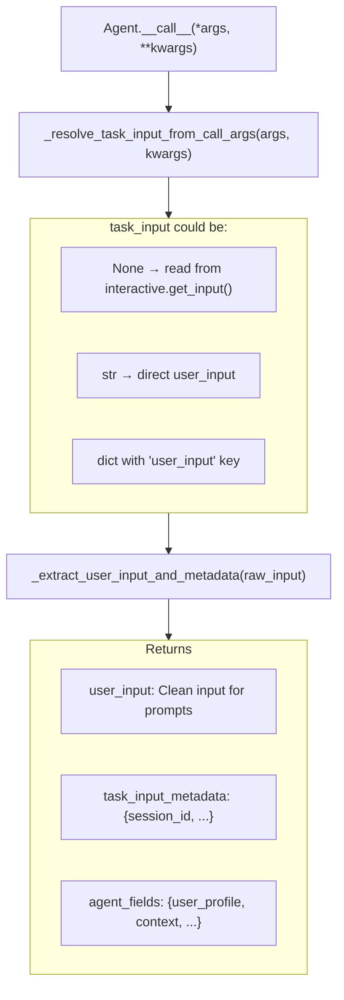
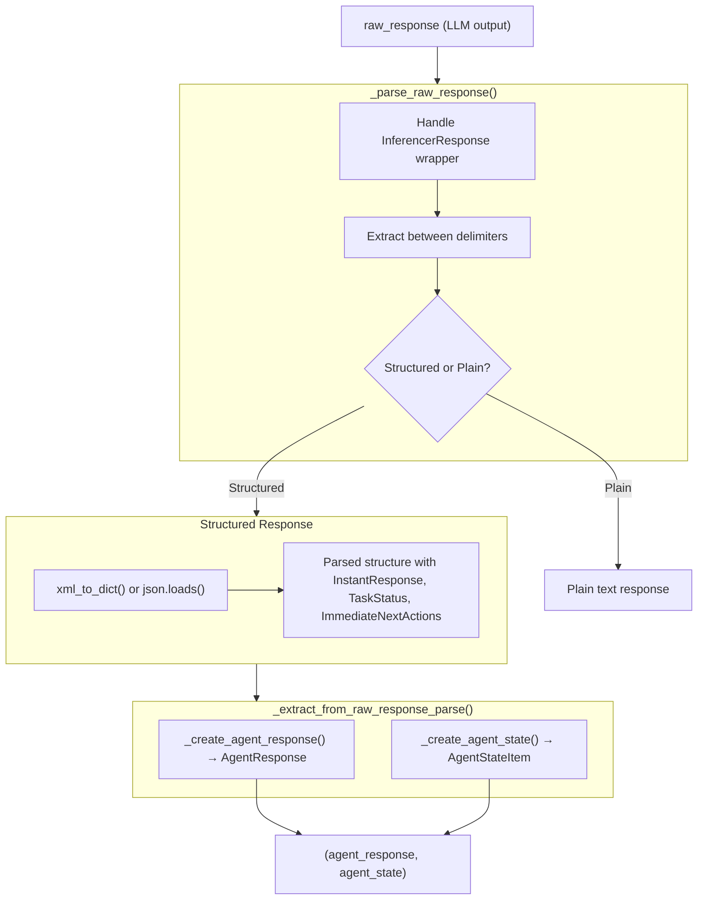
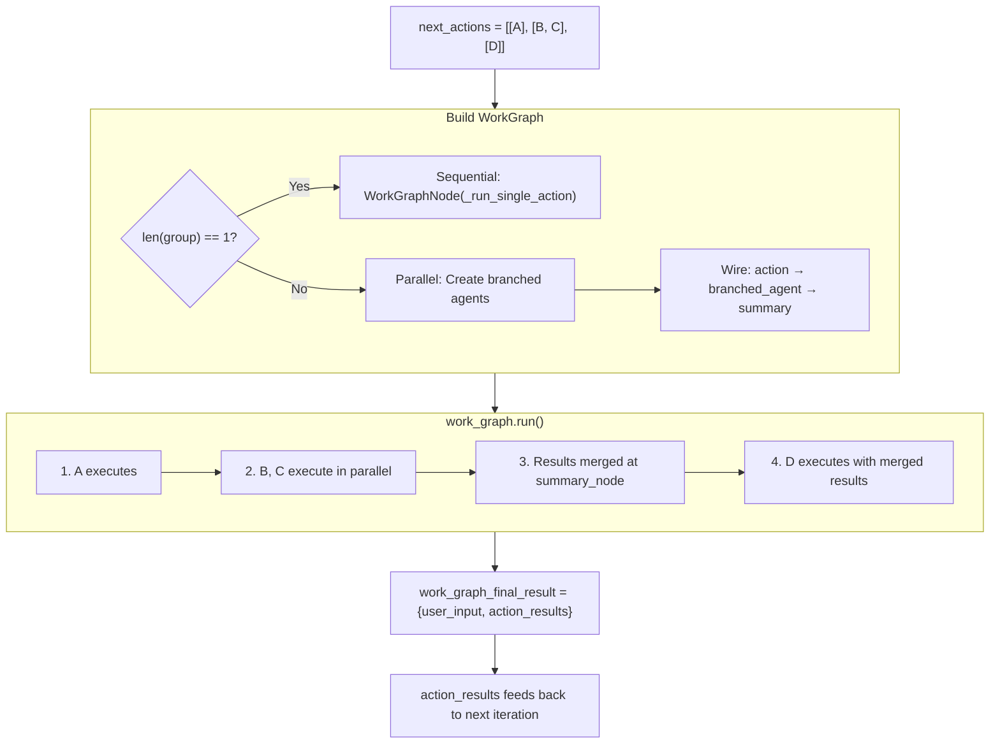

# Data Flow Diagrams

Visual diagrams showing how data flows through the agent framework at key stages.

**Related documents:** [Execution Flow](02_execution_flow.md) | [WorkGraph](03_workgraph.md) | [State & Memory](05_state_and_memory.md)

---

## Input Resolution Flow

## Response Parsing Flow (PromptBasedActionAgent)

## Action Execution Flow

---

**Previous:** [State & Memory](05_state_and_memory.md) | **Next:** [API Reference](07_api_reference.md)
