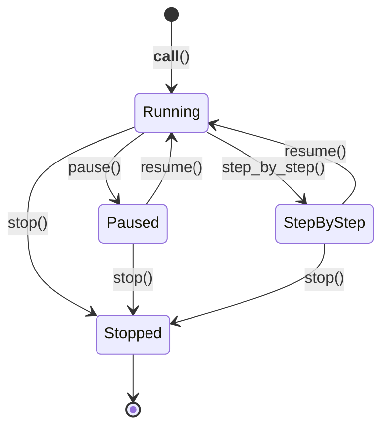

# Workflow Control

This document covers the agent's runtime control mechanisms and a summary of the framework's key architectural insights.

**Related documents:** [Execution Flow](02_execution_flow.md) | [State & Memory](05_state_and_memory.md)

---

## Workflow Control

The agent supports real-time control through:

```python
agent.stop()         # Terminate execution
agent.pause()        # Pause (blocking)
agent.resume()       # Resume from pause
agent.step_by_step() # Execute one step at a time
```



Control is checked at the start of each loop iteration via `_check_workflow_control()`.

---

## Summary

The Agent framework implements a sophisticated agentic loop with:

1. **Flexible input handling** - Supports direct calls, queue-based I/O, and structured task inputs
2. **Template-based prompting** - PromptBasedAgent handles prompt construction with placeholders
3. **Structured response parsing** - XML/JSON parsing with type coercion
4. **Sequential and parallel execution** - WorkGraph manages complex action dependencies
5. **Unbounded recursion** - Branched agents can spawn more agents infinitely
6. **State management** - AgentStates tracks full execution history
7. **Workflow control** - Stop/pause/resume capabilities for debugging

The key architectural insight is the separation between:
- **action_results**: Raw operational feedback for the reasoning loop
- **agent_results**: Human-readable summaries for final output

---

**Previous:** [Examples](08_examples.md) | **Next:** [Knowledge Integration](10_knowledge_integration.md)
