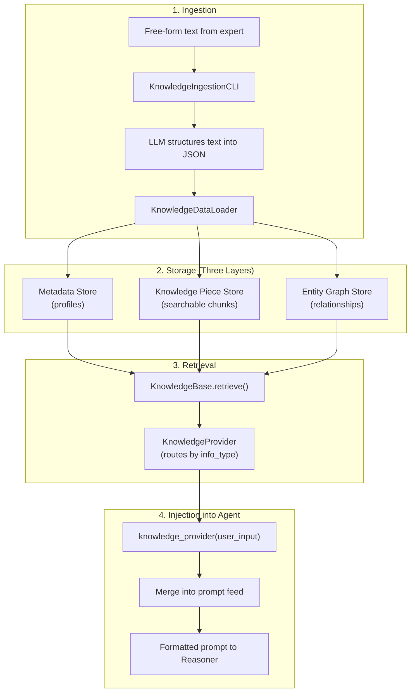
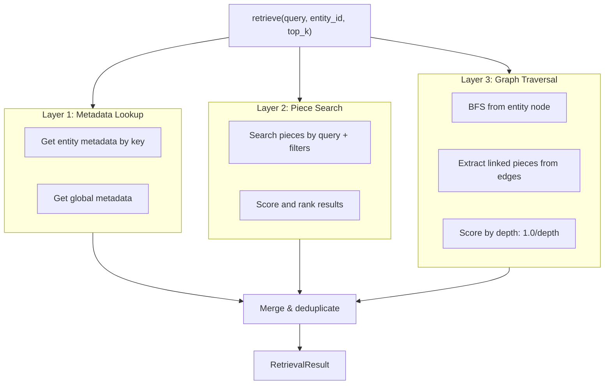
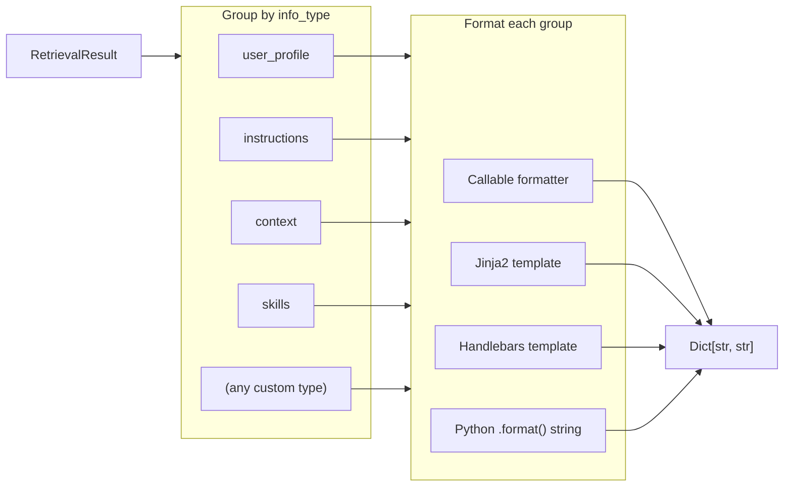
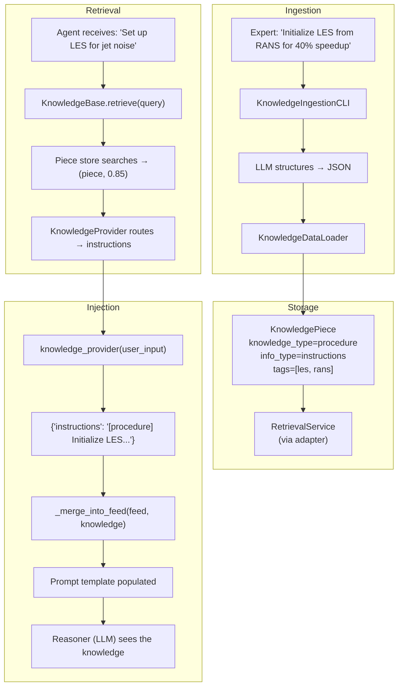

# Knowledge Integration

This document covers the end-to-end flow of how knowledge is ingested, stored, retrieved, and injected into agents. It bridges the Knowledge module (`knowledge/`) and the Agent framework (`agents/`), explaining how external expertise becomes part of an agent's reasoning context.

**Related documents:** [Architecture](01_architecture.md) | [Execution Flow](02_execution_flow.md) | [State & Memory](05_state_and_memory.md) | [Data Flow](06_data_flow.md)

---

## End-to-End Overview

Knowledge flows through four stages: ingestion, storage, retrieval, and injection.



---

## Stage 1: Knowledge Ingestion

Knowledge enters the system from two paths: LLM-assisted structuring of free-form text, or direct loading of pre-structured JSON files.

### Path A: Free-Form Text via KnowledgeIngestionCLI

Engineers provide plain text describing their expertise. An LLM reads the text and produces structured JSON.

```
Expert writes:                          LLM produces:

"Initializing LES from a converged      {
 RANS cuts spin-up by ~40%.              "metadata": { ... },
 Use CFL of 0.3 for the first            "pieces": [ ... ],
 1000 time steps, then ramp              "graph": {
 to 0.8."                                  "nodes": [...],
                                            "edges": [...]
                                          }
                                        }
```

The `KnowledgeIngestionCLI` (`knowledge/ingestion_cli.py`) orchestrates this:

1. Accept free-form text input
2. Send text to LLM with a **structuring prompt** that instructs extraction of entities, facts, procedures, and relationships
3. Parse and validate the JSON response (retry on malformed output, up to `max_retries`)
4. Optionally save a **check-in record** (raw input + structured output + artifacts) for auditability
5. Pass the structured JSON to `KnowledgeDataLoader` for loading into stores

### Path B: Pre-Structured JSON via KnowledgeDataLoader

The `KnowledgeDataLoader` (`knowledge/data_loader.py`) loads a JSON file with three top-level sections:

```json
{
  "metadata": {
    "user:alice": {
      "entity_type": "user",
      "properties": {
        "specialization": "turbomachinery",
        "team": "aero"
      }
    }
  },
  "pieces": [
    {
      "piece_id": "les-rans-init",
      "content": "Initialize transient LES from converged RANS -- cuts spin-up by ~40%",
      "knowledge_type": "procedure",
      "info_type": "instructions",
      "tags": ["les", "initialization", "rans"],
      "entity_id": "user:alice",
      "embedding_text": "LES RANS initialization spin-up transient"
    }
  ],
  "graph": {
    "nodes": [
      { "node_id": "user:alice", "node_type": "user", "label": "Alice" },
      { "node_id": "technique:les", "node_type": "technique", "label": "LES" }
    ],
    "edges": [
      {
        "source_id": "user:alice",
        "target_id": "technique:les",
        "edge_type": "SPECIALIZES_IN",
        "properties": { "piece_id": "les-rans-init" }
      }
    ]
  }
}
```

The loader processes each section:

| Section | Action | Validation |
|---------|--------|------------|
| `metadata` | Creates `EntityMetadata` objects, saves to metadata store | Requires `entity_id` and `entity_type` |
| `pieces` | Creates `KnowledgePiece` objects, calls `KnowledgeBase.add_piece()` | Validates non-empty content, rejects sensitive patterns, checks `knowledge_type` enum |
| `graph` | Creates `GraphNode` and `GraphEdge` objects, adds to graph store | Validates node existence before creating edges |

Invalid items are logged as warnings and skipped; the loader continues with remaining items.

### Two Dimensions of Classification

Each knowledge piece carries two labels that serve distinct purposes:

**knowledge_type** -- *what the knowledge is*:

| Type | Description | Example |
|------|-------------|---------|
| `Fact` | Factual statement | "Smagorinsky constant of 0.1 works better than default 0.17" |
| `Instruction` | Behavioral directive | "Always check mesh quality before CHT runs" |
| `Preference` | Opinion or preference | "Prefer second-order discretization for accuracy" |
| `Procedure` | Multi-step workflow | "Step 1: Initialize with steady-state. Step 2: Switch to transient..." |
| `Note` | General observation | "Residuals showed unexpected oscillation around iteration 500" |
| `Episodic` | Past event record | "On case JN-042 we tried dynamic Smagorinsky and saw 15% improvement" |

**info_type** -- *where the knowledge goes in the agent's prompt*:

| Type | Prompt Section | Agent Treats As |
|------|---------------|-----------------|
| `user_profile` | User context section | Things to personalize for |
| `instructions` | Behavioral directives section | Rules to obey |
| `context` | Background knowledge section | Things to reason over |
| `skills` | Agent capabilities section | Techniques the agent can perform |

This separation means the same classification (e.g., a `Procedure`) can be routed to different prompt sections depending on its purpose. A procedure that the agent should follow is `instructions`; a procedure describing how a past experiment was done is `context`.

Info types are plain strings and fully extensible -- using a new info type requires zero code changes, just matching the string in knowledge data and the agent's prompt template.

---

## Stage 2: Three-Layer Knowledge Storage

The knowledge base stores information across three complementary layers, each optimized for a different access pattern.

```mermaid
flowchart TB
    subgraph KB["KnowledgeBase (Orchestrator)"]
        direction TB
        subgraph L1["Layer 1: Metadata"]
            MS["MetadataStore ABC"]
            KVA["KeyValueMetadataStore\n(adapter)"]
            KVS["KeyValueServiceBase\n(SciencePythonUtils)"]
            MS --> KVA --> KVS
        end

        subgraph L2["Layer 2: Knowledge Pieces"]
            PS["KnowledgePieceStore ABC"]
            RKA["RetrievalKnowledgePieceStore\n(adapter)"]
            RS["RetrievalServiceBase\n(SciencePythonUtils)"]
            PS --> RKA --> RS
        end

        subgraph L3["Layer 3: Entity Graph"]
            GS["EntityGraphStore ABC"]
            GSA["GraphServiceEntityGraphStore\n(adapter)"]
            GSB["GraphServiceBase\n(SciencePythonUtils)"]
            GS --> GSA --> GSB
        end
    end
```



### Adapter Architecture

Each store layer follows the same pattern: a domain-specific ABC defines the knowledge-level interface, a thin adapter translates to a generic service from `SciencePythonUtils/service_utils`, and the generic service has pluggable backends.

| Layer | Knowledge ABC | Adapter | Generic Service | Model Mapping |
|-------|--------------|---------|-----------------|---------------|
| Metadata | `MetadataStore` | `KeyValueMetadataStore` | `KeyValueServiceBase` | `EntityMetadata` ↔ serialized dict; `entity_type` → namespace |
| Pieces | `KnowledgePieceStore` | `RetrievalKnowledgePieceStore` | `RetrievalServiceBase` | `KnowledgePiece` ↔ `Document`; `entity_id` → namespace |
| Graph | `EntityGraphStore` | `GraphServiceEntityGraphStore` | `GraphServiceBase` | Direct pass-through (`GraphNode`/`GraphEdge` used natively) |

### Backend Options

The same knowledge base logic works with different backends -- only the service implementation changes:

| Layer | Development | Production |
|-------|-------------|------------|
| Metadata | `MemoryKeyValueService`, `FileKeyValueService` | `SQLiteKeyValueService`, `RedisKeyValueService` |
| Pieces | `MemoryRetrievalService`, `SQLiteFTS5RetrievalService` | `ChromaRetrievalService`, `LanceDBRetrievalService`, `ElasticsearchRetrievalService` |
| Graph | `MemoryGraphService`, `FileGraphService` | `NetworkxGraphService`, `Neo4jGraphService` |

### Namespace Scoping

All services use namespace isolation. Each layer maps namespaces differently:

- **Metadata**: `entity_type` as namespace (e.g., all `user` entities in one namespace)
- **Pieces**: `entity_id` as namespace (e.g., all pieces belonging to `user:alice` in one namespace)
- **Graph**: logical partition for multi-tenancy

---

## Stage 3: Knowledge Retrieval

When a query arrives, the `KnowledgeBase` orchestrates retrieval across all three layers, then the `KnowledgeProvider` routes results to typed outputs.

### KnowledgeBase.retrieve()

A single call to `retrieve()` triggers all three layers:



**Step-by-step flow:**

1. **Metadata lookup**: Retrieve `EntityMetadata` for the active entity (e.g., `user:alice`) plus global metadata. This is a direct key lookup -- no search involved.

2. **Piece search**: If the query is non-empty, search the piece store using the query text. Results are filtered by `entity_id`, `knowledge_type`, and `tags` as applicable. Each result is a `(KnowledgePiece, score)` tuple with scores in `[0.0, 1.0]`.

3. **Graph traversal**: BFS from the entity node up to `graph_traversal_depth` hops. For each neighbor node, extract edge properties. If an edge has a `piece_id` property, look up the linked knowledge piece. Score neighbors by inverse depth (`1.0/depth`).

4. **Merge and deduplicate**: Combine pieces from search and graph traversal. Deduplicate by `piece_id`, keeping the higher score. Sort by `(-score, piece_id)` for deterministic output.

The result is a `RetrievalResult` containing:

```python
@attrs
class RetrievalResult:
    metadata: EntityMetadata          # Entity-specific profile
    global_metadata: EntityMetadata   # Shared across all entities
    pieces: List[Tuple[KnowledgePiece, float]]  # Scored knowledge pieces
    graph_context: List[dict]         # Traversal results with relation info
```

### KnowledgeProvider Routing

The `KnowledgeProvider` (`knowledge/provider.py`) sits between `KnowledgeBase` and the agent. It routes retrieval results into typed buckets by `info_type`:



**Routing rules:**

| Source | Target info_type |
|--------|------------------|
| Entity metadata | `metadata_info_type` (default `"user_profile"`) |
| Knowledge pieces | The piece's own `info_type` field |
| Graph edges with a linked piece | The linked piece's `info_type` |
| Graph edges from the active entity (no linked piece) | `"user_profile"` |
| Other graph edges (no linked piece) | `"context"` |

The provider returns `Dict[str, str]` -- each key is an info_type string, each value is formatted text ready for prompt injection.

---

## Stage 4: Knowledge Injection into Agents

This is where the knowledge module meets the agent framework. The agent's `knowledge_provider` attribute connects the two systems.

### The knowledge_provider Attribute

The base `Agent` class (`agent.py`) has a `knowledge_provider` attribute that can be:

| Type | Behavior |
|------|----------|
| `None` | No knowledge injection |
| `Callable` | Called with `user_input`, must return `Dict[str, str]` |
| `Dict` | Used directly as static knowledge |

### Resolution in Agent.__call__()

During each execution, the agent resolves knowledge before constructing the reasoner input:

```python
# agent.py — inside Agent.__call__()
knowledge = {}
if self.knowledge_provider is not None:
    if callable(self.knowledge_provider):
        knowledge = self.knowledge_provider(user_input)  # Dynamic lookup
    elif isinstance(self.knowledge_provider, dict):
        knowledge = self.knowledge_provider              # Static dict
```

The `knowledge` dict is then passed to `_construct_reasoner_input()`.

### Merging Knowledge into the Prompt Feed

In `PromptBasedAgent._construct_reasoner_input()`, knowledge is merged into the prompt feed dictionary. The feed maps placeholder names to their values:

```python
# prompt_based_agent.py — inside _construct_reasoner_input()

# 1. Build the base prompt feed from standard sources
feed = self._construct_prompt_feed(
    task_input, user_input, user_profile, context,
    action_results, attachments
)

# 2. Merge knowledge into the feed
if knowledge:
    self._merge_into_feed(feed, knowledge)

# 3. Format the template with the complete feed
return self.prompt_formatter(self.states.last_anchor_action_type, feed=feed)
```

### Conflict Resolution

When knowledge keys overlap with existing feed values (e.g., both `user_profile` from task input and `user_profile` from knowledge provider), the `feed_conflict_resolution` strategy determines the outcome:

| Strategy | Behavior |
|----------|----------|
| `FEED_ONLY` (default) | Knowledge values **replace** existing feed values |
| `ATTRIBUTE_ONLY` | Existing feed values take priority; knowledge is ignored for overlapping keys |
| `MERGE` | Both values are **concatenated** with a newline separator |

### How Knowledge Reaches the Prompt Template

The prompt feed populates template placeholders. A typical prompt template might look like:

```
{{ user_profile }}

{{ instructions }}

{{ context }}

{{ skills }}

User request: {{ user_input }}

{{ action_result }}
```

After knowledge merging, the feed contains entries like:

```python
feed = {
    "user_profile": "specialization: turbomachinery\nteam: aero",
    "instructions": "[procedure] Initialize LES from converged RANS...",
    "context": "[fact] Smagorinsky constant of 0.1 works better...",
    "skills": "[skill] RANS-to-LES Initialization: ...",
    "user_input": "Set up an LES simulation for jet noise",
    "action_result": ""
}
```

The template formatter substitutes these into the prompt, and the Reasoner (LLM) receives the knowledge-enriched prompt.

---

## Complete Data Flow: Ingestion to Prompt

Tracing a single piece of knowledge from expert input to agent prompt:



### Step-by-Step Trace

**1. Expert provides input:**
> "Initialize LES from converged RANS -- cuts spin-up by ~40%"

**2. LLM structures it** (via `KnowledgeIngestionCLI`):
```json
{
  "pieces": [{
    "piece_id": "les-rans-init",
    "content": "Initialize transient LES from converged RANS -- cuts spin-up by ~40%",
    "knowledge_type": "procedure",
    "info_type": "instructions",
    "tags": ["les", "initialization", "rans"],
    "embedding_text": "LES RANS initialization spin-up transient warm start"
  }]
}
```

**3. KnowledgeDataLoader** creates a `KnowledgePiece` and calls `kb.add_piece()`:
- Content validated (non-empty, no sensitive patterns)
- Piece stored via `RetrievalKnowledgePieceStore` adapter
- Adapter converts to `Document`, stores in `RetrievalService`

**4. Agent receives a user query**: "Set up an LES simulation for jet noise"

**5. knowledge_provider is called** with the user input:
- `KnowledgeProvider.__call__("Set up an LES simulation for jet noise")`
- Calls `kb.retrieve(query="Set up an LES simulation for jet noise", entity_id="user:alice")`

**6. KnowledgeBase.retrieve()** queries all three layers:
- Metadata: retrieves Alice's profile (`specialization: turbomachinery`)
- Pieces: search finds the LES-RANS piece with score 0.85
- Graph: BFS from `user:alice` finds `SPECIALIZES_IN → technique:les`

**7. KnowledgeProvider** groups results by `info_type`:
```python
{
    "user_profile": "specialization: turbomachinery\nteam: aero",
    "instructions": "[procedure] Initialize transient LES from converged RANS..."
}
```

**8. Agent merges knowledge into prompt feed** (via `_merge_into_feed`):
- `feed["user_profile"]` = "specialization: turbomachinery..."
- `feed["instructions"]` = "[procedure] Initialize transient LES..."

**9. Prompt formatter** fills the template and sends to the Reasoner.

**10. The Reasoner** now has the expert's knowledge in its context and can apply the RANS initialization procedure in its response.

---

## Knowledge vs. Other Context Sources

The agent has multiple context channels. Knowledge injection is one of several, and they coexist:

| Source | Mechanism | When It's Set | Prompt Placeholder |
|--------|-----------|---------------|-------------------|
| `user_profile` (static) | Direct attribute on Agent | At agent creation | `{{ user_profile }}` |
| `context` (static) | Direct attribute on Agent | At agent creation | `{{ context }}` |
| `knowledge_provider` | Called with `user_input` each iteration | Dynamic per query | Keys from provider dict (e.g., `{{ instructions }}`, `{{ skills }}`) |
| `action_results` | From previous action execution | Each iteration | `{{ action_result }}` |
| `attachments` | From previous agent in a DAG | Cross-agent passing | `{{ attachments }}` |
| `action_memory` | Extracted from action result | Each iteration | `{{ action_memory }}` |
| Conversational history | Accumulated `self.states` | Each iteration | `{{ user_input }}` (conversational mode) |

### Interaction with user_profile and context

The `user_profile` and `context` attributes on the Agent can themselves be callables. When they are, they're resolved with `user_input` at the start of each execution:

```python
# agent.py — context resolution
user_profile = _resolve_task_input_field(user_input, task_input, 'user_profile', self.user_profile)
context = _resolve_task_input_field(user_input, task_input, 'context', self.context)
```

A `KnowledgeBase` instance can be assigned directly to `agent.user_profile` or `agent.context` because it implements `__call__(query) -> str`. In this mode, the `KnowledgeBase` returns a single formatted string (via `KnowledgeFormatter`) rather than a typed dict.

The `knowledge_provider` path (via `KnowledgeProvider`) offers more control because it returns a dict keyed by `info_type`, allowing knowledge to be routed into multiple prompt sections simultaneously.

| Approach | Assignment | Returns | Granularity |
|----------|------------|---------|-------------|
| `KnowledgeBase` as `user_profile` or `context` | `agent.user_profile = kb` | Single formatted string | All knowledge in one section |
| `KnowledgeProvider` as `knowledge_provider` | `agent.knowledge_provider = provider` | `Dict[str, str]` by info_type | Knowledge routed to multiple sections |

---

## Formatting and Determinism

The `KnowledgeFormatter` (`knowledge/formatter.py`) converts a `RetrievalResult` into prompt-ready text with deterministic output:

**Sorting guarantees:**
- Metadata keys: alphabetically sorted
- Pieces: sorted by `(-score, piece_id)` -- highest relevance first, ties broken by ID
- Graph context: sorted by `(relation_type, target_node_id)`

**Output structure:**
```
[Metadata]
specialization: turbomachinery
team: aero

[Global Metadata]
organization: NASA

[Knowledge]
[procedure] Initialize transient LES from converged RANS -- cuts spin-up by ~40%
  Tags: les, initialization, rans
---
[fact] Smagorinsky constant of 0.1 works better than default 0.17
  Tags: les, smagorinsky

[Relationships]
SPECIALIZES_IN → Technique:les (LES simulation expert)
USES → Technique:dynamic-smagorinsky (15% better spectral agreement on JN-042)
```

**Configuration options:**

| Setting | Default | Purpose |
|---------|---------|---------|
| `section_delimiter` | `"\n\n"` | Separator between sections |
| `item_delimiter` | `"\n---\n"` | Separator between pieces in knowledge section |
| `include_tags` | `True` | Show tags below each piece |
| `include_scores` | `False` | Show relevance scores |

---

## Security

The knowledge base enforces security constraints at ingestion time:

- **Sensitive pattern detection**: Content is checked against regex patterns for API keys, passwords, tokens, and bearer tokens. Pieces matching these patterns are rejected with a validation error.
- **Non-empty validation**: Empty content is rejected.
- **No credentials in structuring prompt**: The LLM structuring prompt explicitly instructs exclusion of credentials and sensitive data.

---

## Lifecycle Management

The `KnowledgeBase` supports the context manager protocol for resource cleanup:

```python
with KnowledgeBase(
    metadata_store=metadata_store,
    piece_store=piece_store,
    graph_store=graph_store,
    active_entity_id="user:alice"
) as kb:
    provider = KnowledgeProvider(kb)
    agent.knowledge_provider = provider
    agent("Set up LES for jet noise")
# All store connections closed automatically
```

The `close()` method propagates to all three underlying stores, which in turn close their backend connections (database connections, file handles, etc.).

---

**Previous:** [Workflow Control](09_workflow_control.md)
