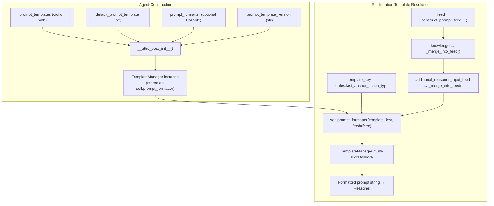
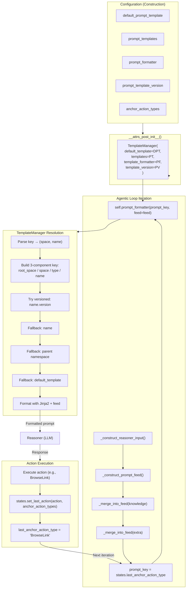

# Prompt Template Integration

How `PromptBasedAgent` integrates with the `TemplateManager` from SciencePythonUtils to enable flexible, state-driven prompt template resolution and switching.

**Related documents:** [Architecture](01_architecture.md) | [Execution Flow](02_execution_flow.md) | [Data Flow](06_data_flow.md) | [Knowledge Integration](10_knowledge_integration.md)

---

## Why This Matters

Agents that use LLM-based reasoning need to construct prompts from templates. Different agent states (e.g., after browsing a webpage vs. after executing a search) may require fundamentally different prompts. The `TemplateManager` provides a hierarchical namespace, versioning, and multi-level fallback system that `PromptBasedAgent` leverages for this purpose — but the integration between the two is non-obvious and crosses module boundaries.

This document traces the full lifecycle: how templates are configured, how the agent selects and fills them, how state-based switching works, and what extension points are available.

---

## Overview



---

## Stage 1: Construction — How Templates Become a TemplateManager

When a `PromptBasedAgent` is instantiated, four attributes control template setup:

| Attribute | Type | Purpose |
|-----------|------|---------|
| `default_prompt_template` | `str` | Fallback template when no specific match is found |
| `prompt_templates` | `str` (path) or `Dict[Any, str]` | Template source — a directory path or a nested dictionary |
| `prompt_formatter` | `Callable` or `None` | Custom template formatting function; if `None`, Jinja2 is used |
| `prompt_template_version` | `str` | Deployment-level version suffix (e.g., `"enterprise"`, `"end_customers"`) |

In `__attrs_post_init__()`, these are wrapped into a `TemplateManager`:

```python
# prompt_based_agent.py:108-114
if not isinstance(self.prompt_formatter, TemplateManager):
    self.prompt_formatter = TemplateManager(
        default_template=self.default_prompt_template,
        templates=self.prompt_templates,
        template_formatter=self.prompt_formatter,
        template_version=self.prompt_template_version
    )
```

**Key behavior:** After construction, `self.prompt_formatter` is always a `TemplateManager` instance, regardless of what was originally passed. The original callable (if any) becomes the TemplateManager's internal formatter; if `None`, `TemplateManager` defaults to Jinja2 formatting.

**Pre-constructed TemplateManager:** If `prompt_formatter` is already a `TemplateManager` (e.g., shared across agents or pre-configured externally), the wrapping is skipped. This allows injecting a fully-configured `TemplateManager` with custom root spaces, versioning, or component definitions.

### Template Dictionary Structure

When `prompt_templates` is a dict, it follows a two-level namespace structure expected by `TemplateManager`:

```python
prompt_templates = {
    # Namespace "main" (the default active_template_type)
    "main": {
        "default": "You are a helpful assistant.\n\nUser: {{ user_input }}",
        "BrowseLink": "You navigated to {{ context }}.\n\nUser: {{ user_input }}",
        "Search": "Search results:\n{{ action_result }}\n\nUser: {{ user_input }}"
    },
    # Namespace "reflection" (activated via switch())
    "reflection": {
        "default": "Review your previous actions.\n{{ previous_states }}\n\n{{ user_input }}"
    }
}
```

When `prompt_templates` is a string path, `TemplateManager` loads templates from the filesystem, where directory structure maps to namespace hierarchy.

---

## Stage 2: Per-Iteration Prompt Construction

Each iteration of the agentic loop constructs a fresh prompt via `_construct_reasoner_input()`. This method orchestrates four steps:

### Step 1: Build the Prompt Feed

`_construct_prompt_feed()` assembles a dictionary of placeholder values from the current iteration's data:

```python
feed = {
    "{{ user_input }}":     formatted user input (plain or conversational),
    "{{ task_input }}":     task-level metadata,
    "{{ user_profile }}":   user profile string (from JSON or direct),
    "{{ context }}":        context string (from XML mapping or direct),
    "{{ action_result }}":  XML-formatted action results,
    "{{ action_memory }}":  extracted memory from action results,
    "{{ current_state }}":  current task status description,
    "{{ previous_states }}": accumulated previous state descriptions,
    "{{ attachments }}":    concatenated attachment strings
}
```

Each placeholder name is configurable via the `prompt_placeholder_*` attributes. Only non-empty values are included.

### Step 2: Merge Knowledge

If the agent has a `knowledge_provider`, the resolved knowledge dict is merged into the feed:

```python
if knowledge:
    self._merge_into_feed(feed, knowledge)
```

The `feed_conflict_resolution` strategy controls what happens when knowledge keys overlap with existing feed keys:

| Strategy | Behavior |
|----------|----------|
| `FEED_ONLY` (default) | Knowledge **replaces** existing feed values |
| `ATTRIBUTE_ONLY` | Existing values take priority |
| `MERGE` | Values are **concatenated** with `\n\n` separator |

### Step 3: Resolve Additional Feed

The `additional_reasoner_input_feed` attribute allows injecting extra template variables. Callable values are called with `user_input` at resolution time:

```python
for k, v in self.additional_reasoner_input_feed.items():
    if callable(v):
        result = v(user_input)
        # dict results are spread; scalar results use the key
    else:
        resolved_extra[k] = v
```

### Step 4: Resolve Template and Format

The final call passes the complete feed to the `TemplateManager`:

```python
prompt_key = self.states.last_anchor_action_type
return self.prompt_formatter(prompt_key, feed=feed)
```

This is the critical line. The `prompt_key` determines which template is selected from the namespace hierarchy; the `feed` provides the variable values.

---

## Stage 3: State-Based Template Selection

The most powerful feature of this integration is **automatic template switching based on the agent's execution state**. The mechanism works through three components:

### 3.1 Anchor Actions

The agent tracks which actions are "anchor" actions via the `anchor_action_types` attribute:

```python
agent = PromptBasedAgent(
    anchor_action_types=["BrowseLink", "Search", "SubmitForm"],
    ...
)
```

When an action is executed, `AgentStates.set_last_action()` checks if its type is in the anchor list:

```python
# agent_state.py:95-101
def set_last_action(self, action, anchor_actions_types=None):
    last_action_type = self._resolve_action_type(action)
    if anchor_actions_types and last_action_type in anchor_actions_types:
        self.last_anchor_action = action
        self.last_anchor_action_type = last_action_type
    self.last_action = action
    self.last_action_type = last_action_type
```

Only anchor actions update `last_anchor_action_type`. Non-anchor actions (intermediate steps, logging, etc.) do not change the template selection.

### 3.2 Template Key Resolution

On the next iteration, when `_construct_reasoner_input()` runs:

```python
prompt_key = self.states.last_anchor_action_type  # e.g., "BrowseLink"
return self.prompt_formatter(prompt_key, feed=feed)
```

The `TemplateManager` resolves this key through its hierarchical fallback:

```
1. Try:   "main/BrowseLink"          (exact match in active type)
2. Try:   "main/default"             (default in active type)
3. Try:   "default"                  (global default)
4. Use:   self.default_template      (system fallback)
```

If `active_template_root_space` is set (e.g., `"action_agent"`), the full resolution path becomes:

```
1. Try:   "action_agent/main/BrowseLink"
2. Try:   "action_agent/main/default"
3. Try:   "main/BrowseLink"
4. Try:   "main/default"
5. Try:   "default"
6. Use:   self.default_template
```

### 3.3 Example: Agent Adapts Prompt After Navigation

```python
# Template configuration
templates = {
    "main": {
        "default": "You are a helpful assistant.\n\nUser: {{ user_input }}",
        "BrowseLink": (
            "You just navigated to a webpage. Here is what you see:\n"
            "{{ context }}\n\n"
            "Based on the page content, respond to the user.\n"
            "User: {{ user_input }}"
        ),
        "Search": (
            "You just performed a search. Results:\n"
            "{{ action_result }}\n\n"
            "Analyze these results for the user.\n"
            "User: {{ user_input }}"
        )
    }
}

agent = PromptBasedActionAgent(
    prompt_templates=templates,
    anchor_action_types=["BrowseLink", "Search"],
    reasoner=llm_inferencer,
    ...
)
```

**Iteration 1** — No prior action:
- `last_anchor_action_type` is `None`
- `TemplateManager` resolves `None` → uses `"main/default"`
- Prompt: *"You are a helpful assistant..."*

**Iteration 2** — After `BrowseLink` action:
- `last_anchor_action_type` is `"BrowseLink"`
- `TemplateManager` resolves `"BrowseLink"` → finds `"main/BrowseLink"`
- Prompt: *"You just navigated to a webpage..."*

**Iteration 3** — After `Search` action:
- `last_anchor_action_type` is `"Search"`
- `TemplateManager` resolves `"Search"` → finds `"main/Search"`
- Prompt: *"You just performed a search..."*

---

## Stage 4: Template Switching at Runtime

Beyond state-based automatic switching, there are three explicit mechanisms for changing template resolution behavior.

### 4.1 Construction-Time Configuration

Set the template version, root space, or type at agent creation:

```python
agent = PromptBasedAgent(
    prompt_templates=templates,
    prompt_template_version="enterprise",  # → TemplateManager.template_version
    ...
)
```

With versioning enabled, the `TemplateManager` first looks for `"BrowseLink.enterprise"` before falling back to `"BrowseLink"`. This enables deployment-level prompt variants without changing any code.

### 4.2 TemplateManager.switch() — Non-Destructive Switching

`switch()` creates a shallow copy of the `TemplateManager` with different settings:

```python
# Switch the agent to use "reflection" type templates
agent.prompt_formatter = agent.prompt_formatter.switch(
    active_template_type="reflection"
)

# Switch to a different deployment version
agent.prompt_formatter = agent.prompt_formatter.switch(
    template_version="end_customers"
)

# Switch to a different root namespace
agent.prompt_formatter = agent.prompt_formatter.switch(
    active_template_root_space="specialized_agent"
)
```

`switch()` does **not** modify the original `TemplateManager` — it returns a new copy. This makes it safe to use within agent logic without side effects on other agents sharing the same template source.

**Available switch dimensions:**

| Parameter | Effect |
|-----------|--------|
| `active_template_type` | Changes the type namespace (e.g., `"main"` → `"reflection"`) |
| `active_template_root_space` | Changes the root namespace prefix |
| `template_version` | Changes the version suffix for deployment-level variants |
| `default_template_name` | Changes the fallback key within a namespace |
| `predefined_variables` | Changes the predefined variable set |

### 4.3 Per-Call Override

The `TemplateManager.__call__()` method accepts `active_template_type` and `active_template_root_space` as keyword arguments, allowing per-call overrides without modifying the manager:

```python
# One-off use of a different template type
self.prompt_formatter(
    prompt_key,
    feed=feed,
    active_template_type="reflection"
)
```

The `PromptBasedAgent` does not currently use per-call overrides internally, but subclasses can override `_construct_reasoner_input()` to do so.

---

## Stage 5: Inference Configuration Feedback

The agent also communicates template resolution state back to the reasoner (LLM inferencer) through `_construct_reasoner_inference_config()`:

```python
# prompt_based_agent.py:431-438
def _construct_reasoner_inference_config(self):
    if isinstance(self.prompt_formatter, TemplateManager):
        config = {
            TemplateManager.ARG_NAME_ACTIVE_TEMPLATE_ROOT_SPACE:
                self.prompt_formatter.active_template_root_space
        }
        if self.states.last_anchor_action_type:
            config[TemplateManager.ARG_NAME_TEMPLATE_KEY] = self.states.last_anchor_action_type
        return config
```

This config is passed to the reasoner alongside the formatted prompt, enabling the inferencer to adapt its behavior (e.g., adjusting system prompts, temperature, or model selection) based on which template namespace and key were used.

---

## Component/Partial System

The `TemplateManager` supports reusable template components (partials) that can be shared across templates:

```python
templates = {
    "main": {
        "default": "{{ system_preamble }}\n\n{{ user_input }}\n\n{{ response_instructions }}",
        "BrowseLink": "{{ system_preamble }}\n\nPage: {{ context }}\n\n{{ response_instructions }}",
        "components": {
            "system_preamble": "You are a helpful AI assistant with expertise in CFD.",
            "response_instructions": "Respond in a structured format with reasoning."
        }
    }
}
```

Components are resolved and injected into the feed before template formatting, allowing consistent shared sections across all templates in a namespace.

### Versioned Components

Components can have multiple versions, generating all combinations via Cartesian product:

```python
"components": {
    "system_preamble": [
        {"version": "concise", "content": "You are a CFD assistant."},
        {"version": "detailed", "content": "You are a helpful AI assistant specializing in CFD..."}
    ],
    "response_instructions": [
        {"version": "structured", "content": "Use XML tags for your response."},
        {"version": "freeform", "content": "Respond naturally."}
    ]
}
```

When versioned components are present, `TemplateManager.__call__()` returns an `Iterator[str]` of all combinations (2 x 2 = 4 prompts) instead of a single string. This is primarily useful for prompt optimization experiments.

---

## Integration Diagram: Complete Data Flow



---

## Extension Points

| Extension Point | How | Use Case |
|----------------|-----|----------|
| Custom template formatter | Pass a callable as `prompt_formatter` (it becomes `TemplateManager.template_formatter`) | Handlebars, Mustache, or custom formatting |
| Pre-constructed TemplateManager | Pass a `TemplateManager` instance as `prompt_formatter` | Shared templates across agents, custom root spaces |
| Override `_construct_reasoner_input()` | Subclass `PromptBasedAgent` | Per-call template type overrides, dynamic feed manipulation |
| Override `_construct_prompt_feed()` | Subclass `PromptBasedAgent` | Custom placeholder population logic |
| Additional feed variables | Set `additional_reasoner_input_feed` (dict of static values or callables) | Inject computed values without subclassing |
| Runtime template switching | Call `prompt_formatter.switch()` | Change template type/version/root space during execution |
| Knowledge-based feed injection | Set `knowledge_provider` | Dynamic knowledge retrieval merged into prompt feed |

---

## Relationship to Other Documents

| Topic | Where Covered | What This Doc Adds |
|-------|--------------|-------------------|
| Class hierarchy (Agent → PromptBasedAgent) | [01_architecture.md](01_architecture.md) | How `prompt_formatter` is initialized and used |
| Agentic loop and reasoner calls | [02_execution_flow.md](02_execution_flow.md) | Template selection within the loop |
| Action execution and state tracking | [03_workgraph.md](03_workgraph.md), [05_state_and_memory.md](05_state_and_memory.md) | How actions update `last_anchor_action_type` for template selection |
| Input resolution and data flow | [06_data_flow.md](06_data_flow.md) | Feed construction from resolved inputs |
| Knowledge injection | [10_knowledge_integration.md](10_knowledge_integration.md) | How knowledge merges into the template feed |

---

**Previous:** [Knowledge Integration](10_knowledge_integration.md)
