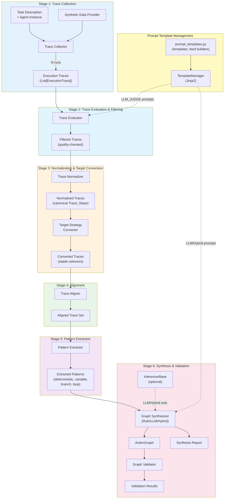
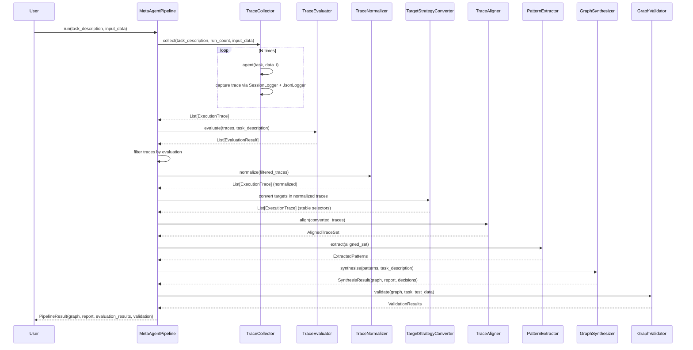

# Design Document: Meta Agent Workflow

## Overview

The Meta Agent Workflow feature automates the creation of deterministic ActionGraph workflows from agent execution traces. The pipeline has six stages:

1. **Trace Collection** — Run an agent N times on a task with varied synthetic data, capturing structured execution traces via the existing SessionLogger + JsonLogger infrastructure (JSONL files with `.parts/` artifact extraction).
2. **Trace Evaluation & Filtering** — Evaluate collected traces for quality and correctness using configurable strategies (exception-only, rule-based, or LLM-judge). Filter out low-quality traces before normalization.
3. **Trace Normalization & Target Conversion** — Convert raw agent logs into canonical Trace_Step format with consistent action types and target representations. Then convert `__id__` targets to stable selectors (xpath, css, id, data-qa) using HTML snapshots captured during collection.
4. **Trace Alignment** — Align multiple traces step-by-step using sequence alignment to identify corresponding steps across runs.
5. **Pattern Extraction** — Analyze aligned traces to classify each position as deterministic, variable, branching, or looping.
6. **Graph Synthesis & Validation** — Convert extracted patterns into an ActionGraph using configurable synthesis strategies (rule-based, LLM-assisted, or hybrid), then validate by executing the graph.

The design builds on existing infrastructure:
- **ActionGraph** (`agent_foundation.automation.schema.action_graph`) — DAG-based workflow with fluent API, conditions, loops, serialization
- **Agent** (`agent_foundation.agents.agent`) — LLM-based reasoning with structured logging via Debuggable hierarchy
- **SessionLogger** (`rich_python_utils.service_utils.session_management.session_logger`) — Turn-aware callable logger that routes agent logs to JSONL session files with `.parts/` artifact extraction
- **SessionLogReader** (`rich_python_utils.service_utils.session_management.session_logger`) — Read-side counterpart to SessionLogger; loads the session manifest and iterates JSONL entries per-turn with automatic `.parts/` artifact resolution via `resolve_parts=True`
- **JsonLogger** (`rich_python_utils.io_utils.json_io`) — Writes structured JSONL logs with automatic extraction of large fields (HTML snapshots, responses) into `.parts/` subdirectories
- **WebDriver** (`webaxonautomation.web_driver`) — Local browser execution with action execution and element finding
- **MultiActionExecutor** (`agent_foundation.automation.schema.action_executor`) — Routes action types to agents or standard executors
- **InferencerBase** (`agent_foundation.common.inferencers.inferencer_base`) — Abstract base class for LLM inference with retry, pre/post-processing, and model-agnostic `infer()` / `__call__()` interface. Used by LLMSynthesizer and LLM-judge evaluation strategy.
- **TemplateManager** (`rich_python_utils.string_utils.formatting.template_manager`) — Jinja2-based template manager with hierarchical namespace resolution, versioning, and `__call__(template_key, **kwargs) -> str` interface. Used for centralised prompt management in the evaluation and synthesis stages.
- **Agent-as-Action pattern** (`.kiro/specs/agent-as-action/`) — Agents registered as action types for bounded ambiguity within deterministic graphs

## Architecture



### Pipeline Orchestration



## Components and Interfaces

### 1. TraceCollector

Runs the agent N times and captures structured execution traces.

```python
from dataclasses import dataclass, field
from typing import Any, Callable, Dict, List, Optional
from datetime import datetime


@dataclass
class TraceStep:
    """A single action within an execution trace.
    
    Corresponds to a single AgentAction from AgentResponse.next_actions.
    """
    action_type: str                          # Canonical action type (click, input_text, etc.)
    target: Optional[Any] = None              # TargetSpec, TargetSpecWithFallback, or str
    args: Optional[Dict[str, Any]] = None     # Action arguments
    result: Optional['TraceActionResult'] = None  # Structured action result
    timestamp: Optional[datetime] = None      # When the action executed
    html_before: Optional[str] = None         # HTML state before action — may be None (see note below)
    html_after: Optional[str] = None          # HTML state after action (always captured by WebDriver)
    source_url: Optional[str] = None          # Page URL at time of action
    action_group_index: int = 0               # Which sequential group this action belongs to
    parallel_index: int = 0                   # Position within parallel group (inner iterable)
    reasoning: Optional[str] = None           # Agent's reasoning for this action
    metadata: Dict[str, Any] = field(default_factory=dict)

    # NOTE on html_before availability:
    # WebDriver only captures body_html_before_last_action when
    # return_only_incremental_change_for_cleaned_body_html=True, which is
    # controlled per-action-type by ActionTypeMetadata.incremental_change_mode.
    # For many action types (default mode), html_before will be None in the
    # raw WebDriverActionResult.
    #
    # The TraceCollector handles this via html_before chaining:
    #   If html_before[i] is None, use html_after[i-1] from the previous step.
    # body_html_after_last_action is ALWAYS captured by WebDriver, so
    # html_after is reliably available for every step.


@dataclass
class TraceActionResult:
    """Structured result of a single action execution.
    
    Mirrors the key fields from WebDriverActionResult.
    """
    success: bool = True
    action_skipped: bool = False
    skip_reason: Optional[str] = None
    value: Optional[Any] = None               # Extracted value (e.g., text content)
    error: Optional[str] = None


@dataclass
class ExecutionTrace:
    """Complete trace of a single agent run.
    
    Parsed from a session directory containing JSONL logs and .parts/ artifacts
    written by SessionLogger + JsonLogger.
    """
    trace_id: str
    task_description: str
    steps: List[TraceStep]
    input_data: Optional[Dict[str, Any]] = None  # Synthetic data used for this run
    success: bool = True
    error: Optional[str] = None
    start_time: Optional[datetime] = None
    end_time: Optional[datetime] = None
    session_dir: Optional[str] = None            # Path to the session directory
    turn_count: int = 0                          # Number of agent turns
    metadata: Dict[str, Any] = field(default_factory=dict)


class TraceCollector:
    """
    Runs an agent on a task N times and collects execution traces.
    
    Each agent run produces a session directory with JSONL logs and .parts/
    artifact files (via SessionLogger + JsonLogger). The collector delegates
    all session I/O to ``SessionLogReader`` from SciencePythonUtils, which
    reads the manifest, iterates JSONL entries per-turn, and automatically
    inlines ``.parts/`` file references when ``resolve_parts=True``.
    
    Trace file structure per session (consumed by SessionLogReader):
        session_dir/
          manifest.json                       ← session metadata + turn list
          turn_001/session.jsonl              ← flat JSONL file for the turn
          turn_001/session.jsonl.parts/       ← extracted artifacts (HTML, .md, etc.)
          turn_002/session.jsonl
          turn_002/session.jsonl.parts/
          ...
    
    With ``resolve_parts=True``, SessionLogReader replaces
    ``{"__parts_file__": "path"}`` references in each JSONL entry with
    the actual file content, so HTML snapshots (body_html_before_last_action,
    body_html_after_last_action) are available directly in the entry dict.
    
    The collector reads AgentResponse entries to extract next_actions
    (Iterable[Iterable[AgentAction]]), and extracts inlined HTML fields
    from AgentActionResults entries for target conversion.
    """
    
    def __init__(
        self,
        agent: Any,  # Agent instance
        synthetic_data_provider: Optional['SyntheticDataProvider'] = None,
    ):
        self._agent = agent
        self._synthetic_data_provider = synthetic_data_provider
    
    def collect(
        self,
        task_description: str,
        run_count: int,
        input_data: Optional[List[Dict[str, Any]]] = None,
    ) -> List[ExecutionTrace]:
        """
        Run the agent run_count times and return execution traces.
        
        Args:
            task_description: The task for the agent to perform
            run_count: Number of times to run the agent (must be >= 1)
            input_data: Optional explicit input data per run (overrides synthetic provider)
            
        Returns:
            List of ExecutionTrace, one per run (including failed runs)
            
        Raises:
            ValueError: If run_count < 1
        """
        ...
    
    def _run_single(
        self,
        task_description: str,
        data: Optional[Dict[str, Any]],
        run_index: int,
    ) -> ExecutionTrace:
        """Execute a single agent run and capture the trace.
        
        Note: No os.path.isdir guard is needed before calling
        _convert_logs_to_steps — the try/except around SessionLogReader
        construction in that method handles missing/invalid directories.
        """
        ...
    
    def _convert_logs_to_steps(
        self,
        session_dir: str,
    ) -> List[TraceStep]:
        """
        Parse session logs into TraceStep objects using SessionLogReader.
        
        Creates a ``SessionLogReader(session_dir, resolve_parts=True)``
        and iterates all entries across turns. Each entry is converted
        to a TraceStep via ``_entry_to_step``. With ``resolve_parts=True``,
        HTML artifacts (.parts/ references) are automatically inlined
        into the entry dicts, so no manual artifact loading is needed.
        
        If the session directory is missing, has no manifest.json, or
        is otherwise unreadable, logs a warning and returns an empty list.
        
        html_before chaining:
            After all entries are parsed, ``_chain_html_before`` fills in
            missing html_before values by chaining html_after[i-1] →
            html_before[i], ensuring the TargetStrategyConverter always
            has an HTML snapshot to work with.
        """
        ...

    # ------------------------------------------------------------------
    # Entry parsing
    # ------------------------------------------------------------------

    def _entry_to_step(self, entry: Dict[str, Any]) -> Optional[TraceStep]:
        """Convert a single JSONL entry to a TraceStep, or None if not actionable.
        
        With resolve_parts=True, HTML fields (body_html_before_last_action,
        body_html_after_last_action) are already inlined in the entry dict
        by SessionLogReader/iter_json_objs. This method extracts them
        directly from the entry data.
        """
        entry_type = entry.get("type", "")

        if entry_type == "AgentResponse":
            return self._parse_agent_response_entry(entry)

        if entry_type == "AgentActionResults":
            return self._parse_action_result_entry(entry)

        # Generic action entries — extract inlined HTML fields
        action_type = entry.get("action_type")
        if action_type:
            return TraceStep(
                action_type=action_type,
                target=entry.get("target"),
                args=entry.get("args"),
                result=self._parse_result(entry.get("result")),
                timestamp=self._parse_timestamp(entry.get("timestamp")),
                html_before=entry.get("body_html_before_last_action"),
                html_after=entry.get("body_html_after_last_action"),
                source_url=entry.get("source_url"),
                action_group_index=entry.get("action_group_index", 0),
                parallel_index=entry.get("parallel_index", 0),
                reasoning=entry.get("reasoning"),
                metadata=entry.get("metadata", {}),
            )

        return None

    def _parse_agent_response_entry(self, entry: Dict[str, Any]) -> Optional[TraceStep]:
        """Parse an AgentResponse JSONL entry into a TraceStep.
        
        AgentResponse entries contain ``next_actions`` — an
        ``Iterable[Iterable[AgentAction]]`` representing sequential groups
        of parallel actions. This method extracts only the **first** planned
        action (flattening the outer and inner iterables) to produce a single
        TraceStep. Subsequent actions in the same response are intentionally
        discarded here because the actual execution results (including all
        actions) are captured separately by ``_parse_action_result_entry``
        from AgentActionResults entries.
        """
        ...

    def _action_dict_to_step(
        self,
        action: Dict[str, Any],
        group_index: int,
        parallel_index: int,
    ) -> TraceStep:
        """Convert an action dictionary to a TraceStep.
        
        Extracts inlined HTML fields (body_html_before_last_action,
        body_html_after_last_action) that SessionLogReader resolved
        from .parts/ references.
        """
        return TraceStep(
            action_type=action.get("action_type", action.get("type", "unknown")),
            target=action.get("target"),
            args=action.get("args", action.get("arguments")),
            timestamp=self._parse_timestamp(action.get("timestamp")),
            html_before=action.get("body_html_before_last_action"),
            html_after=action.get("body_html_after_last_action"),
            source_url=action.get("source_url"),
            action_group_index=group_index,
            parallel_index=parallel_index,
            reasoning=action.get("reasoning"),
            metadata=action.get("metadata", {}),
        )

    def _parse_action_result_entry(self, entry: Dict[str, Any]) -> Optional[TraceStep]:
        """Parse an AgentActionResults JSONL entry into a TraceStep.
        
        Extracts inlined HTML fields (body_html_before_last_action,
        body_html_after_last_action) that SessionLogReader resolved
        from .parts/ references.
        """
        data = entry.get("data", entry)
        return TraceStep(
            action_type=data.get("action_type", "unknown"),
            target=data.get("target"),
            args=data.get("args"),
            result=self._parse_result(data.get("result", {})),
            timestamp=self._parse_timestamp(data.get("timestamp")),
            html_before=data.get("body_html_before_last_action"),
            html_after=data.get("body_html_after_last_action"),
            source_url=data.get("source_url"),
            action_group_index=data.get("action_group_index", 0),
            parallel_index=data.get("parallel_index", 0),
            reasoning=data.get("reasoning"),
            metadata=data.get("metadata", {}),
        )

    # ------------------------------------------------------------------
    # html_before chaining
    # ------------------------------------------------------------------

    @staticmethod
    def _chain_html_before(steps: List[TraceStep]) -> None:
        """
        Chain html_after[i-1] → html_before[i] when html_before[i] is None.
        """
        ...

    # ------------------------------------------------------------------
    # Helpers
    # ------------------------------------------------------------------

    @staticmethod
    def _count_turns(session_dir: Optional[str]) -> int:
        """Count turns using SessionLogReader's manifest.
        
        Creates a SessionLogReader with resolve_parts=False (no need to
        read artifacts just for counting) and returns len(reader.turns).
        Returns 0 if the session directory is missing or unreadable.
        """
        if not session_dir:
            return 0
        try:
            reader = SessionLogReader(session_dir, resolve_parts=False)
            return len(reader.turns)
        except (OSError, KeyError, ValueError):
            return 0
```

**Deleted methods** (replaced by SessionLogReader):
- `_parse_turn_directory` — SessionLogReader handles turn iteration
- `_parse_jsonl_directory` — SessionLogReader handles JSONL reading
- `_parse_jsonl_file` — SessionLogReader handles JSONL reading
- `_attach_artifacts` — `resolve_parts=True` handles artifact inlining
- `_find_html_artifacts` — `resolve_parts=True` handles artifact inlining
- `_load_file` — `resolve_parts=True` handles artifact inlining

### 2. TraceEvaluator

Evaluates collected traces for quality and correctness using configurable strategies.

```python
from enum import Enum
from dataclasses import dataclass, field
from typing import Any, Callable, Dict, List, Optional


class EvaluationStrategy(Enum):
    """Strategy for evaluating trace quality."""
    EXCEPTION_ONLY = "exception_only"    # Only filter traces that raised exceptions
    RULE_BASED = "rule_based"            # Apply configurable evaluation rules
    LLM_JUDGE = "llm_judge"             # Use InferencerBase to judge trace quality


@dataclass
class EvaluationRule:
    """A single rule for evaluating trace quality.
    
    Rules are predicates over ExecutionTrace that return True if the trace
    passes the rule, False otherwise.
    """
    name: str
    description: str
    predicate: Callable[['ExecutionTrace'], bool]
    severity: str = "error"  # "error" (trace rejected) or "warning" (trace kept, flagged)


@dataclass
class EvaluationResult:
    """Result of evaluating a single trace."""
    trace_id: str
    passed: bool
    score: float = 1.0                    # Quality score (0.0-1.0)
    failed_rules: List[str] = field(default_factory=list)   # Names of failed rules
    warnings: List[str] = field(default_factory=list)
    metadata: Dict[str, Any] = field(default_factory=dict)


class TraceEvaluator:
    """
    Evaluates execution traces for quality and correctness.
    
    Supports three evaluation strategies:
    
    - EXCEPTION_ONLY: Filters traces where success=False (exception during execution).
      This is the default and requires no additional configuration.
    
    - RULE_BASED: Applies a list of EvaluationRule predicates to each trace.
      Rules with severity="error" cause the trace to fail evaluation.
      Rules with severity="warning" flag the trace but don't reject it.
    
    - LLM_JUDGE: Uses an InferencerBase instance to evaluate trace quality.
      The inferencer receives a structured prompt with the trace steps and
      task description, and returns a quality assessment. Requires an
      inferencer to be provided at construction time.

    The evaluator does NOT modify traces — it produces EvaluationResult
    objects that the pipeline uses to filter traces before normalization.

    LLM prompt construction uses a dual-path approach: when a
    ``prompt_formatter`` (TemplateManager) is provided, the evaluation
    prompt is rendered via the template engine; otherwise, the original
    inline f-string is used for bit-identical backward compatibility.
    """

    def __init__(
        self,
        strategy: EvaluationStrategy = EvaluationStrategy.EXCEPTION_ONLY,
        rules: Optional[List[EvaluationRule]] = None,
        inferencer: Optional['InferencerBase'] = None,
        min_score: float = 0.5,
        prompt_formatter: Optional['TemplateManager'] = None,
    ):
        """
        Args:
            strategy: Evaluation strategy to use
            rules: List of evaluation rules (required for RULE_BASED strategy)
            inferencer: InferencerBase instance (required for LLM_JUDGE strategy)
            min_score: Minimum quality score for a trace to pass (used by LLM_JUDGE)
            prompt_formatter: Optional TemplateManager for rendering LLM prompts.
                When None, the legacy inline f-string prompt is used.

        Raises:
            ValueError: If RULE_BASED strategy is used without rules
            ValueError: If LLM_JUDGE strategy is used without inferencer
        """
        self._strategy = strategy
        self._rules = rules or []
        self._inferencer = inferencer
        self._min_score = min_score
        self._prompt_formatter = prompt_formatter

        if strategy == EvaluationStrategy.RULE_BASED and not self._rules:
            raise ValueError("RULE_BASED strategy requires at least one evaluation rule")
        if strategy == EvaluationStrategy.LLM_JUDGE and self._inferencer is None:
            raise ValueError("LLM_JUDGE strategy requires an InferencerBase instance")
    
    def evaluate(
        self,
        traces: List['ExecutionTrace'],
        task_description: str = "",
    ) -> List[EvaluationResult]:
        """
        Evaluate all traces and return evaluation results.
        
        Args:
            traces: List of execution traces to evaluate
            task_description: The task description (used by LLM_JUDGE for context)
            
        Returns:
            List of EvaluationResult, one per trace, in the same order
        """
        ...
    
    def _evaluate_exception_only(self, trace: 'ExecutionTrace') -> EvaluationResult:
        """Evaluate based on exception status only."""
        ...
    
    def _evaluate_rule_based(self, trace: 'ExecutionTrace') -> EvaluationResult:
        """Evaluate by applying all configured rules."""
        ...
    
    def _evaluate_llm_judge(
        self,
        trace: 'ExecutionTrace',
        task_description: str,
    ) -> EvaluationResult:
        """Evaluate using InferencerBase as an LLM judge.

        Calls _build_llm_prompt() to construct the prompt (using
        TemplateManager when available, or the legacy f-string path),
        passes it to self._inferencer.infer(), and parses the response
        into a quality score and pass/fail determination.
        """
        ...

    def _build_llm_prompt(
        self,
        trace: 'ExecutionTrace',
        task_description: str,
    ) -> str:
        """Build a structured prompt for the LLM judge.

        When a ``prompt_formatter`` (TemplateManager) was provided at
        construction time, renders the evaluation template via
        ``build_evaluation_feed()`` + TemplateManager.__call__().
        Otherwise falls back to the original inline f-string for
        bit-identical backward compatibility.
        """
        ...
```

### 3. TraceNormalizer

Converts raw trace steps into canonical format.

```python
class TraceNormalizer:
    """
    Normalizes trace steps to canonical format.
    
    Per-step normalization only (no cross-run operations):
    - Maps action types to registered ActionMetadataRegistry types
      (e.g., "ElementInteraction.Click" → "click")
    - Normalizes target representations to canonical TargetSpec format
    - Normalizes wait durations
    - Converts UserInputsRequired to wait(True)
    
    Note: Target consolidation across runs (merging multiple target observations
    into TargetSpecWithFallback) happens in Pattern Extraction, not here,
    because it requires cross-run comparison from the alignment stage.
    """
    
    # Mapping from agent-internal action types to ActionGraph canonical types.
    # Types not in this map are passed through as-is if they match a registered
    # type in ActionMetadataRegistry (e.g., "visit_url", "no_op", "wait" are
    # already canonical and don't need mapping).
    ACTION_TYPE_MAP = {
        'ElementInteraction.Click': 'click',
        'ElementInteraction.InputText': 'input_text',
        'ElementInteraction.AppendText': 'append_text',
        'ElementInteraction.Scroll': 'scroll',
        'ElementInteraction.ScrollUpToElement': 'scroll_up_to_element',
        'ElementInteraction.InputAndSubmit': 'input_and_submit',
        'UserInputsRequired': 'wait',
    }
    
    def __init__(
        self,
        action_metadata: Optional['ActionMetadataRegistry'] = None,
        custom_type_map: Optional[Dict[str, str]] = None,
    ):
        self._action_metadata = action_metadata or ActionMetadataRegistry()
        self._type_map = {**self.ACTION_TYPE_MAP, **(custom_type_map or {})}
    
    def normalize(self, traces: List[ExecutionTrace]) -> List[ExecutionTrace]:
        """
        Normalize all traces to canonical format.
        
        Returns new ExecutionTrace objects with normalized steps.
        """
        ...
    
    def normalize_step(self, step: TraceStep) -> TraceStep:
        """Normalize a single trace step."""
        ...
    
    def normalize_action_type(self, raw_type: str) -> str:
        """Map raw action type to canonical registered type."""
        ...
    
    def normalize_target(self, target: Any) -> Any:
        """Normalize target to canonical TargetSpec format."""
        ...
```

### 4. TraceAligner

Aligns multiple traces to identify corresponding steps.

```python
from enum import Enum
from typing import Tuple


class AlignmentType(Enum):
    """Classification of an aligned position."""
    DETERMINISTIC = "deterministic"      # Same action type + target across all traces
    PARAMETERIZABLE = "parameterizable"  # Same action type + target, different args (template vars)
    VARIABLE = "variable"                # Different actions across traces (needs agent node)
    OPTIONAL = "optional"                # Present in some traces but not others
    BRANCH_POINT = "branch_point"        # Traces diverge into different paths


@dataclass
class AlignedPosition:
    """A single position in the aligned trace set."""
    index: int
    alignment_type: AlignmentType
    steps: Dict[str, Optional[TraceStep]]  # trace_id -> step (None if absent)
    confidence: float = 1.0                # Alignment confidence (0-1)


@dataclass
class AlignedTraceSet:
    """Result of aligning multiple execution traces."""
    positions: List[AlignedPosition]
    trace_ids: List[str]
    alignment_score: float  # Overall alignment quality (0-1)
    metadata: Dict[str, Any] = field(default_factory=dict)


class TraceAligner:
    """
    Aligns multiple execution traces using sequence alignment.
    
    Uses longest common subsequence (LCS) based alignment to match
    corresponding steps across traces. Steps are matched by action type
    and target equivalence.
    """
    
    def align(self, traces: List[ExecutionTrace]) -> AlignedTraceSet:
        """
        Align multiple traces and classify each position.
        
        Args:
            traces: List of normalized execution traces
            
        Returns:
            AlignedTraceSet with classified positions
        """
        ...
    
    def _pairwise_align(
        self,
        trace_a: ExecutionTrace,
        trace_b: ExecutionTrace,
    ) -> List[Tuple[Optional[int], Optional[int]]]:
        """
        Align two traces using LCS-based sequence alignment.
        
        Returns list of (index_a, index_b) pairs. None indicates a gap.
        """
        ...
    
    def _steps_equivalent(self, step_a: TraceStep, step_b: TraceStep) -> bool:
        """
        Determine if two steps are equivalent for alignment purposes.
        
        Two steps are equivalent if they have the same action type AND
        their targets refer to the same element. Since __id__ values are
        session-specific and not stable across runs, equivalence is determined by:
        
        1. Same action_type (required)
        2. Target equivalence via one of (tried in order):
           a. Matching stable selectors (id, css, xpath) if available
           b. Matching HTML element structure (tag + attributes) using html_before
           c. Matching target description/reasoning text
           d. Same action_group_index within their respective turns AND
              surrounding already-matched steps agree (contextual fallback)
        
        Strategy (d) is a weak contextual signal used only when (a)-(c) fail.
        It does NOT use absolute sequence position (which would be circular
        with LCS alignment). Instead it checks whether the step occupies the
        same relative position within its agent turn (action_group_index) and
        whether the immediately preceding and following steps were already
        matched by strategies (a)-(c).
        
        Note: Raw __id__ values CANNOT be used for cross-run matching since
        they are reassigned per page snapshot and reset on page reload.
        """
        ...
    
    def _classify_position(
        self,
        steps: Dict[str, Optional[TraceStep]],
    ) -> AlignmentType:
        """Classify an aligned position based on the steps present."""
        ...
    
    def merge(
        self,
        existing: AlignedTraceSet,
        new_traces: List[ExecutionTrace],
    ) -> AlignedTraceSet:
        """
        Merge new traces into an existing alignment for iterative refinement.
        """
        ...
```

### 5. PatternExtractor

Analyzes aligned traces to extract structural patterns.

```python
@dataclass
class LoopPattern:
    """A detected loop pattern."""
    body_start: int       # Start index in aligned positions
    body_end: int         # End index in aligned positions
    min_iterations: int   # Minimum observed iterations
    max_iterations: int   # Maximum observed iterations
    body_steps: List[AlignedPosition]


@dataclass
class BranchPattern:
    """A detected branch pattern."""
    branch_point_index: int                    # Index in aligned positions
    branches: Dict[str, List[AlignedPosition]] # branch_label -> positions
    condition_description: str                 # Human-readable condition
    condition_source: Optional[str] = None     # Page state or result that differentiates


@dataclass
class ParameterizableInfo:
    """Info about a parameterizable step's template variables."""
    variable_args: Dict[str, str]   # arg_key -> template_variable_name (e.g., {"text": "search_query"})
    constant_args: Dict[str, Any]   # arg_key -> constant_value


@dataclass
class ExtractedPatterns:
    """All patterns extracted from an aligned trace set."""
    deterministic_steps: List[AlignedPosition]
    parameterizable_steps: List[Tuple[AlignedPosition, ParameterizableInfo]]
    variable_steps: List[AlignedPosition]
    optional_steps: List[AlignedPosition]
    branch_patterns: List[BranchPattern]
    loop_patterns: List[LoopPattern]
    user_input_boundaries: List[int]  # Indices of user input boundary positions
    step_order: List[int]  # Ordered indices into the aligned positions


class PatternExtractor:
    """
    Extracts structural patterns from an aligned trace set.
    
    Identifies deterministic sequences, variable steps (for Agent Nodes),
    branching points (for ConditionContext), and loop patterns.
    """
    
    def extract(self, aligned_set: AlignedTraceSet) -> ExtractedPatterns:
        """
        Extract all patterns from the aligned trace set.
        """
        ...
    
    def _detect_loops(
        self,
        positions: List[AlignedPosition],
    ) -> List[LoopPattern]:
        """
        Detect repeated subsequences indicating loops.
        
        Uses a rolling-hash approach: for each candidate body length L
        (from 1 up to half the sequence length), slide a window of size L
        and check whether consecutive windows have matching action-type
        signatures. When two or more consecutive windows match, record a
        LoopPattern.
        
        **Known bug (to fix):** The current consumed-position check only
        tests ``if i in consumed`` (the window start). It should test ALL
        positions in the window — ``if any(k in consumed for k in range(i, i + body_len))``
        — to prevent a longer-body-length pass from creating a LoopPattern
        that overlaps with positions already claimed by a shorter pattern.
        Without this fix, Property 11 (each index in exactly one category)
        can be violated.
        """
        ...
    
    def _detect_branches(
        self,
        positions: List[AlignedPosition],
    ) -> List[BranchPattern]:
        """
        Detect divergence points indicating conditional branches.
        
        Note on condition_description:
            The initial condition_description is set to a placeholder:
            "Unknown: runs diverge at this point" since automated condition
            inference is not in scope for the initial implementation.
            This field is intended for human review and manual refinement
            during the ActionGraph audit step.
        """
        ...
    
    def _select_best_target(
        self,
        steps: Dict[str, Optional[TraceStep]],
    ) -> Any:
        """
        Select the most robust target from multiple observations.
        
        Consolidates targets across runs into a TargetSpecWithFallback.
        Orders strategies by stability: data-qa > data-testid > id > aria > xpath > css > agent.
        This is where cross-run target consolidation happens (not in normalization).
        """
        ...
```

### 6. TargetStrategyConverter

Converts `__id__` targets from agent traces to stable selectors.

```python
class TargetStrategyConverter:
    """
    Converts __id__ targets (framework-assigned, session-specific) from agent
    traces into stable selectors (xpath, css, id, data-qa) suitable for
    production ActionGraphs.
    
    Uses HTML snapshots captured during trace collection to locate elements
    by __id__ and generate alternative stable selectors.
    """
    
    # Selector stability priority (highest to lowest)
    STRATEGY_PRIORITY = [
        'data-qa',       # Explicitly for testing/automation
        'data-testid',   # Explicitly for testing
        'id',            # Native HTML id
        'aria',          # aria-label + role combination
        'xpath-text',    # XPath with text content
        'xpath-class',   # XPath with class
        'css',           # CSS structural selector
        'agent',         # Agent-based fallback
    ]
    
    def convert(
        self,
        trace_action: TraceStep,
    ) -> 'TargetSpecWithFallback':
        """
        Convert a __id__ target to stable selectors using the step's html_before.
        
        Args:
            trace_action: The trace step with __id__ target and html_before snapshot
            
        Returns:
            TargetSpecWithFallback with stable selectors ordered by priority
            
        Note:
            If trace_action.html_before is None (common when incremental_change_mode
            is disabled — see TraceStep NOTE), the converter falls back to
            trace_action.html_after. If both are None, returns a single-strategy
            TargetSpecWithFallback using the agent fallback strategy.
        """
        ...
    
    def _find_element_by_id(
        self,
        html: str,
        framework_id: str,
    ) -> Optional[str]:
        """
        Find element HTML by __id__ attribute in the page source.
        
        Args:
            html: The page HTML to search. May be None if the caller's
                  html_before was unavailable; callers must handle None
                  before invoking this method (convert() does this by
                  falling back to html_after or the agent strategy).
            framework_id: The __id__ value to search for.
            
        Returns:
            The element's outer HTML string, or None if not found.
        """
        ...
    
    def _try_data_attributes(self, element_html: str) -> Optional['TargetSpec']:
        """Try data-qa or data-testid attributes."""
        ...
    
    def _try_native_id(self, element_html: str) -> Optional['TargetSpec']:
        """Try native HTML id attribute."""
        ...
    
    def _try_aria_selector(self, element_html: str) -> Optional['TargetSpec']:
        """Try aria-label + role combination."""
        ...
    
    def _try_xpath_with_text(self, element_html: str) -> Optional['TargetSpec']:
        """Generate XPath using text content."""
        ...
    
    def _try_css_selector(self, element_html: str) -> Optional['TargetSpec']:
        """Generate CSS selector from structural hierarchy."""
        ...
    
    def _validate_uniqueness(
        self,
        spec: 'TargetSpec',
        html: str,
    ) -> bool:
        """Verify the selector matches exactly one element in the HTML."""
        ...
```

### 7. GraphSynthesizer (Strategy Pattern)

Converts extracted patterns into an ActionGraph using configurable synthesis strategies.

```python
from enum import Enum
from abc import ABC, abstractmethod
from dataclasses import dataclass, field
from typing import Any, Dict, List, Optional, Tuple


class SynthesisStrategy(Enum):
    """Strategy for graph synthesis."""
    RULE_BASED = "rule_based"    # Deterministic rule-based synthesis (default)
    LLM = "llm"                  # LLM-assisted synthesis via InferencerBase
    HYBRID = "hybrid"            # Rule-based with LLM fallback for ambiguous patterns


@dataclass
class ActionDecision:
    """Decision made by the synthesizer for a single pattern position.
    
    Records what action was synthesized and why, for auditability.
    """
    position_index: int
    action_type: str
    target: Optional[Any] = None
    args: Optional[Dict[str, Any]] = None
    decision_source: str = "rule"  # "rule", "llm", or "hybrid"
    confidence: float = 1.0
    reasoning: Optional[str] = None  # LLM reasoning (when decision_source != "rule")


@dataclass
class SynthesisResult:
    """Extended synthesis result including per-action decisions."""
    graph: Any  # ActionGraph
    report: 'SynthesisReport'
    decisions: List[ActionDecision] = field(default_factory=list)
    python_script: Optional[str] = None  # Generated Python script (when generate_script=True)


@dataclass
class SynthesisReport:
    """Report documenting the synthesis results."""
    total_steps: int
    deterministic_count: int
    parameterizable_count: int
    agent_node_count: int
    optional_count: int
    user_input_boundary_count: int
    branch_count: int
    loop_count: int
    synthesis_strategy: str = "rule_based"  # Which strategy was used
    target_strategy_coverage: Dict[str, int] = field(default_factory=dict)
    template_variables: List[str] = field(default_factory=list)
    warnings: List[str] = field(default_factory=list)


class GraphSynthesizer(ABC):
    """
    Abstract base for graph synthesis. Converts extracted patterns into an
    ActionGraph using the ActionGraph fluent API.

    Subclasses implement ``_decide_action`` to determine how each pattern
    position is translated into a graph action. The base class handles
    the common graph construction logic (loops, branches, user input
    boundaries) and delegates per-position action decisions to the
    subclass.

    LLM prompt construction for LLM/Hybrid strategies uses a dual-path
    approach: when a ``prompt_formatter`` (TemplateManager) is provided,
    the synthesis prompt is rendered via the template engine; otherwise,
    the original inline f-string is used for backward compatibility.

    Common mappings (handled by base class):
    - Deterministic steps → graph.action(type, target=..., args=...)
    - Parameterizable steps → graph.action(type, target=..., args={"text": "{var}"})
    - Variable steps → graph.action(agent_name, target=description)
    - Optional steps → graph.action(type, target=..., no_action_if_target_not_found=True)
    - User input boundaries → graph.action("wait", target=True)
    - Branch points → graph.condition() with ConditionContext
    - Loop patterns → graph.loop()
    """

    def __init__(
        self,
        action_executor: Any,
        action_metadata: Optional['ActionMetadataRegistry'] = None,
        agent_action_type: str = "meta_workflow_agent",
        prompt_formatter: Optional['TemplateManager'] = None,
    ):
        self._action_executor = action_executor
        self._action_metadata = action_metadata or ActionMetadataRegistry()
        self._agent_action_type = agent_action_type
        self._prompt_formatter = prompt_formatter
    
    def synthesize(
        self,
        patterns: ExtractedPatterns,
        task_description: str = "",
    ) -> SynthesisResult:
        """
        Synthesize an ActionGraph from extracted patterns.
        
        Args:
            patterns: Extracted patterns from the alignment stage
            task_description: The original task description, used by
                LLM/Hybrid strategies for prompt construction
        
        Returns a SynthesisResult with the ActionGraph, SynthesisReport,
        and per-action decisions.
        """
        ...
    
    @abstractmethod
    def _decide_action(
        self,
        position: AlignedPosition,
        context: Dict[str, Any],
    ) -> ActionDecision:
        """
        Decide what action to synthesize for a given position.
        
        Subclasses implement this to provide strategy-specific logic.
        
        Args:
            position: The aligned position to synthesize
            context: Additional context (surrounding positions, patterns, etc.)
            
        Returns:
            ActionDecision describing the synthesized action
        """
        ...
    
    def _synthesize_deterministic(self, graph: 'ActionGraph', position: AlignedPosition) -> None:
        """Add a deterministic action to the graph."""
        ...
    
    def _synthesize_parameterizable(self, graph: 'ActionGraph', position: AlignedPosition, param_info: 'ParameterizableInfo') -> None:
        """Add a parameterizable action with template variables."""
        ...
    
    def _synthesize_variable(self, graph: 'ActionGraph', position: AlignedPosition) -> None:
        """Add an Agent Node for a variable step."""
        ...
    
    def _synthesize_optional(self, graph: 'ActionGraph', position: AlignedPosition) -> None:
        """Add an optional action with no_action_if_target_not_found=True."""
        ...
    
    def _synthesize_user_input_boundary(self, graph: 'ActionGraph') -> None:
        """Add a wait(True) human confirmation gate."""
        ...
    
    def _synthesize_branch(self, graph: 'ActionGraph', branch: BranchPattern) -> None:
        """Add a ConditionContext branch to the graph."""
        ...
    
    def _synthesize_loop(self, graph: 'ActionGraph', loop: LoopPattern) -> None:
        """Add a loop construct to the graph."""
        ...


class RuleBasedSynthesizer(GraphSynthesizer):
    """
    Deterministic rule-based synthesis (default strategy).
    
    Uses fixed rules to map pattern types to ActionGraph constructs.
    No LLM involvement — all decisions are deterministic based on
    the pattern classification from the extraction stage.
    """
    
    def _decide_action(
        self,
        position: AlignedPosition,
        context: Dict[str, Any],
    ) -> ActionDecision:
        """
        Apply deterministic rules to decide the action.
        
        Maps directly from AlignmentType to the corresponding
        graph construct without any ambiguity resolution.
        """
        ...


class LLMSynthesizer(GraphSynthesizer):
    """
    LLM-assisted synthesis using InferencerBase.

    Uses an InferencerBase instance to make synthesis decisions,
    particularly for ambiguous patterns (variable steps, branch
    conditions, loop termination). The LLM receives the pattern
    context and returns structured decisions.

    Requires an InferencerBase instance at construction time.
    """

    def __init__(
        self,
        action_executor: Any,
        inferencer: 'InferencerBase',
        action_metadata: Optional['ActionMetadataRegistry'] = None,
        agent_action_type: str = "meta_workflow_agent",
        prompt_formatter: Optional['TemplateManager'] = None,
    ):
        super().__init__(action_executor, action_metadata, agent_action_type, prompt_formatter)
        self._inferencer = inferencer
    
    def _decide_action(
        self,
        position: AlignedPosition,
        context: Dict[str, Any],
    ) -> ActionDecision:
        """
        Use InferencerBase for ALL positions, including deterministic ones.
        
        The LLM may suggest better action arguments, improved target
        descriptions, or alternative approaches even for clear patterns.
        Constructs a prompt with the pattern context and task description,
        calls self._inferencer.infer(), and parses the structured decision.
        """
        ...


class HybridSynthesizer(GraphSynthesizer):
    """
    Hybrid synthesis: rule-based for clear patterns, LLM for ambiguous ones.

    Uses deterministic rules for DETERMINISTIC, PARAMETERIZABLE, and
    OPTIONAL positions. Falls back to InferencerBase for VARIABLE and
    BRANCH_POINT positions where the rule-based approach would produce
    a generic agent node.

    Requires an InferencerBase instance at construction time.
    """

    def __init__(
        self,
        action_executor: Any,
        inferencer: 'InferencerBase',
        action_metadata: Optional['ActionMetadataRegistry'] = None,
        agent_action_type: str = "meta_workflow_agent",
        prompt_formatter: Optional['TemplateManager'] = None,
    ):
        super().__init__(action_executor, action_metadata, agent_action_type, prompt_formatter)
        self._inferencer = inferencer
    
    def _decide_action(
        self,
        position: AlignedPosition,
        context: Dict[str, Any],
    ) -> ActionDecision:
        """
        Use rules for clear patterns, LLM for ambiguous ones.
        
        DETERMINISTIC/PARAMETERIZABLE/OPTIONAL → rule-based (confidence=1.0)
        VARIABLE/BRANCH_POINT → LLM-assisted (confidence from LLM response)
        """
        ...
```

### 8. GraphValidator

Validates the synthesized graph by executing it.

```python
@dataclass
class ValidationResult:
    """Result of validating a single execution."""
    input_data: Optional[Dict[str, Any]]
    passed: bool
    divergence_point: Optional[int] = None  # Step index where divergence occurred
    expected_outcome: Optional[Any] = None
    actual_outcome: Optional[Any] = None
    error: Optional[str] = None


@dataclass
class ValidationResults:
    """Aggregate validation results."""
    results: List[ValidationResult]
    
    @property
    def success_rate(self) -> float:
        if not self.results:
            return 0.0
        return sum(1 for r in self.results if r.passed) / len(self.results)
    
    @property
    def all_passed(self) -> bool:
        return all(r.passed for r in self.results)


class GraphValidator:
    """
    Validates a synthesized ActionGraph by executing it and comparing
    results against expected outcomes from the original traces.
    """
    
    def validate(
        self,
        graph: 'ActionGraph',
        task_description: str,
        test_data: Optional[List[Dict[str, Any]]] = None,
        expected_traces: Optional[List[ExecutionTrace]] = None,
    ) -> ValidationResults:
        """
        Validate the graph against test data and/or expected traces.
        """
        ...
    
    def _compare_execution(
        self,
        execution_result: 'ExecutionResult',
        expected_trace: ExecutionTrace,
    ) -> ValidationResult:
        """Compare a graph execution result against an expected trace."""
        ...
```

### 9. Prompt Template Management

Centralises all LLM prompt templates used by the evaluation and synthesis stages. Separates static template structure (instructions, response format, examples) from dynamic data construction (trace step summaries, position data).

```python
from typing import Any, Dict, Optional

# Template key constants
EVALUATION_TEMPLATE_KEY = "evaluation"
SYNTHESIS_TEMPLATE_KEY = "synthesis"

# Default Jinja2 template strings.
# Templates use explicit ``\n`` concatenation (not triple-quoted strings) to
# guarantee character-exact whitespace matching with the original inline
# f-strings in evaluator.py and synthesizer.py.
_EVALUATION_TEMPLATE_JINJA2 = (
    "Evaluate the quality of the following execution trace.\n"
    "Task: {{ task_description }}\n"
    "Trace ID: {{ trace_id }}\n"
    "Success: {{ trace_success }}\n"
    "Steps ({{ step_count }}):\n"
    "{{ steps_text }}\n"
    "\n"
    "Respond with a JSON object containing a single key 'score' "
    "with a float value between 0.0 and 1.0, where 1.0 is perfect quality.\n"
    'Example: {"score": 0.85}'
)

_SYNTHESIS_TEMPLATE_JINJA2 = (
    "Synthesize an ActionGraph action for a {{ pattern_type }} pattern.\n"
    "Task: {{ task_description }}\n"
    "Position index: {{ position_index }}\n"
    "Observed steps across traces:\n"
    "{{ steps_text }}\n"
    "{{ param_section }}\n"
    "Respond with a JSON object containing:\n"
    '  "action_type": string (the action type to use),\n'
    '  "target": string or null (the target element or description),\n'
    '  "args": object or null (action arguments),\n'
    '  "confidence": float between 0.0 and 1.0,\n'
    '  "reasoning": string (explanation of your decision)\n'
    "\n"
    'Example: {"action_type": "click", "target": "btn-submit", '
    '"args": null, "confidence": 0.9, '
    '"reasoning": "All traces show a click on submit button"}'
)

# Default aliases — swap to switch the template engine project-wide.
_EVALUATION_TEMPLATE = _EVALUATION_TEMPLATE_JINJA2
_SYNTHESIS_TEMPLATE = _SYNTHESIS_TEMPLATE_JINJA2

DEFAULT_PROMPT_TEMPLATES: Dict[str, str] = {
    EVALUATION_TEMPLATE_KEY: _EVALUATION_TEMPLATE,
    SYNTHESIS_TEMPLATE_KEY: _SYNTHESIS_TEMPLATE,
}


def build_evaluation_feed(
        trace: 'ExecutionTrace',
        task_description: str,
) -> Dict[str, Any]:
    """Build the template variable dict for the evaluation prompt.

    Extracts dynamic data from *trace* (step summaries, counts) that
    was previously computed inline in ``TraceEvaluator._build_llm_prompt()``.

    Returns:
        Dict with keys: ``task_description``, ``trace_id``,
        ``trace_success``, ``step_count``, ``steps_text``.
    """
    ...


def build_synthesis_feed(
        position: 'AlignedPosition',
        context: Dict[str, Any],
) -> Dict[str, Any]:
    """Build the template variable dict for the synthesis prompt.

    Extracts dynamic data from *position* and *context* (step summaries,
    param info) that was previously computed inline in
    ``GraphSynthesizer._build_synthesis_prompt()``.

    Returns:
        Dict with keys: ``pattern_type``, ``task_description``,
        ``position_index``, ``steps_text``, ``param_section``.
    """
    ...


def create_prompt_formatter(
        templates: Optional[Dict[str, str]] = None,
) -> 'TemplateManager':
    """Create a TemplateManager for meta_agent prompts.

    Uses ``active_template_type=None`` for flat-dict resolution (no
    namespace hierarchy). Template keys are looked up directly in the
    dict without any prefix.

    Args:
        templates: Custom template dict. Defaults to DEFAULT_PROMPT_TEMPLATES.

    Returns:
        A TemplateManager instance.
    """
    from rich_python_utils.string_utils.formatting.template_manager import TemplateManager
    return TemplateManager(
        templates=templates or DEFAULT_PROMPT_TEMPLATES,
        active_template_type=None,  # flat namespace — direct key lookup
    )
```

**Design decisions:**

1. **`active_template_type=None`** — TemplateManager defaults `active_template_type="main"`, which prepends `"main/"` to key lookups. For a flat dict (no namespace hierarchy), this causes an unnecessary fallback step. Setting `None` gives direct key resolution.

2. **Feed builders separate data from templates** — The `steps_text` and `param_section` values are complex strings assembled by code, not simple scalar values. This is intentional: the dynamic data construction logic doesn't belong in templates. The value of TemplateManager comes from centralising the static instruction/format structure.

3. **Dual-path backward compatibility** — When `prompt_formatter is None`, both `_build_llm_prompt` (evaluator) and `_build_synthesis_prompt` (synthesizer) fall back to the exact original f-string output. This makes the integration fully backward-compatible — existing callers without a TemplateManager see bit-identical prompts.

4. **`prompt_formatter` as last parameter** — Added as the last parameter in `GraphSynthesizer.__init__()` because `LLMSynthesizer` and `HybridSynthesizer` call `super().__init__(action_executor, action_metadata, agent_action_type)` with positional args. Adding after `agent_action_type` preserves these 3-arg positional calls.

5. **`_JINJA2` suffix naming** — Template constants are named with the engine suffix (e.g., `_EVALUATION_TEMPLATE_JINJA2`) then aliased to `_EVALUATION_TEMPLATE`. This marks the template engine and allows future engine swaps by changing only the alias.

### 10. SyntheticDataProvider

Generates varied input data for development-time runs.

```python
class SyntheticDataProvider:
    """
    Generates synthetic input data for agent runs.
    
    Supports custom generators or default random generation
    based on a parameter schema.
    """
    
    def __init__(
        self,
        parameter_schema: Optional[Dict[str, str]] = None,
        custom_generator: Optional[Callable[[int], List[Dict[str, Any]]]] = None,
    ):
        self._parameter_schema = parameter_schema
        self._custom_generator = custom_generator
    
    def generate(self, count: int) -> List[Dict[str, Any]]:
        """
        Generate count sets of synthetic input data.
        
        Uses custom_generator if provided, otherwise generates
        based on parameter_schema.
        """
        ...
```

### 11. MetaAgentPipeline

Orchestrates the full pipeline.

```python
@dataclass
class PipelineConfig:
    """Configuration for the meta agent pipeline."""
    run_count: int = 5
    validate: bool = True
    validation_runs: int = 3
    agent_action_type: str = "meta_workflow_agent"
    evaluation_strategy: EvaluationStrategy = EvaluationStrategy.EXCEPTION_ONLY
    synthesis_strategy: SynthesisStrategy = SynthesisStrategy.RULE_BASED
    min_success_traces: int = 1
    generate_script: bool = False
    prompt_templates: Optional[Dict[str, str]] = None  # Custom prompt templates (overrides defaults)


@dataclass
class PipelineResult:
    """Result of the full pipeline execution."""
    graph: Optional['ActionGraph']
    synthesis_report: Optional[SynthesisReport]
    validation_results: Optional[ValidationResults]
    traces: List[ExecutionTrace]
    evaluation_results: List[EvaluationResult] = field(default_factory=list)
    python_script: Optional[str] = None
    error: Optional[str] = None
    failed_stage: Optional[str] = None


class MetaAgentPipeline:
    """
    End-to-end pipeline: trace collection → evaluation → normalization →
    target conversion → alignment → pattern extraction → synthesis → validation.

    The constructor receives the agent, action_executor, and optional
    configuration. Internal pipeline components (TraceEvaluator,
    TraceNormalizer, TargetStrategyConverter, TraceAligner,
    PatternExtractor, GraphValidator) are created internally by the
    pipeline — they are either stateless or can be constructed from the
    provided action_metadata and action_executor. This keeps the public
    API simple while allowing full dependency injection via optional
    constructor parameters for testing.

    The appropriate GraphSynthesizer subclass (RuleBasedSynthesizer,
    LLMSynthesizer, or HybridSynthesizer) is selected based on
    config.synthesis_strategy. LLM and Hybrid strategies require an
    inferencer to be provided.

    A TemplateManager is constructed from ``config.prompt_templates``
    (or defaults) and threaded to both the TraceEvaluator and
    GraphSynthesizer, centralising all LLM prompt templates for easy
    experimentation and versioning.
    """

    def __init__(
        self,
        agent: Any,
        action_executor: Any,
        config: Optional[PipelineConfig] = None,
        synthetic_data_provider: Optional[SyntheticDataProvider] = None,
        action_metadata: Optional['ActionMetadataRegistry'] = None,
        inferencer: Optional['InferencerBase'] = None,
        evaluation_rules: Optional[List[EvaluationRule]] = None,
    ):
        """
        Args:
            agent: Agent instance for trace collection
            action_executor: MultiActionExecutor for graph synthesis and validation
            config: Pipeline configuration (defaults to PipelineConfig())
            synthetic_data_provider: Optional provider for synthetic input data
            action_metadata: Optional ActionMetadataRegistry for type mapping
            inferencer: Optional InferencerBase instance for LLM/Hybrid synthesis
                        and LLM_JUDGE evaluation. Required when config uses
                        SynthesisStrategy.LLM, SynthesisStrategy.HYBRID, or
                        EvaluationStrategy.LLM_JUDGE.
            evaluation_rules: Optional list of EvaluationRule for RULE_BASED evaluation

        Raises:
            ValueError: If LLM or HYBRID synthesis strategy is configured without inferencer
            ValueError: If LLM_JUDGE evaluation strategy is configured without inferencer
        """
        self._agent = agent
        self._action_executor = action_executor
        self._config = config or PipelineConfig()
        self._synthetic_data_provider = synthetic_data_provider
        self._action_metadata = action_metadata
        self._inferencer = inferencer
        self._evaluation_rules = evaluation_rules or []

        # Validate strategy/inferencer compatibility
        if self._config.synthesis_strategy in (SynthesisStrategy.LLM, SynthesisStrategy.HYBRID):
            if self._inferencer is None:
                raise ValueError(
                    f"{self._config.synthesis_strategy.value} synthesis strategy "
                    f"requires an InferencerBase instance"
                )
        if self._config.evaluation_strategy == EvaluationStrategy.LLM_JUDGE:
            if self._inferencer is None:
                raise ValueError(
                    "LLM_JUDGE evaluation strategy requires an InferencerBase instance"
                )

        # Build prompt formatter from config (or defaults).
        from .prompt_templates import create_prompt_formatter
        self._prompt_formatter = create_prompt_formatter(self._config.prompt_templates)
    
    def run(
        self,
        task_description: str,
        input_data: Optional[List[Dict[str, Any]]] = None,
    ) -> PipelineResult:
        """
        Run the full pipeline.
        
        Args:
            task_description: The task for the agent
            input_data: Optional explicit input data (overrides synthetic provider)
            
        Returns:
            PipelineResult with graph, report, evaluation results, and validation results
            
        Raises:
            InsufficientSuccessTracesError: If fewer than min_success_traces pass evaluation
        """
        ...
    
    def refine(
        self,
        existing_result: PipelineResult,
        additional_run_count: int = 3,
    ) -> PipelineResult:
        """
        Refine an existing result with additional traces.
        """
        ...
```

## Data Models

### Core Data Models

All data models use Python dataclasses for simplicity and compatibility with the existing codebase (which uses both attrs and pydantic).

```python
from dataclasses import dataclass, field
from datetime import datetime
from enum import Enum
from typing import Any, Callable, Dict, List, Optional, Tuple


# --- Trace Models ---

@dataclass
class TraceActionResult:
    """Structured result of a single action execution."""
    success: bool = True
    action_skipped: bool = False
    skip_reason: Optional[str] = None
    value: Optional[Any] = None
    error: Optional[str] = None


@dataclass
class TraceStep:
    """A single action within an execution trace."""
    action_type: str
    target: Optional[Any] = None       # TargetSpec | TargetSpecWithFallback | str
    args: Optional[Dict[str, Any]] = None
    result: Optional[TraceActionResult] = None
    timestamp: Optional[datetime] = None
    html_before: Optional[str] = None  # HTML state before action (from .parts/)
    html_after: Optional[str] = None   # HTML state after action (from .parts/)
    source_url: Optional[str] = None   # Page URL at time of action
    action_group_index: int = 0        # Sequential group index
    parallel_index: int = 0            # Position within parallel group
    reasoning: Optional[str] = None    # Agent's reasoning for this action
    metadata: Dict[str, Any] = field(default_factory=dict)


@dataclass
class ExecutionTrace:
    """Complete trace of a single agent run."""
    trace_id: str
    task_description: str
    steps: List[TraceStep]
    input_data: Optional[Dict[str, Any]] = None
    success: bool = True
    error: Optional[str] = None
    start_time: Optional[datetime] = None
    end_time: Optional[datetime] = None
    session_dir: Optional[str] = None
    turn_count: int = 0
    metadata: Dict[str, Any] = field(default_factory=dict)


# --- Evaluation Models ---

class EvaluationStrategy(Enum):
    EXCEPTION_ONLY = "exception_only"
    RULE_BASED = "rule_based"
    LLM_JUDGE = "llm_judge"


@dataclass
class EvaluationRule:
    """A single rule for evaluating trace quality."""
    name: str
    description: str
    predicate: Callable[['ExecutionTrace'], bool]
    severity: str = "error"  # "error" or "warning"


@dataclass
class EvaluationResult:
    """Result of evaluating a single trace."""
    trace_id: str
    passed: bool
    score: float = 1.0
    failed_rules: List[str] = field(default_factory=list)
    warnings: List[str] = field(default_factory=list)
    metadata: Dict[str, Any] = field(default_factory=dict)


# --- Alignment Models ---

class AlignmentType(Enum):
    DETERMINISTIC = "deterministic"
    PARAMETERIZABLE = "parameterizable"
    VARIABLE = "variable"
    OPTIONAL = "optional"
    BRANCH_POINT = "branch_point"


@dataclass
class AlignedPosition:
    """A single position in the aligned trace set."""
    index: int
    alignment_type: AlignmentType
    steps: Dict[str, Optional[TraceStep]]  # trace_id -> step
    confidence: float = 1.0


@dataclass
class AlignedTraceSet:
    """Result of aligning multiple execution traces."""
    positions: List[AlignedPosition]
    trace_ids: List[str]
    alignment_score: float
    metadata: Dict[str, Any] = field(default_factory=dict)


# --- Pattern Models ---

@dataclass
class LoopPattern:
    body_start: int
    body_end: int
    min_iterations: int
    max_iterations: int
    body_steps: List[AlignedPosition]


@dataclass
class BranchPattern:
    branch_point_index: int
    branches: Dict[str, List[AlignedPosition]]
    condition_description: str
    condition_source: Optional[str] = None


@dataclass
class ParameterizableInfo:
    """Info about a parameterizable step's template variables."""
    variable_args: Dict[str, str]   # arg_key -> template_variable_name (e.g., {"text": "search_query"})
    constant_args: Dict[str, Any]   # arg_key -> constant_value


@dataclass
class ExtractedPatterns:
    deterministic_steps: List[AlignedPosition]
    parameterizable_steps: List[Tuple[AlignedPosition, ParameterizableInfo]]
    variable_steps: List[AlignedPosition]
    optional_steps: List[AlignedPosition]
    branch_patterns: List[BranchPattern]
    loop_patterns: List[LoopPattern]
    user_input_boundaries: List[int]
    step_order: List[int]


# --- Synthesis Models ---

class SynthesisStrategy(Enum):
    RULE_BASED = "rule_based"
    LLM = "llm"
    HYBRID = "hybrid"


@dataclass
class ActionDecision:
    """Decision made by the synthesizer for a single pattern position."""
    position_index: int
    action_type: str
    target: Optional[Any] = None
    args: Optional[Dict[str, Any]] = None
    decision_source: str = "rule"  # "rule", "llm", or "hybrid"
    confidence: float = 1.0
    reasoning: Optional[str] = None


@dataclass
class SynthesisResult:
    """Extended synthesis result including per-action decisions."""
    graph: Any  # ActionGraph
    report: 'SynthesisReport'
    decisions: List[ActionDecision] = field(default_factory=list)
    python_script: Optional[str] = None


@dataclass
class SynthesisReport:
    total_steps: int
    deterministic_count: int
    parameterizable_count: int
    agent_node_count: int
    optional_count: int
    user_input_boundary_count: int
    branch_count: int
    loop_count: int
    synthesis_strategy: str = "rule_based"
    target_strategy_coverage: Dict[str, int] = field(default_factory=dict)
    template_variables: List[str] = field(default_factory=list)
    warnings: List[str] = field(default_factory=list)


# --- Validation Models ---

@dataclass
class ValidationResult:
    input_data: Optional[Dict[str, Any]]
    passed: bool
    divergence_point: Optional[int] = None
    expected_outcome: Optional[Any] = None
    actual_outcome: Optional[Any] = None
    error: Optional[str] = None


@dataclass
class ValidationResults:
    results: List[ValidationResult]
    
    @property
    def success_rate(self) -> float:
        if not self.results:
            return 0.0
        return sum(1 for r in self.results if r.passed) / len(self.results)
    
    @property
    def all_passed(self) -> bool:
        return all(r.passed for r in self.results)


# --- Pipeline Models ---

@dataclass
class PipelineConfig:
    run_count: int = 5
    validate: bool = True
    validation_runs: int = 3
    agent_action_type: str = "meta_workflow_agent"
    evaluation_strategy: EvaluationStrategy = EvaluationStrategy.EXCEPTION_ONLY
    synthesis_strategy: SynthesisStrategy = SynthesisStrategy.RULE_BASED
    min_success_traces: int = 1           # Minimum traces passing evaluation to proceed
    generate_script: bool = False         # Whether to generate Python script output
    prompt_templates: Optional[Dict[str, str]] = None  # Custom Jinja2 templates (overrides defaults)


@dataclass
class PipelineResult:
    graph: Optional[Any] = None  # ActionGraph
    synthesis_report: Optional[SynthesisReport] = None
    validation_results: Optional[ValidationResults] = None
    traces: List[ExecutionTrace] = field(default_factory=list)
    evaluation_results: List[EvaluationResult] = field(default_factory=list)
    python_script: Optional[str] = None   # Generated Python script (when generate_script=True)
    error: Optional[str] = None
    failed_stage: Optional[str] = None
```

### Serialization Format

Traces are serialized to JSON for persistence and debugging:

```json
{
  "trace_id": "trace-001",
  "task_description": "Search for flights on Expedia",
  "success": true,
  "input_data": {"origin": "SFO", "destination": "LAX"},
  "steps": [
    {
      "action_type": "visit_url",
      "target": "https://www.expedia.com/Flights",
      "args": {},
      "result": {"success": true},
      "timestamp": "2024-12-01T10:00:01Z"
    },
    {
      "action_type": "input_text",
      "target": {
        "strategies": [
          {"strategy": "id", "value": "origin-input"},
          {"strategy": "css", "value": "input[data-testid='origin']"},
          {"strategy": "xpath", "value": "//input[@placeholder='Origin']"}
        ]
      },
      "args": {"text": "SFO"},
      "result": {"success": true},
      "timestamp": "2024-12-01T10:00:02Z"
    }
  ]
}
```

The SynthesisReport is serialized alongside the ActionGraph:

```json
{
  "total_steps": 12,
  "deterministic_count": 7,
  "parameterizable_count": 2,
  "agent_node_count": 2,
  "optional_count": 1,
  "user_input_boundary_count": 0,
  "branch_count": 0,
  "loop_count": 0,
  "synthesis_strategy": "rule_based",
  "target_strategy_coverage": {
    "data-testid": 4,
    "id": 3,
    "xpath": 6,
    "css": 5,
    "agent": 2
  },
  "template_variables": ["search_query", "username"],
  "warnings": [
    "Step 5: Low alignment confidence (0.6) - consider collecting more traces"
  ]
}
```


## Correctness Properties

*A property is a characteristic or behavior that should hold true across all valid executions of a system — essentially, a formal statement about what the system should do. Properties serve as the bridge between human-readable specifications and machine-verifiable correctness guarantees.*

### Property 1: Trace collection produces correct count

*For any* run count N >= 1 and any agent instance, the TraceCollector SHALL return exactly N ExecutionTrace objects, including traces from failed runs (with success=False).

**Validates: Requirements 1.1, 1.4**

### Property 2: Trace steps capture complete action data

*For any* action executed by the agent during a trace run, the resulting TraceStep SHALL contain a non-empty action_type, and a non-None timestamp. If the action had a target, the TraceStep's target SHALL be non-None. If the action had arguments, the TraceStep's args SHALL be non-None.

**Validates: Requirements 1.2**

### Property 3: Synthetic data distinctness

*For any* SyntheticDataProvider and count N >= 2, the generated N data sets SHALL all be pairwise distinct (no two sets are equal).

**Validates: Requirements 1.3, 9.1**

### Property 4: Action type normalization

*For any* raw log entry with an action type string (including agent-internal names like "ElementInteraction.Click"), the TraceNormalizer SHALL produce a TraceStep whose action_type is either a registered type in ActionMetadataRegistry or is flagged as unrecognized.

**Validates: Requirements 2.1, 2.2, 2.3**

### Property 5: HTML artifact loading from .parts/ directories

*For any* trace step whose raw log has associated HTML artifacts in `.parts/` directories, the parsed TraceStep's html_before and html_after fields SHALL contain the loaded HTML content from the corresponding artifact files.

**Validates: Requirements 2.5**

### Property 6: Wait duration normalization to median

*For any* list of wait action durations observed across traces, the normalized duration SHALL equal the median of the observed values.

**Validates: Requirements 2.4**

### Property 7: Target strategy conversion uniqueness

*For any* generated selector from the TargetStrategyConverter, the selector SHALL match exactly one element in the source HTML snapshot. Selectors matching zero or multiple elements SHALL be discarded.

**Validates: Requirements 3.3, 3.4**

### Property 8: Target strategy conversion produces fallback chain

*For any* element with a `__id__` target and an HTML snapshot, the TargetStrategyConverter SHALL produce a TargetSpecWithFallback with strategies ordered by the stability priority (data-qa > id > aria > xpath > css > agent).

**Validates: Requirements 3.2, 3.4**

### Property 9: Alignment covers all traces

*For any* set of N execution traces provided to the TraceAligner, the resulting AlignedTraceSet SHALL have trace_ids containing all N trace IDs, and each AlignedPosition's steps dict SHALL have keys for all N trace IDs.

**Validates: Requirements 4.1**

### Property 10: Alignment classification consistency

*For any* AlignedPosition:
- If all non-None steps have the same action type and equivalent targets with identical args, the alignment_type SHALL be DETERMINISTIC.
- If all non-None steps have the same action type and equivalent targets but different args, the alignment_type SHALL be PARAMETERIZABLE.
- If any non-None steps differ in action type or target, the alignment_type SHALL be VARIABLE.
- If some steps are None (gaps) and all non-None steps are equivalent (same action type, target, and args), the alignment_type SHALL be OPTIONAL.
- If some steps are None (gaps) and the non-None steps differ in action type, target, or args, the alignment_type SHALL be VARIABLE (the gap indicates the step is not consistently present, and the differing content means it cannot be treated as a simple optional step).

**Validates: Requirements 4.3, 4.4, 4.5, 4.6**

### Property 11: Pattern extraction completeness

*For any* AlignedTraceSet, the ExtractedPatterns SHALL account for every position index — each index appears in exactly one of: deterministic_steps, parameterizable_steps, variable_steps, optional_steps, branch_patterns (as part of a branch), or loop_patterns (as part of a loop body). The user_input_boundaries list is an orthogonal annotation: a position may appear in user_input_boundaries AND in one of the above categories (typically deterministic_steps, since wait(True) steps are usually consistent across traces).

**Validates: Requirements 5.1**

### Property 12: Variable step variant frequency

*For any* Variable_Step in the extracted patterns, the recorded variants SHALL include all distinct action types observed at that position, and the frequency of each variant SHALL equal the number of traces containing that variant.

**Validates: Requirements 5.4**

### Property 13: Parameterizable step template variable detection

*For any* Parameterizable_Step, the ParameterizableInfo SHALL correctly identify which arguments vary across traces (variable_args) and which are constant (constant_args). The union of variable_args keys and constant_args keys SHALL equal the full set of argument keys.

**Validates: Requirements 5.6**

### Property 14: Deterministic step target robustness

*For any* Deterministic_Step with multiple target observations across traces, the selected target SHALL be a TargetSpecWithFallback containing all unique strategies observed, ordered by reliability.

**Validates: Requirements 5.5**

### Property 15: Synthesis type mapping

*For any* extracted pattern, the synthesized ActionGraph action type SHALL be: a standard registered action type for Deterministic_Steps and Parameterizable_Steps, the configured agent action type for Variable_Steps, and a standard action with `no_action_if_target_not_found=True` for Optional_Steps.

**Validates: Requirements 6.1, 6.2, 6.3, 6.4**

### Property 16: Synthesis report accuracy

*For any* set of ExtractedPatterns, the SynthesisReport's deterministic_count SHALL equal the number of deterministic steps, parameterizable_count SHALL equal the number of parameterizable steps, agent_node_count SHALL equal the number of variable steps, optional_count SHALL equal the number of optional steps, branch_count SHALL equal the number of branch patterns, and loop_count SHALL equal the number of loop patterns.

**Validates: Requirements 6.8**

### Property 17: Synthesized target strategy ordering

*For any* synthesized action with a TargetSpecWithFallback, the strategies SHALL be ordered by reliability: data-qa/data-testid first, then id, aria, xpath, css, and agent last.

**Validates: Requirements 6.9**

### Property 18: ActionGraph JSON serialization round-trip

*For any* valid synthesized ActionGraph, serializing to JSON and then deserializing SHALL produce an ActionGraph with equivalent structure (same action types, targets, and graph topology).

**Validates: Requirements 7.1, 7.3**

### Property 19: SynthesisReport serialization completeness

*For any* SynthesisReport, serializing to JSON SHALL produce valid JSON containing all fields: total_steps, deterministic_count, parameterizable_count, agent_node_count, optional_count, user_input_boundary_count, branch_count, loop_count, synthesis_strategy, target_strategy_coverage, template_variables, and warnings.

**Validates: Requirements 7.4**

### Property 20: Validation result correctness

*For any* execution result and expected trace, the ValidationResult's passed field SHALL be True if and only if the execution result matches the expected outcome. When passed is False, divergence_point SHALL be non-None.

**Validates: Requirements 8.2, 8.3**

### Property 21: Validation success rate calculation

*For any* list of ValidationResults, the success_rate SHALL equal the count of passed results divided by the total count. If the list is empty, success_rate SHALL be 0.0.

**Validates: Requirements 8.4**

### Property 22: Pipeline result completeness

*For any* MetaAgentPipeline execution, if the pipeline succeeds then graph, synthesis_report, and validation_results SHALL all be non-None and failed_stage SHALL be None. If the pipeline fails, failed_stage SHALL name the failing stage and traces SHALL contain all traces collected before the failure.

**Validates: Requirements 10.2, 10.3**

### Property 23: Alignment merge preserves existing traces

*For any* existing AlignedTraceSet and new traces, the merged AlignedTraceSet's trace_ids SHALL be the union of the existing trace_ids and the new trace IDs.

**Validates: Requirements 11.1**

### Property 24: Refinement strengthens target specifications

*For any* target specification in a refined ActionGraph, if additional traces provided new strategies for the same element, the TargetSpecWithFallback SHALL contain at least as many strategies as the original specification.

**Validates: Requirements 11.3**

### Property 25: Trace evaluation consistency

*For any* list of ExecutionTraces and any EvaluationStrategy, the TraceEvaluator SHALL return exactly one EvaluationResult per input trace, in the same order. For EXCEPTION_ONLY strategy, a trace with success=True SHALL always produce EvaluationResult(passed=True), and a trace with success=False SHALL always produce EvaluationResult(passed=False). For RULE_BASED strategy, a trace that passes all error-severity rules SHALL produce EvaluationResult(passed=True) regardless of warning-severity rule results.

**Validates: Requirements 12.1, 12.2, 12.3**

## Error Handling

### Error Categories

```python
class MetaAgentError(Exception):
    """Base exception for meta agent workflow errors."""
    pass


class TraceCollectionError(MetaAgentError):
    """Error during trace collection phase."""
    def __init__(self, run_index: int, original_error: Exception):
        self.run_index = run_index
        self.original_error = original_error
        super().__init__(
            f"Trace collection failed at run {run_index}: {original_error}"
        )


class TraceNormalizationError(MetaAgentError):
    """Error during trace normalization."""
    def __init__(self, trace_id: str, step_index: int, message: str):
        self.trace_id = trace_id
        self.step_index = step_index
        super().__init__(
            f"Normalization failed for trace '{trace_id}' at step {step_index}: {message}"
        )


class TraceAlignmentError(MetaAgentError):
    """Error during trace alignment."""
    def __init__(self, message: str, trace_ids: Optional[List[str]] = None):
        self.trace_ids = trace_ids or []
        super().__init__(f"Alignment failed: {message}")


class PatternExtractionError(MetaAgentError):
    """Error during pattern extraction."""
    pass


class TraceEvaluationError(MetaAgentError):
    """Error during trace evaluation phase."""
    def __init__(self, trace_id: str, message: str):
        self.trace_id = trace_id
        super().__init__(
            f"Trace evaluation failed for trace '{trace_id}': {message}"
        )


class InsufficientSuccessTracesError(MetaAgentError):
    """Raised when too few traces pass evaluation to proceed with the pipeline."""
    def __init__(self, required: int, actual: int, total: int):
        self.required = required
        self.actual = actual
        self.total = total
        super().__init__(
            f"Insufficient successful traces: {actual}/{total} passed evaluation, "
            f"but {required} required"
        )


class GraphSynthesisError(MetaAgentError):
    """Error during graph synthesis."""
    def __init__(self, message: str, pattern_type: Optional[str] = None):
        self.pattern_type = pattern_type
        super().__init__(f"Synthesis failed: {message}")


class PipelineStageError(MetaAgentError):
    """Error with pipeline stage context."""
    def __init__(self, stage: str, original_error: Exception):
        self.stage = stage
        self.original_error = original_error
        super().__init__(f"Pipeline failed at stage '{stage}': {original_error}")
```

### Error Handling Strategy

1. **Trace Collection**: Individual run failures are captured as partial traces (success=False, error set). The collector continues with remaining runs and always returns N traces. TraceCollectionError is defined in the error hierarchy for use by pipeline-level orchestration (e.g., MetaAgentPipeline may raise it if all traces have success=False), but the collector itself never raises it.

2. **Trace Evaluation**: Individual evaluation failures are captured as EvaluationResult(passed=False). The evaluator continues with remaining traces. If the evaluation itself errors (e.g., LLM_JUDGE inferencer failure), TraceEvaluationError is raised for that trace. If fewer than min_success_traces pass evaluation, the pipeline raises InsufficientSuccessTracesError.

3. **Normalization**: Unrecognized action types are flagged in metadata rather than raising errors. Invalid target formats raise TraceNormalizationError with trace_id and step_index for debugging.

4. **Alignment**: If traces are too dissimilar to align (alignment_score below threshold), TraceAlignmentError is raised with the trace IDs involved.

5. **Pattern Extraction**: Extraction errors are non-fatal — unrecognizable patterns are logged as warnings in the SynthesisReport.

6. **Pipeline**: Each stage failure is wrapped in PipelineStageError. The pipeline returns partial results from completed stages via PipelineResult.failed_stage.

## Testing Strategy

### Dual Testing Approach

The testing strategy combines unit tests for specific examples and edge cases with property-based tests for universal correctness properties.

### Property-Based Testing

Use **Hypothesis** for Python property-based testing. Each property test runs a minimum of 100 iterations.

Each property test is tagged with: `Feature: meta-agent-workflow, Property {N}: {property_text}`

Key property tests:

1. **TraceCollector count** (Property 1): Generate random N, mock agent, verify trace count
2. **TraceStep completeness** (Property 2): Generate random actions, verify field presence
3. **Synthetic data distinctness** (Property 3): Generate random N, verify pairwise uniqueness
4. **Action type normalization** (Property 4): Generate random type strings including agent-internal names, verify canonical output
5. **HTML artifact loading** (Property 5): Generate trace steps with .parts/ artifacts, verify html_before and html_after loaded
6. **Wait normalization** (Property 6): Generate random duration lists, verify median
7. **Target conversion uniqueness** (Property 7): Generate selectors against HTML, verify single-match
8. **Target conversion fallback chain** (Property 8): Generate elements with various attributes, verify strategy ordering
9. **Alignment coverage** (Property 9): Generate random traces, verify all trace IDs present
10. **Classification consistency** (Property 10): Generate aligned positions with known equivalence/args, verify classification
11. **Pattern completeness** (Property 11): Generate aligned sets, verify all indices accounted for
12. **Variant frequency** (Property 12): Generate variable positions, verify variant counts
13. **Template variable detection** (Property 13): Generate parameterizable steps, verify variable/constant arg split
14. **Target robustness** (Property 14): Generate multi-strategy targets, verify ordering
15. **Synthesis type mapping** (Property 15): Generate patterns, verify action types and flags
16. **Report accuracy** (Property 16): Generate patterns, verify report counts match
17. **Strategy ordering** (Property 17): Generate TargetSpecWithFallback, verify order
18. **JSON round-trip** (Property 18): Generate ActionGraphs, verify serialize/deserialize equivalence
19. **Report serialization** (Property 19): Generate reports, verify JSON completeness
20. **Validation correctness** (Property 20): Generate results and expectations, verify passed field
21. **Success rate** (Property 21): Generate result lists, verify arithmetic
22. **Pipeline completeness** (Property 22): Mock pipeline stages, verify result fields
23. **Merge preserves traces** (Property 23): Generate alignments, verify trace ID union
24. **Refinement strengthens targets** (Property 24): Generate targets with new strategies, verify count
25. **Trace evaluation consistency** (Property 25): Generate traces with various success states, verify evaluation result count, order, and pass/fail logic per strategy

### Unit Tests

Unit tests cover specific examples and edge cases:

- **TraceCollector**: Run count of 0 raises ValueError, single run produces one trace, all-failing runs still return N traces
- **TraceNormalizer**: Known action type mappings (e.g., "ElementInteraction.Click" → "click", "ElementInteraction.InputText" → "input_text"), UserInputsRequired → wait(True), empty target handling, wait duration edge cases (single value, all same values)
- **TargetStrategyConverter**: Element with data-testid produces data-testid selector first, element with only class produces xpath, element with no stable attributes falls back to agent, selector matching multiple elements is discarded
- **TraceAligner**: Two identical traces produce all-DETERMINISTIC alignment, traces with same actions but different args produce PARAMETERIZABLE, completely different traces produce all-VARIABLE, trace with extra popup-dismiss step produces OPTIONAL at that position, empty trace handling
- **PatternExtractor**: Known loop pattern detection (e.g., [A, B, A, B] → loop of [A, B]), known branch detection, parameterizable step correctly splits variable vs constant args
- **GraphSynthesizer**: Single deterministic step produces single action, parameterizable step produces action with template vars, single variable step produces agent node, optional step produces action with no_action_if_target_not_found=True, user input boundary produces wait(True)
- **TraceEvaluator**: EXCEPTION_ONLY passes success=True traces, RULE_BASED applies error/warning severity correctly, LLM_JUDGE without inferencer raises ValueError, RULE_BASED without rules raises ValueError, result count matches input count
- **Synthesis Strategies**: RuleBasedSynthesizer backward-compatible with original GraphSynthesizer, LLMSynthesizer requires InferencerBase, HybridSynthesizer uses rules for clear patterns and LLM for ambiguous ones, SynthesisReport includes synthesis_strategy
- **GraphValidator**: Matching execution passes, mismatching execution fails with correct divergence point
- **SyntheticDataProvider**: Custom generator is used when provided, parameter schema generates correct types
- **MetaAgentPipeline**: Full pipeline with mocked components, stage failure produces partial results, LLM/HYBRID strategy without inferencer raises ValueError, evaluation stage filters traces before normalization
- **Prompt Templates**: Feed builders produce correct keys/values for evaluation and synthesis feeds, TemplateManager-rendered output matches legacy f-string output character-for-character, custom templates override defaults, create_prompt_formatter resolves both template keys, evaluator and synthesizer accept and use prompt_formatter, dual-path (TemplateManager vs legacy) produces identical output

### Test Configuration

```python
# conftest.py
from hypothesis import settings

# Default profile: 100 examples per test
settings.register_profile("default", max_examples=100)
settings.register_profile("ci", max_examples=200)
settings.load_profile("default")
```
