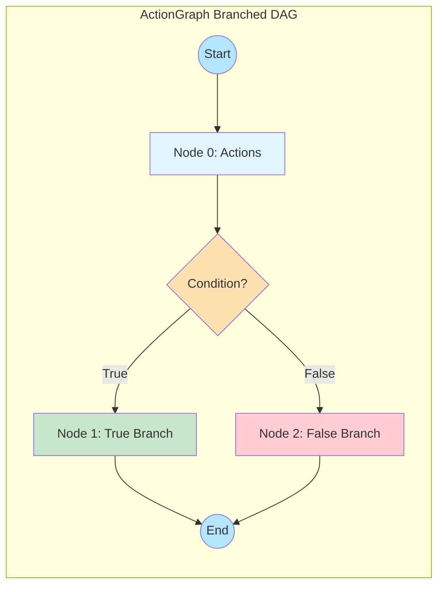
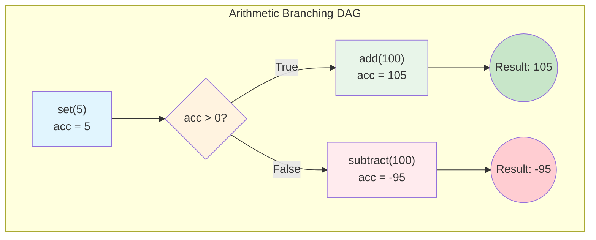
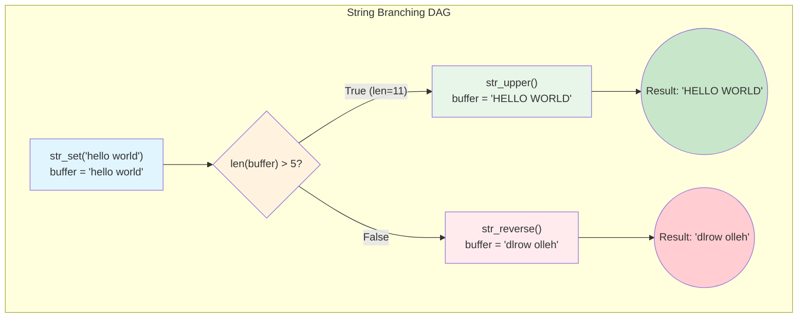
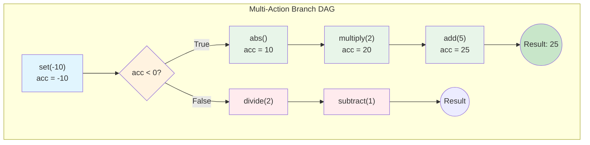
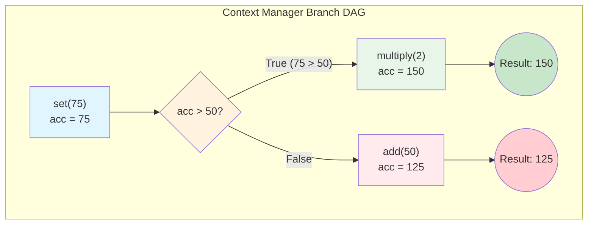

# Automation Schema Module

Platform-agnostic action schema system for UI automation. This module provides the core infrastructure for defining, loading, and executing action sequences across different UI automation frameworks.

## Architecture

```
science_modeling_tools/automation/schema/
├── __init__.py           # Public API exports
├── constants.py          # Enums, constants, default actions (SOURCE OF TRUTH)
├── common.py             # Core models (Action, ActionSequence, ExecutionRuntime, ExecutionResult)
├── action_metadata.py    # ActionTypeMetadata model and registry
├── action_node.py        # ActionNode - single action execution with retry
├── action_flow.py        # ActionFlow - sequential action execution
├── action_graph.py       # ActionGraph - DAG execution with conditional branching
└── artifacts/
    └── default_action_types.json  # Reference artifact (not source of truth)
```

## Execution Layers

The module provides two execution layers:

| Layer | Class | Description |
|-------|-------|-------------|
| **Sequential** | `ActionFlow` | Executes a list of actions in order |
| **Graph-based** | `ActionGraph` | DAG execution with conditional branching |

```
┌─────────────────────────────────────────────────────────────┐
│  ActionGraph (DAG with conditional branching)               │
│  ├── ActionSequenceNode → ActionFlow (sequential exec)      │
│  │       └── ActionNode (single action with retry)          │
│  └── Uses WorkGraph for DAG orchestration                   │
└─────────────────────────────────────────────────────────────┘
```

---

## ActionFlow - Sequential Execution

`ActionFlow` executes a sequence of actions in order. It's the simpler execution model for linear workflows.

### Basic Usage

```python
from science_modeling_tools.automation.schema import (
    ActionFlow,
    ActionSequence,
    Action,
    ActionMetadataRegistry,
)

# Create an action sequence
sequence = ActionSequence(
    id="login_sequence",
    actions=[
        Action(id="visit", type="visit_url", args={"url": "https://example.com/login"}),
        Action(id="input_user", type="input_text", target="username_field", args={"text": "user@example.com"}),
        Action(id="input_pass", type="input_text", target="password_field", args={"text": "secret123"}),
        Action(id="click_login", type="click", target="login_button"),
    ]
)

# Create executor with your action executor (e.g., WebDriver)
flow = ActionFlow(
    action_executor=driver,  # Your action executor callable
    action_metadata=ActionMetadataRegistry(),
)

# Execute the sequence
result = flow.execute(sequence)
print(f"Success: {result.success}")
```

### Loading from JSON

```python
# From JSON file
result = flow.execute("path/to/sequence.json")

# From JSON string
json_str = '{"id": "test", "actions": [{"id": "a1", "type": "click", "target": "btn"}]}'
result = flow.execute(json_str)
```

### With Result Persistence (Resume Support)

```python
flow = ActionFlow(
    action_executor=driver,
    action_metadata=ActionMetadataRegistry(),
    enable_result_save=True,
    result_save_dir="/tmp/workflow_results",
)

# First run - saves results
result = flow.execute(sequence)

# If interrupted, create new flow with resume
flow_resume = ActionFlow(
    action_executor=driver,
    action_metadata=ActionMetadataRegistry(),
    enable_result_save=True,
    result_save_dir="/tmp/workflow_results",
    resume_with_saved_results=True,  # Skip completed actions
)
result = flow_resume.execute(sequence)
```

---

## ActionGraph - Graph-based Execution with Branching

`ActionGraph` provides a builder pattern for constructing workflows with conditional branching. It supports multiple syntaxes for defining branches.

### Basic Usage with Method Chaining

```python
from science_modeling_tools.automation.schema import ActionGraph, ActionMetadataRegistry

# Create graph with builder pattern
graph = ActionGraph(
    action_executor=driver,
    action_metadata=ActionMetadataRegistry(),
)

# Chain actions together
graph.action("visit_url", args={"url": "https://example.com"})
graph.action("click", target="login_btn")
graph.action("input_text", target="username", args={"text": "user"})
graph.action("input_text", target="password", args={"text": "pass"})
graph.action("click", target="submit_btn")

# Execute
result = graph.execute()
```

### Fluent Method Chaining

All builder methods return `self` for fluent chaining:

```python
graph = ActionGraph(action_executor=driver, action_metadata=registry)

result = (
    graph
    .action("visit_url", args={"url": "https://example.com"})
    .action("click", target="menu_btn")
    .action("click", target="settings_link")
    .action("input_text", target="name_field", args={"text": "New Name"})
    .action("click", target="save_btn")
    .execute()
)
```

---

## Conditional Branching

`ActionGraph` supports **4 different syntaxes** for conditional branching. Choose the one that fits your style.

### 1. If-Statement + else_branch() (Simple)

```python
graph = ActionGraph(action_executor=driver, action_metadata=registry)
graph.action("click", target="submit_btn")

# Condition evaluated at runtime
if graph.condition(lambda r: r.success):
    graph.action("click", target="success_btn")
    graph.action("visit_url", args={"url": "/dashboard"})

# Use else_branch() instead of else: (Python limitation)
graph.else_branch()
graph.action("click", target="retry_btn")
graph.action("screenshot", target="error_area")

result = graph.execute()
```

> **Note**: Python's `else:` block won't execute during graph build time due to how `__bool__()` works. Use `else_branch()` method instead.

### 2. Context Manager Syntax (Recommended)

The cleanest syntax with explicit true/false branches:

```python
graph = ActionGraph(action_executor=driver, action_metadata=registry)
graph.action("click", target="submit_btn")

with graph.condition(lambda r: r.success) as branch:
    with branch.if_true():
        graph.action("click", target="success_btn")
        graph.action("visit_url", args={"url": "/dashboard"})

    with branch.if_false():
        graph.action("click", target="retry_btn")
        graph.action("screenshot", target="error_area")

result = graph.execute()
```

### 3. Match-Case Syntax (Python 3.10+)

For those who prefer pattern matching:

```python
from science_modeling_tools.automation.schema import ActionGraph, ConditionContext

graph = ActionGraph(action_executor=driver, action_metadata=registry)
graph.action("click", target="submit_btn")

match graph.condition(lambda r: r.success):
    case ConditionContext.TRUE:
        graph.action("click", target="success_btn")
        graph.action("visit_url", args={"url": "/dashboard"})

    case ConditionContext.FALSE:
        graph.action("click", target="retry_btn")
        graph.action("screenshot", target="error_area")

result = graph.execute()
```

### 4. Callback-based branch() API

Best for programmatic branch construction:

```python
graph = ActionGraph(action_executor=driver, action_metadata=registry)
graph.action("click", target="submit_btn")

# Single-action branches with lambdas
graph.branch(
    condition=lambda r: r.success,
    if_true=lambda g: g.action("click", target="success_btn"),
    if_false=lambda g: g.action("click", target="retry_btn"),
)

# Multi-action branches with functions
def on_success(g):
    g.action("click", target="success_btn")
    g.action("visit_url", args={"url": "/dashboard"})
    g.action("wait", args={"seconds": 1})

def on_failure(g):
    g.action("click", target="retry_btn")
    g.action("screenshot", target="error_area")
    g.action("click", target="support_link")

graph.branch(
    condition=lambda r: r.success,
    if_true=on_success,
    if_false=on_failure,
)

result = graph.execute()
```

---

## Nested Conditions

All branching syntaxes support nesting:

```python
graph = ActionGraph(action_executor=driver, action_metadata=registry)

with graph.condition(lambda r: r.success) as outer:
    with outer.if_true():
        graph.action("click", target="continue_btn")

        # Nested condition
        with graph.condition(lambda r: r.context.variables.get("premium")) as inner:
            with inner.if_true():
                graph.action("click", target="premium_features")
            with inner.if_false():
                graph.action("click", target="upgrade_prompt")

    with outer.if_false():
        graph.action("click", target="error_handler")

result = graph.execute()
```

---

## Complex Workflow Example

Here's a complete example combining multiple features:

```python
from science_modeling_tools.automation.schema import (
    ActionGraph,
    ActionMetadataRegistry,
    TargetSpec,
    TargetSpecWithFallback,
)

graph = ActionGraph(
    action_executor=driver,
    action_metadata=ActionMetadataRegistry(),
    enable_result_save=True,
    result_save_dir="/tmp/checkout_flow",
)

# Phase 1: Login
(
    graph
    .action("visit_url", args={"url": "https://shop.example.com"})
    .action("click", target="login_btn")
    .action("input_text", target="email", args={"text": "user@example.com"})
    .action("input_text", target="password", args={"text": "secret"})
    .action("click", target="submit_login")
)

# Phase 2: Conditional - Check login success
with graph.condition(lambda r: r.success) as login_check:
    with login_check.if_true():
        # Phase 3: Add to cart with fallback target strategies
        graph.action(
            "click",
            target=TargetSpecWithFallback(strategies=[
                TargetSpec(strategy="id", value="add-to-cart"),
                TargetSpec(strategy="css", value=".add-cart-btn"),
                TargetSpec(strategy="xpath", value="//button[contains(text(), 'Add')]"),
            ])
        )
        graph.action("click", target="checkout_btn")

        # Phase 4: Payment
        graph.action("input_text", target="card_number", args={"text": "4111111111111111"})
        graph.action("click", target="pay_btn")

        # Nested: Check payment result
        graph.branch(
            condition=lambda r: r.success,
            if_true=lambda g: g.action("screenshot", target="confirmation"),
            if_false=lambda g: (
                g.action("screenshot", target="error")
                 .action("click", target="retry_payment")
            ),
        )

    with login_check.if_false():
        graph.action("screenshot", target="login_error")
        graph.action("click", target="forgot_password")

result = graph.execute()
print(f"Checkout completed: {result.success}")
```

---

## Custom Executor Examples

ActionGraph works with any callable executor. Here are examples using arithmetic and string executors to demonstrate branched DAG execution with verifiable results.

**Branched DAG Concept:**



At runtime, the condition is evaluated and only one branch executes. The graph structure is built at construction time, but branch selection happens during execution.

### Example 1: Arithmetic Operations with Branching

This example shows a calculator-style executor that maintains an accumulator value.

**DAG Visualization:**



**Code:

```python
from dataclasses import dataclass
from typing import Any, Dict, List, Optional

from science_modeling_tools.automation.schema import ActionGraph, ActionMetadataRegistry
from science_modeling_tools.automation.schema.action_metadata import ActionTypeMetadata


@dataclass
class Result:
    """Result object returned by executor."""
    success: bool
    value: Any
    error: Optional[Exception] = None


class ArithmeticExecutor:
    """Executor for arithmetic operations on an accumulator."""
    
    def __init__(self):
        self.accumulator: float = 0
        self.history: List[Dict] = []
    
    def __call__(self, action_type: str, action_target=None, action_args=None, **kwargs) -> Result:
        action_args = action_args or {}
        value = action_args.get("value")
        
        try:
            if action_type == "set":
                self.accumulator = float(value)
            elif action_type == "add":
                self.accumulator += float(value)
            elif action_type == "subtract":
                self.accumulator -= float(value)
            elif action_type == "multiply":
                self.accumulator *= float(value)
            elif action_type == "divide":
                if float(value) == 0:
                    raise ZeroDivisionError("Cannot divide by zero")
                self.accumulator /= float(value)
            elif action_type == "negate":
                self.accumulator = -self.accumulator
            elif action_type == "abs":
                self.accumulator = abs(self.accumulator)
            else:
                raise ValueError(f"Unknown action: {action_type}")
            
            self.history.append({"action": action_type, "result": self.accumulator})
            return Result(success=True, value=self.accumulator)
        except Exception as e:
            return Result(success=False, value=self.accumulator, error=e)
    
    def reset(self):
        self.accumulator = 0
        self.history = []


# Setup registry with arithmetic actions
registry = ActionMetadataRegistry()
for action in ["set", "add", "subtract", "multiply", "divide", "negate", "abs"]:
    registry.register_action(ActionTypeMetadata(
        name=action,
        requires_target=False,
        supported_args=["value"] if action not in ["negate", "abs"] else [],
    ))

# Create executor and graph
executor = ArithmeticExecutor()
graph = ActionGraph(action_executor=executor, action_metadata=registry)

# Build a branched workflow: set(5) → branch(>0: +100, else: -100)
graph.action("set", args={"value": 5})

# Helper to extract accumulator from result
def is_positive(r, **kwargs):
    return executor.accumulator > 0

# Branch based on accumulator value
graph.branch(
    condition=is_positive,
    if_true=lambda g: g.action("add", args={"value": 100}),
    if_false=lambda g: g.action("subtract", args={"value": 100}),
)

result = graph.execute()
print(f"Result: {executor.accumulator}")  # Output: 105 (5 > 0, so +100)
print(f"History: {executor.history}")
```

### Example 2: String Operations with Branching

This example shows a string buffer executor with conditional transformations.

**DAG Visualization:**



**Code:**

```python
class StringExecutor:
    """Executor for string operations on a buffer."""
    
    def __init__(self):
        self.buffer: str = ""
        self.history: List[Dict] = []
    
    def __call__(self, action_type: str, action_target=None, action_args=None, **kwargs) -> Result:
        action_args = action_args or {}
        
        try:
            if action_type == "str_set":
                self.buffer = str(action_args.get("value", ""))
            elif action_type == "str_concat":
                self.buffer += str(action_args.get("value", ""))
            elif action_type == "str_upper":
                self.buffer = self.buffer.upper()
            elif action_type == "str_lower":
                self.buffer = self.buffer.lower()
            elif action_type == "str_reverse":
                self.buffer = self.buffer[::-1]
            elif action_type == "str_trim":
                self.buffer = self.buffer.strip()
            elif action_type == "str_replace":
                old = str(action_args.get("old", ""))
                new = str(action_args.get("new", ""))
                self.buffer = self.buffer.replace(old, new)
            else:
                raise ValueError(f"Unknown action: {action_type}")
            
            self.history.append({"action": action_type, "result": self.buffer})
            return Result(success=True, value=self.buffer)
        except Exception as e:
            return Result(success=False, value=self.buffer, error=e)
    
    def reset(self):
        self.buffer = ""
        self.history = []


# Setup registry with string actions
str_registry = ActionMetadataRegistry()
for action in ["str_set", "str_concat", "str_upper", "str_lower", "str_reverse", "str_trim", "str_replace"]:
    str_registry.register_action(ActionTypeMetadata(
        name=action,
        requires_target=False,
        supported_args=["value", "old", "new"],
    ))

# Create executor and graph
str_executor = StringExecutor()
str_graph = ActionGraph(action_executor=str_executor, action_metadata=str_registry)

# Build workflow: set("hello world") → branch(len>5: upper, else: reverse)
str_graph.action("str_set", args={"value": "hello world"})

def is_long_string(r, **kwargs):
    return len(str_executor.buffer) > 5

# Branch based on string length
str_graph.branch(
    condition=is_long_string,
    if_true=lambda g: g.action("str_upper"),
    if_false=lambda g: g.action("str_reverse"),
)

result = str_graph.execute()
print(f"Result: {str_executor.buffer}")  # Output: "HELLO WORLD" (len=11 > 5)
print(f"History: {str_executor.history}")
```

### Example 3: Multi-Action Branches

Branches can contain multiple sequential actions.

**DAG Visualization:**



**Code:**

```python
executor = ArithmeticExecutor()
graph = ActionGraph(action_executor=executor, action_metadata=registry)

# Start with a value
graph.action("set", args={"value": -10})

def is_negative(r, **kwargs):
    return executor.accumulator < 0

# Multi-action branches
def handle_negative(g):
    g.action("abs")           # Make positive: -10 → 10
    g.action("multiply", args={"value": 2})  # Double: 10 → 20
    g.action("add", args={"value": 5})       # Add 5: 20 → 25

def handle_positive(g):
    g.action("divide", args={"value": 2})    # Halve
    g.action("subtract", args={"value": 1})  # Subtract 1

graph.branch(
    condition=is_negative,
    if_true=handle_negative,
    if_false=handle_positive,
)

result = graph.execute()
print(f"Result: {executor.accumulator}")  # Output: 25 (-10 was negative)
```

### Example 4: Context Manager Syntax for Branching

For cleaner code, use the context manager syntax.

**DAG Visualization:**



**Code:**

```python
executor = ArithmeticExecutor()
graph = ActionGraph(action_executor=executor, action_metadata=registry)

graph.action("set", args={"value": 75})

def check_threshold(r, **kwargs):
    return executor.accumulator > 50

with graph.condition(check_threshold) as branch:
    with branch.if_true():
        graph.action("multiply", args={"value": 2})  # 75 * 2 = 150
    with branch.if_false():
        graph.action("add", args={"value": 50})      # Would be 75 + 50 = 125

result = graph.execute()
print(f"Result: {executor.accumulator}")  # Output: 150 (75 > 50)
```

---

## Target Specifications

### Simple String Target

```python
graph.action("click", target="button_id")
```

### Explicit Strategy

```python
from science_modeling_tools.automation.schema import TargetSpec

graph.action("click", target=TargetSpec(strategy="xpath", value="//button[@id='submit']"))
graph.action("click", target=TargetSpec(strategy="css", value="button.primary"))
```

### Fallback Strategies (Resilient)

Try multiple strategies in order until one succeeds:

```python
from science_modeling_tools.automation.schema import TargetSpec, TargetSpecWithFallback

graph.action(
    "click",
    target=TargetSpecWithFallback(strategies=[
        TargetSpec(strategy="id", value="submit-btn"),      # Try ID first
        TargetSpec(strategy="css", value="button.submit"),  # Then CSS
        TargetSpec(strategy="xpath", value="//button[@type='submit']"),  # Finally XPath
    ])
)
```

---

## JSON Serialization

### Export Graph to JSON

```python
graph = ActionGraph(action_executor=driver, action_metadata=registry)
graph.action("click", target="btn1")
graph.action("input_text", target="field", args={"text": "hello"})

# To dictionary
data = graph.to_dict()

# To JSON string
json_str = graph.to_json()

# To JSON file
graph.to_json("/path/to/workflow.json")
```

### Load Graph from JSON

```python
# From file
graph = ActionGraph.from_json(
    "/path/to/workflow.json",
    action_executor=driver,
    action_metadata=registry,
)

# From string
graph = ActionGraph.from_json(
    '{"version": "1.0", "id": "test", "nodes": [...]}',
    action_executor=driver,
    action_metadata=registry,
)

result = graph.execute()
```

### Serializable Conditions

Use `@condition_expr` decorator to make conditions serializable:

```python
from science_modeling_tools.automation.schema import condition_expr

@condition_expr("result.success")
def check_success(result):
    return result.success

@condition_expr("result.context.variables.get('count', 0) > 5")
def check_count(result):
    return result.context.variables.get('count', 0) > 5

# These conditions can be serialized to JSON
graph.condition(check_success)
```

---

## Constants and Enums

### Target Strategies

| Strategy | Value | Description |
|----------|-------|-------------|
| `INCREMENTAL_ID` | `__id__` | Framework-assigned unique ID (default) |
| `ID` | `id` | Native UI element identifier |
| `XPATH` | `xpath` | XPath expression |
| `CSS` | `css` | CSS selector |
| `DESCRIPTION` | `description` | Natural language (AI-based) |
| `HTML` | `html` | HTML content matching |
| `LITERAL` | `literal` | Literal value (e.g., URLs) |

### Memory Modes

| Mode | Description | Use Case |
|------|-------------|----------|
| `NONE` | No memory capture | click, input_text, visit_url |
| `TARGET` | Capture target element only | scroll, scroll_up_to_element |
| `FULL` | Capture full UI state | (reserved for future use) |

### Default Actions

| Action | Default Strategy | Memory Mode | Description |
|--------|-----------------|-------------|-------------|
| `click` | INCREMENTAL_ID | NONE | Click on a UI element |
| `input_text` | INCREMENTAL_ID | NONE | Input text into a field |
| `append_text` | INCREMENTAL_ID | NONE | Append text to existing content |
| `visit_url` | LITERAL | NONE | Navigate to a URL |
| `scroll` | INCREMENTAL_ID | TARGET | Scroll an element or page |
| `scroll_up_to_element` | INCREMENTAL_ID | TARGET | Scroll until element visible |
| `wait` | None | NONE | Wait for specified duration |
| `input_and_submit` | INCREMENTAL_ID | NONE | Composite: input + click |

---

## API Reference

### ActionFlow

```python
ActionFlow(
    action_executor: Callable,           # Executes actions (e.g., WebDriver)
    action_metadata: ActionMetadataRegistry,
    enable_result_save: bool = False,    # Save results for resume
    resume_with_saved_results: bool = False,
    result_save_dir: Optional[str] = None,
)

# Methods
flow.execute(sequence, initial_variables=None) -> ExecutionResult

# Deprecated alias (for backward compatibility)
SequenceExecutor = ActionFlow
```

### ActionGraph

```python
ActionGraph(
    action_executor: Callable,
    action_metadata: ActionMetadataRegistry,
    enable_result_save: bool = False,           # Inherited from Resumable
    resume_with_saved_results: bool = False,    # Inherited from Resumable
    result_save_dir: Optional[str] = None,
)

# Builder methods (all return self for chaining)
graph.action(action_type, target=None, args=None, **kwargs) -> ActionGraph
graph.condition(condition_func, **kwargs) -> ConditionContext
graph.else_branch() -> ActionGraph
graph.branch(condition, if_true=None, if_false=None) -> ActionGraph

# Execution
graph.execute(initial_variables=None) -> ExecutionResult

# Serialization
graph.to_dict() -> Dict
graph.to_json(path=None, indent=2) -> str
ActionGraph.from_dict(data, action_executor, action_metadata) -> ActionGraph
ActionGraph.from_json(source, action_executor, action_metadata) -> ActionGraph
```

### ExecutionResult

```python
@dataclass
class ExecutionResult:
    success: bool                        # Overall success status
    context: ExecutionRuntime            # Variables and action results
    outputs: Dict[str, Any]              # Defined outputs
    error: Optional[Exception]           # Error if failed
    failed_action_id: Optional[str]      # ID of failed action
```

